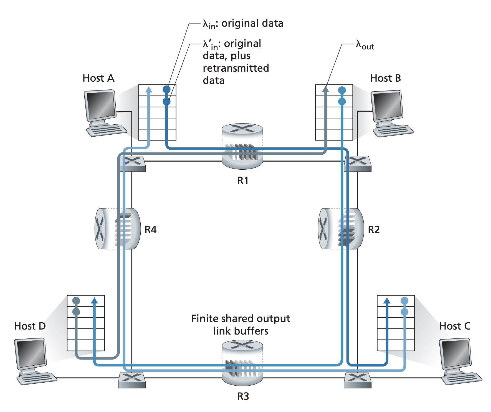

## Principles of Congestion Control

Pages 255-263 Section 3.6

Packet retransmission is a way to treat the symptom of network congestion but
it doesn't solve the fundamental issue of too many sources attempting to send
data. Consider the following scenarios of congestion and the costs of
congestion.

### Causes and costs of congestion control

Two senders, unlimited router buffer: In this case, no packets are ever dropped
and hosts don't have to retransmit. Hosts connected by the same router need to
share that router's bandwidth. In a scenario where we have two hosts that are
connected to a router with link capacity $R$, the two routers have to share
this capacity. No matter how much the two hosts send bytes on the wire to the
router, the per connection throughput cannot be each higher than $\frac{R}{2}$
because the two hosts have to share the bandwidth (pretend that bandwidth is
shared equally in this case). Furthermore, sending at a rate higher than
$\frac{R}{2}$ will cause the router to start buffering packets as it will not
be able to immediately route the packets received from the hosts. In this case,
the average number of queued packets at the router can be unbounded and in
turn, the delay between source and destination can become unbounded as well. We
can say that the cost of congestion in thise case is *large queuing delays are
experienced as packet arrival rate nears link capacity*

Two senders, finite router buffer: Because router buffers are now finite,
packets can be dropped if it arrives at a router with a full buffer. This means
that there are now retransmits. We must differentiate between the rate which
the transport protocl sends original segments and the rate at which the
transport protocol sends original data and retransmitted data. We can call
these two sending rate and offered load respectively. In the unrealistic
scenario that the host is able to know when the router buffer is free, it can
send segments in a where there are no packet losses and thus the sending rate
and the offered load will be the same. In another unrealistic scenario that the
host will be able to know exactly which packets are lost and thus will never
generate duplicate packets on retransmits. We can say even in this scenario,
the cost of congestion is *the sender must perform retransmissions that take
away bandwidth from original data*. Now in the realistic scenario of the sender
prematurely timing out and retransmiting a packet that has been delayed in the
queue but not lost, you end up sending uneeded data in the retransmit that will
be dropped by the receiver anyways. In this way, another cost of congestion is
*the network will waste bandwidth with unecessary retransmits that take away
bandwidth from original data and necessary retransmits*.

Four senders, finite router buffers, and multihop paths: In this most realistic
scenario, we have four hosts that are connected by four routers. All hosts have
the same transmit throughput of $\lambda_{in}$ and routers have capacity of
$R$. Also note that $\lambda_{in}$ is the sum of original data and retransmit
data. Even though the routers are shared by multiple connections (eg R1 is
shared by A-C and D-B), for values of $\lambda_{in}$ that is less than
$\frac{R}{2}$, buffers being full are rare and $\lambda_{in}$ match
$\lambda_{out}$. Now, in the case of high traffic, the way the network is layed
out can cause throughputs of some connections to fall to 0. In the case of B-D,
because it's first router is R2, data from B-D get's to R2 first before data
from A-C. This means that it is possible for A-C throughput to fall to 0
because the R2 router buffer will be constantly full of traffic from B-D. This
indicates that the receiver throughput isn't necessarily positively correlated
with sending rate. At a certain point, increased sending rate will cause packet
loss for some connections that will decrease receiving rate to eventually 0. We
can also see another cost of congestion, *when a packet is dropped the work
done by previous upstream links to forward that packeet has been wasted*.

### Approaches to congestion control
There are two broad ways to handle congestion control. At the highest level,
these two approaches are whether the network layer provides explicit assistance
to the transport layer for congestion control.

End to end congestion control: The network layer provides no explicit support
and end systems need to infer the presence of congestion. This is the approach
taken by TCP because the IP layer is not required to provide feedback regarding
network congestion.

Network assisted congestion control: Routers provide explicit feedback to hosts
regarding state of the network. This can be thinks like a bit set by routers
indicating goestion or more sophisticated things like ATM available bit rate
where a router informs senders of maximum host sending rate the router can
suport on an outgoing link. More recently, IP and TCP have been relying on
network assisted congestion control. For network assisted congestion control,
the information is conveyed to the sender in two ways. Either direct feedback
from the router to sender in the form of a choke packet or a router updating a
field in a packet header from sender to receiver and the receiver notifies the
sender of the congestion.
