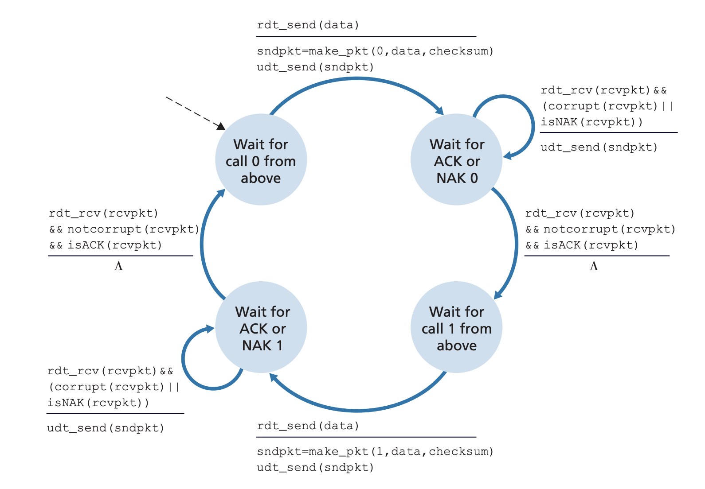
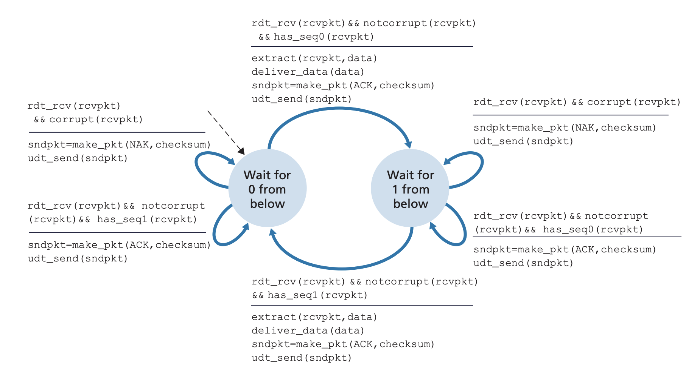
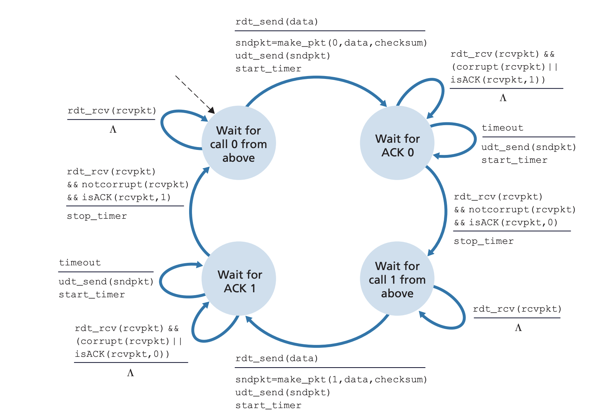
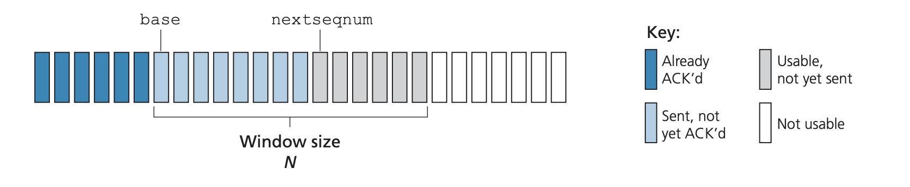
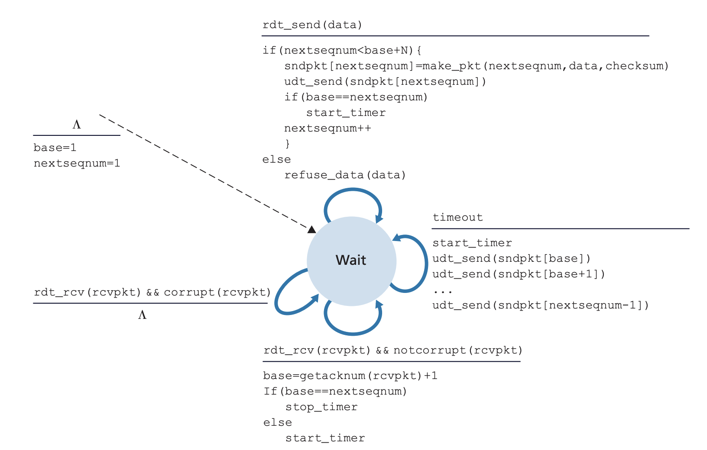
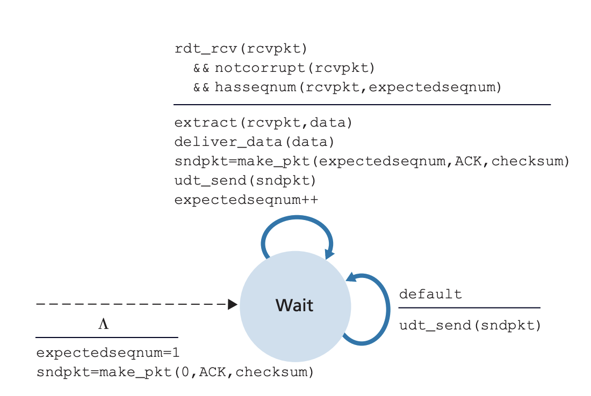
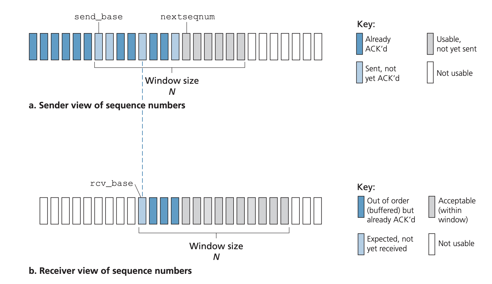

## Principles of reliable data transfer

Pages 200-226 Section 3.4

Reliable transport is not limited to the transport layer but also athe link and
application layer. TCP is simply just a transport protocol that implements a
lot of concepts from the study of reliable data transfer. The goal of a
reliable data transfer protocol is to create an abstraction that provides end
to end delivery with no bit corruption and segments being delivered in the same
order they were sent using the layer below that doesn't have these properties.

### Reliable data transfer over reliable channel v1
This is the simplest case of reliable data transfer where the underlying method
you are using to send messages is reliable in itself. The state machine for
this protocol is very simple with only one state for the sender and the
receiver. On the sender side, this one state is waiting for a user to ask to
send a message. When a user makes a call to send a message, a state transition
occurs where the protocol will send the message over the reliable channel. At
the receiver, the state machine has one state where it is waiting for a call
from the layer below to deliver the data to the user. The state transition
occurs and the user receives the data and the state machine goes back to its
original state.

### Reliable data transfer over channel with bit errors v2
When the underlying channel can send packets reliably but doesn't handle bit
errors, the state machine is more complicated. In order to detect bit errors,
we need to introduce the concept of positie and negative acknowledgements,
essentially saying "OK" or "Send the message again". These cotnrol messages
allows receives to tell the sender to try again. This retransmission is called
Automatic Repeat reQuest (ARQ) protocols. ARQ protocols require:
- Error detection: In order to ask for a retransmission, you first need to know
if a message was corrupted or not. We can employ techniques for error detection
and event error recovery. This means that in addition to the payload, the
packet needs to contain bits for error checking.
- Receiver feedback: The receiver needs to be able to tell the sender whether
it was able to receive a message (ACK) or it wasn't (NAK)
- Retransmission: The sender needs to be able to retransmit the data

At first, it may seem to implement such a protocol. The sender state machine
would need two states: waiting for a call from above and waiting for an ACK or
NAK. If a call from above to send data is received, the sender will send the
data and transition to the waiting for response state. Once a response is
received, the sender will either retransmit the packet or go back to waiting
for a call from above. The receiver is also fairly simple. It has a single
state, waiting for a call from below. Once a call from below arrives, it either
delivers the uncorrupted data to the user, sends an ACk, and waits again or it
sends a NAK and waits again. However, this implementation doesn't actually work
because ACK and NAKs can also be corrupted. We can tackle this problem in two
ways
- Add checksum bits to allow sender to detect and recover from bit errors
- If any acknoledgement is corrupted, just resent the packet. However, this
introduces the problem of duplicate packets. With the current state machine,
the receiver doesn't whether the packet is a duplicate or simply just another
transmission by the sender with the same data.

We can solve the issue of duplicate packets with sequence numbers. Each
transmission is assigned a sequence number and if you receive a packet with the
same sequence number, it is a duplicate message. For a stop and go protocol (a
protocol that only lets you send and receive a fixed number of packets at a
time), a single bit for the sequence number is sufficient. The new statement is
a bit more complex now.

The sender now has four states.
- The sender starts by waiting for a call for sending packet 0. When a request
to send is received, the sender sends the packet with sequence number 0
- The sender then waits for an ACK or NAK for sequence 0. If the response is
corrupt or is a NAK, then it sends again. If it is an ACK, the sender waits for
a call from above for sequence 1

The state repeats like this, going back and forth between sequence 0 and 1.

The receiver now has two states.
- The receier starts by waiting for a call from below for sequence 0. If it is
corrupt, it sends a NAK back to the sender and stays in this state. If it is
not currupt and it is sequence 0, it sends an ACK to the sender and waits for
sequence 1
- The receiver waits for sequence 1 and does the same as what it did for
waiting for sequence 0, instead this time checking that sequence number is
indeed 1 instead of 0.

Note that while this state machine uses negative acknowledgements, the same can
be done by sending ACKs for the alst correctly received packet. When the sender
receives duplicate ACKs, it will know that it has to retransmit the current
sequence. In this case, the ACK messages will also need to contain sequence
numbers.

### Reliable transport over channel with lost packets and bit errors v3
Using the concepts from handling bit errors, we can handle lost or reordered
packets. The burden of detecting lost packets is placed on the sender. The
sender has to wait some amount of time after transmitting a packet and not
receiving an ACK before determining that the packet was dropped. This way, the
sender doesn't have to concern with what exactly happened with the packet. It
could be that the packet was dropped, the ACK was dropped, or that the packet
or the ACK is just taking a long time to be arrive. It simply just has to
retransmit the packet and with sequence numbers, we have a way to deal with
duplicate packets.

The sender has 4 states
- It starts with waiting for a call from above to send sequence 0. It sends the
packet and starts a timer
- While waiting for the ACK for sequence 0, it can either receive an ACK for
sequence 0 and move to waiting for a call to another send, or it can receive an
ACK for the wrong sequence/corrupt ACK and continue to wait, or it can timeout
and resent the packet.

### Pipelined reliable data transfer protocols
The above mentioned protocols only allow you to send and receive one packet at
a time so it is not practical. Consider a scenario where you are sending
packets on a wire with a 1Gbps transmission rate and RTT of 30ms between the
hosts. The packets are 1000 bytes. The time needed to transmit each packet is
$\frac{8000}{10^9} + 30ms = 30.008 ms$. Out of this time, the sender only sends
messages for 0.008 ms, it is waiting for a reply for most of the time. This is
very inefficient and we can have the sender do more work during this time. We
can do this by pipelining our messages. Instead of sending one message at a
time, we can send a bunch of messages and wait for a reply for a bunch of these
messages. In reality, the sender maintains a window of packets in flight and
only moves the window forward (increases the sequence number) only when the
lowest sequence number we are waiting for is ACKd. The two approaches to
piipelining are Go-Back-N and selective repeat.

### Go-Back-N
GBN is a protocol that uses pipelining to send multiple packets at once. The
sender maintains a window of size $N$. It is called GBN because once it has
determined that the receiver hasn't received some packets, it will go back and
retransmit all of the packets in it's window. In this protocol, packets can
either be ACKd, send but not ACKd, usable but not sent, or not usable. Usable
packets are packets that are within the window. The sender maintains two
numbers, the `base` which is the oldes unacknowledged packet and `nextseqnum`
which is the smallest unused sequence number.
- `[0,base-1]`: Sent and ACKd. Basically done with these
- `[base, nextseqnum-1]`: Sent but not ACKd yet. May have to retransmit so remember the states.
- `[nextseqnum, base+N-1]`: Packets that can be sent but aren't sent yet
- `[base+N, ]`: Can't be sent yet

The sequence number range is determined by the $2^k-1$ where $k$ is the number
of bits the sequence number has in the header. The sequence number wraps around
to 0 if it goes over $2^k$.

GBN also uses *cumulatie acknowledgement*. This means that the receiver will
send back ACKs with the sequence number of its most recently received in order
packet. This basically means that if a sender receives an ACK with value $x$,
all packets $<x$ were received by the receiver. This means that the receiver
disregards packets with a sequence number that isn't one greater than the most
recently received in order packet.

The sender's state machine
- Starts with waiting for user to give it packets to send
- If `nextseqnum` is still within the window (we have less than $N$ unACKd
packets in flight), send the packet and update state regarding the current
window. The timer for GBN is set only when the packet at `base` is sent.
- If you receive an ACK, move the baes to 1 past that ACK. If the ACK value is
`nextseqnum` (this means all the packets we sent were received), stop the
timer, otherwise start a new timer
- If ACK is corrupt, do nothing
- If timeout, start the timer and send all the unACKd packets in the window again

The receiver's state machine
- Starts with waiting for packets to be received by lower layer
- If packet is not corrupt and the sequence number is the expected sequence
number (one more than the most recent in order packet's sequence number), send back an ACK
with that expected sequence number. Increment the expected sequence number. If
packet received isn't the expected sequence number, also send back an ACK with
the expected sequence number.

### Selective Repeat

The main weakness of GBN is that it has to send all of the packets in the
window again from a single packet error. When the rate of packet drop increases
and latenecy increases, the protocol will have many unecessary retransmissions.
Selective repeat avoids this by having the sender transmit only the packets
that it thinks were not received by the receiver. The receiver in turn
individually acknowledges packets so instead of cumulative ACKs, each sequence
number needs to be individually ACKd.

Like GBN, the sender and receiver maintains a window of size $N$ with packets
being ACkd, sent but not ACKd, usable but not sent, and unusable. The receiver
now acknowledges packets that are not in order. Out of order packets are
buffered until all the missing packets before it are received. 

The sender
- Waits until a request to send data is received. Once it has a packet to send,
if the packet's sequence number is within its window, it will send the packet.
For each packet, the sender must keep a timer
- Once a timeout for a packet happens, the packet is retransmitted
- If the sender receives an ACK, it marks it as being received. If the ACKd
packet's sequence number is equal to the current `send_base`, `send_base` is
moved to the lowest unACKd packet's sequence number nad the window is moved
accordingly. Any packets that are now in the window but not transmitted is
transmitted.

The receiver
- If a packet with sequence number `[rcv_base, rcv_base+N-1]` (within the
window) is received, it sends back an ACK with the packet's seqeunce number. If
it is the first time it sees the packet, it is buffered. If the packet received
has a sequence number equal to `rcv_base`, all packets between `rcv_base` and
consequtive received packets can now be given to the applicatino layer.
`rcv_base` moves to the lowest packet that hasn't been received.
- If a packet with sequence number `[rcv_base-N, rcv_base-1]` is received, it
is ACKd. Note that these packets were already received and ACKd before
- Any other sequence number is ignored

The receiver needs to ACk already ACKd packets `[rcv_base-N,rcv_base-1]`. This
is ebcause with selective repeat, the sender and receiver's windows are not
necessarily in sync. This is because ACKs can be lost. Consider the following
scenario:
- Packets with seq numbers 0, 1, 2, 3, 4, 5, 6 need to be sent. The window size is
three.
- Packets 0, 1, 2 are transmitted and received by the receiver. The receiver's
window is now 3, 4, 5. The ACKs for 0, 1, and 2 back to the sender are lost
however,
- The sender times out and sends 0, 1, 2 again. If receiver doesn't ACK these
packets, sender's window will never move forward. However, it is important to
note that the receiver's window will never by more than $N$ greater than the
sender's window. This is why as long as the receiver ACKs packets that are $N$
less than `rcv_base`, the sender will be able to move forward. It won't diverge
more than $N$ because the sender's window will simply just not move until it
receives an ACK for at least `send_base`.

Selective repeat also has an interesting problem because the sender and
receiver windows can diverge. It needs to have a maximum window size given a
range of sequence numbers. Consider the scenario where sequence numbers range
from 0 to 3 and the window size is three. The sender sends the first three
packets 0, 1, 2 and the receier receives them. The receiver's window is now
over 3, 0, 1 because the sequnce number wraps around. Then, the following two
things can happen
- Receiver's ACKs are lost, sender times out and retransmits packets 0, 1, 2 again
- Receiver's ACKs are received and sender sends 3, 0, and 1. Packet 3 is lost
and sender receives 0 but a packet with new data not retransmit.
From the receiver's point of view, there is no way to distinguish this
retransmit or new transmit of packet 0. The window size for selective repeat
needs to be *less than or equal to half of the max sequence number*
