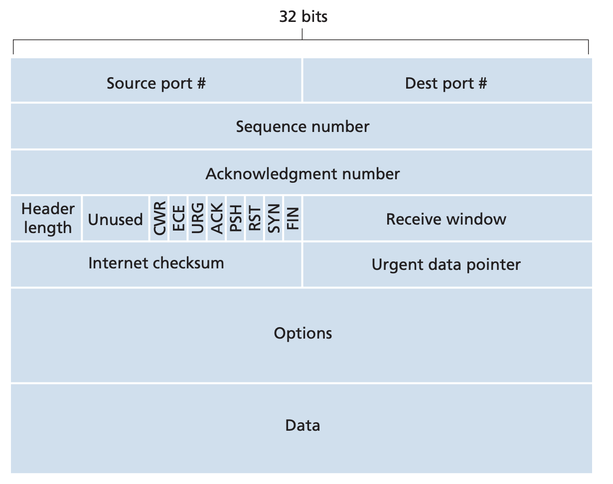
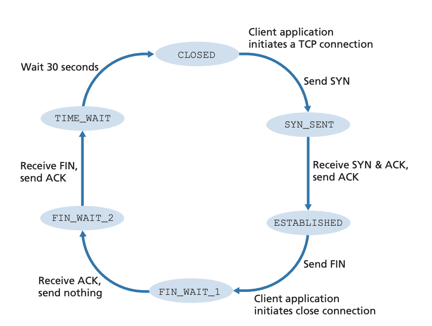
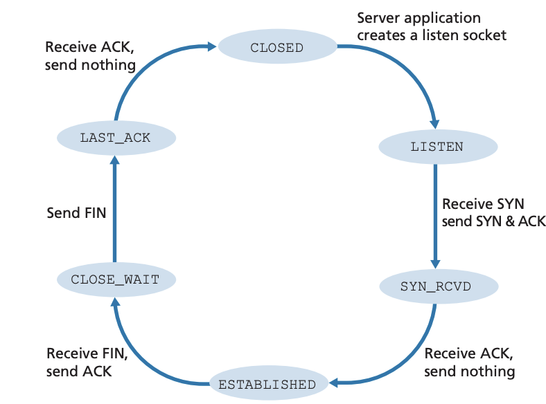

## TCP

Pages 227-255 Section 3.5

Characteristics of TCP are
- TCP is a logical connection based service. There is no physically determine
connection between the hosts. The intermediate nodes don't actually know that
there is a TCP connection between hosts
- TCP provides a duplex service, once a connection has been established, the
two sockets can send messages back and forth on that connection
- TCP connections are point to point. You can only have two sockets connected
by a TCP connection. ie, no multicasting

Once an application passes data into the socket to the TCP running on the host,
TCP directs this data to the connection's send buffer. TCP then takes data from
this send buffer in chunks and passes it down to the network layer. The TCP
sepcification (RFC 793) is very loose about when data is actually passed to the
network layer saying "send that data in segments at it's own convenience". The
maximum size of a segment, called the max segment size (MSS), is determined by
the max transmission unit (MTU). $MSS = MTU - 40$ where the 40 is the typical
size of a TCP/IP header. The MTU is the largets link layer frame that can be
sent and is the minimum of all of the MTU's between each link layer nodes. Note
that MSS is the maximum size of data sent by the application and does not
include the TCP/IP header.

### TCP segment structure

The TCP header is typically 20 bytes with the possibility of extensions
- Source and destination ports for muxing, 16 bits each 
- Sequence number containing the byte stream number of the fist byte in the
segment, 32 bits
- ACK number (ACK sequence number) for acknowledging a specific sequence
number, 32 bits
- Header length needed becasue TCP headers can have variable length with
options. The length is denoted in 32 bit words so a header length value of 5 is
a 20 byte header. This also means headers have to be multiples of 4 bytes, 4 bits
- Flag field for denoting what type of TCP segment, 6 bits.
    - ACK bit denotes that the value in the ACK field is valid
    - RST, FIN, and SYN used for connection setup and teardown
    - CWR and ECE used for explicit congestion notification
    - PSH bit means receiver should pass dat to user immediately
    - URG to indicate some portion of data in this segment is marked as urgent
    by the sender. The loation of last byte of urgetndata indicated by 16 bit
    urgent pointer field
- Receive window for indicating how much space the receiver buffer has, 16 bits
- Checksum for bit error detection, 16 bits
- Urgent data pointer. If URG bit set in flags, points to the end of the urgent
data. TCP must inform the receiving side that urgent data exists and pass it a
pointer to end of urgent data, 16 bits.
- Options, 32 bits
- Data, MTU - TCP header size - IP header size

TCP treats the data it is sending and receiving as a stream of bytes. The
sequence number in the sequence number field is the byte number of the
beginning of the seqeunce. When an application wnats to send 500,000 bytes over
a TCP connection, TCP will imiplicitly number each byte (it doesn't actually
number but it treats the data as bytes instead of a collection of bytes). If
the MSS is 1000 bytes, the first segment will contain the sequence number 0.
The second will be 1000, the third will be 2000 and so on.

Because TCP is a duplex service, a host can be both receiving and sending data
on the same connection. The acknowledgement number that is contained in the
segment from host A to host B contains the sequence number of the next byte
that A expets from B. The vice versa is true. If host A has received bytes 0 to
535 from host B, when host A is sending a segment to host B, it will put 536 in
the ACK number field. TCP also uses cumulative acknowledgements. It will only
ACK up to the first missing byte in the stream. This may make it seem like TCP
is a GBN protocol but the TCP RFCs don't impose any rules on how an
implementation should handle out of order bytes. The two options would be to
disregard the segment with the out of order bytes or to buffer it and wait for
the missing bytes to fill in the gaps. The second is more efficient and is
typically what TCP implementations do. TCP sequence numbers also start from a
random number. This is done to minimize the possibility that a segment present
in the network from a previous terminated connection is not mistaken for a
segment in the current connetion. In this way, ACKs are piggybacked to data
being sent between hosts. If a host needs to only send an ACK, the data section
will just be left empty.

### Round trip time estimation and timeout
TCP maintains a `SampleRTT` state that denotes a segment's amount of time
between passing into the IP layer and receiving an ACK for that segment. TCP
doesn't measure `SampleRTT` for every segment, instead it takes one `SampleRTT`
at a time and it is actually measure for one of the segments that are sent but
not ACKd yet. TCP also doesn't measure `SampleRTT` for retransmits, only
original data. TCP takes averages of these `SampleRTT`s and maintains an
`EstimatedRTT` value. `EstimatedRTT` is updated for every `SampleRTT` with the
following formula: $EstimatedRTT = (1-\alpha)*EstimatedRTT+\alpha*SampleRTT$
where $\alpha$ is usually 0.125. This basically means that TCP puts more weight
on more recent samples. TCP also maintains `DevRTT` which is a measure of
variability between samples and how much `SampleRTT` deviates from the cirrent
`EstimatedRTT`. It is denoted by the following formula: $DevRTT =
(1-\beta)*DevRTT + \beta * | SampleRTT - EstimatedRTT |$ where $\beta$ is
usually 0.25.

Given these two values, TCP sets its timeout interval as $TimeoutInterval =
EstimatedRTT + 4*DevRTT$ with $TimeoutInterval$ starting at 1 second. When a
timeout does occur, $TimeoutInterval$ is doubled but as soon as an ACK is
received and $EstimatedRTT$ is updated, $TimeoutInterval$ is recomputed again.

### Reliable Data Transfer
TCP maintains a single retransmission timer for multipel unACKd sent segments.
TCP is based on four major events: data recevoed from application, a timeout,
an ACK being received, and duplicate ACKs being received.

- Data received from application: TCP creates a segment by encapsulating
application data with a header. This segment is assigned the sequence number
`NextSeqNum`. If the timer is not currently running, the timer is started. The
segment is passed to the IP layer. `NextSeqNum` is incremented by the length of
the data.
- Timeout: TCP retransmits the segment that caused time timeout which is the
segment with the lowest unACKd `SeqNum`. The timer is started again.
- Original ACK received: When a previously unACKd segment is ACKd, the value in
the ACK field is compared to `SendBase`. `SendBase` is the sequence number of
the oldest unACKd byte, thus any value in the ACk field greater than `SendBase`
is ACKing previously unACKd bytes. `SendBase` is updated to be the value in the
ACK field and if any nonACKd segments remain, the timer is restarted.

Whenever a timeout event occurs with TCP, the `TimeoutInterval` is usually
doubled. `TimeoutInterval` is only recalculated once there is data from the
application or there is an ACKd segment.

TCP also has another way of detecting lost packetes in the form of duplicate
ACKs. The receiver sends ACKs according to the following policy
- Arrival of in order segment with expected sequence number: Delayed ACK, wait
for up to 500 ms for arrival of another in order segment and only send if next
in order segment does not arrive
- Arrival of in order segment with expected sequence number but other segment
waiting for ACK transmission: Immediately send single cumulative ACK ACKing
both in order segments
- Arrival of in order segment with higher than expected sequence number (Gap):
Immediately send duplicate ACK indicating sequence number of next expected byte
- Arrival of segment that partiall or fully fills in gap: Immediately send ACK
if segment starts at lower end of gap

If a receiver gets an out of order segment, it will send back an ACK that it
has already sent before. When the sender receives three duplicate ACKs for a
segment, it takes that as the segment being lost and it performs a fast
retransmit which means it retransmits the segment with the sequence number of
the ACK field before it timesout.

### Flow control
TCP hosts maintain a receive buffer. If this receive buffer is not read by the
application, TCP cannot accept new data and packets can be dropped. To mitigate
this, TCP also incoroporates a flow control service to make sure the sender
doesn't overflow the receiver's buffer. TCP hosts maintain s atet called
receive window `rwnd`. This indicates how much free buffer space a receiver
has. TCP also maintains `LastByteRead` which is the last byte that the
application process read and `LastByteRcvd` which is the last byte that arrived
from the network into the receiver buffer. TCP has to maintain $LastByteRcvd -
LastByteRead \le RcvBuffer$. Thus, `rwnd` is denoted by $rwnd = RcvBuffer -
(LastByteRecvd - LastByteRead)$. `rwnd` is inserted in the receive window field
of the TCP header. The sender also keeps track of $LastByteSent - LastByteACKd$
which is the amount of unACKd data in the sender. The sender makes sure that
the amount of unACKd data is less than `rwnd` which assures that the receiver's
buffer won't be overflowed. However, a flaw with this scheme is that if `rwnd`
becomes 0, the sender will see this and not send any data at all. Thus, it will
not be able to discover if the receiver has buffer available. To mitigate this,
TCP specification requires the sender to continue sending segments with one
byte of data when receiver's `rwnd` becomes 0. 

### TCP Connection management
TCP establishes a connection before sending messages and tears down a
connection before completely closing the connection. TCP connection is
established using the three way handshake.
1. Client side sender sends a TCP segment with no application data but `SYN`
flag set to 1. Client also chooses a random initial sequence number and puts
it in the sequence number of field.
2. Once the `SYN` segment is received by the receiver, it sets up a connection
by allocating buffers, variables, and a new socket for the connection. It
then sends back a connectiong granted segment with `SYN` bit set to 1 and the
ACK field containing one greater than the client's initial sequence number. It
also adds its own initial sequence number in the segment. This is referred as a
SYNACK segment.
3. The client receives the SYNACK segment and sends back another segment ACKing
the receiver's SYNACK. The ACK field contains one greater than the server's
initial sequence number. This segment may carry application data if there is
any.

The connection is closed by any side and is done in the following way.
1. The closing side sends a TCP segment with the `FIN` flag set to 1.
2. Other side receives the `FIN` segment and ACKs this segment.
3. The other side sends its own `FIN` segment.
4. The initial closing side sends an ACK to this `FIN` segment.

The states of a TCP client is as follows

The states of a TCP server is as follows

When a TCP server receives a `SYN` segment for a port that is not listening, it
sends back a segment with the `RST` flag set to 1. In the case of UDP, it will
send back a special `ICMP` datagram
