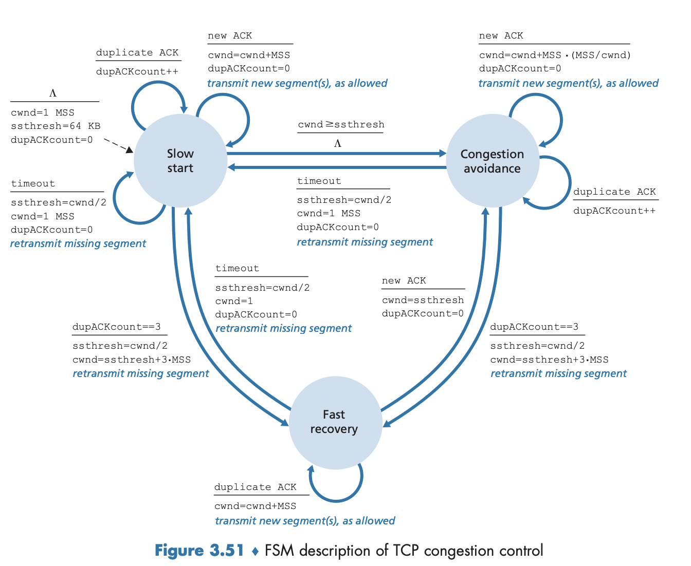
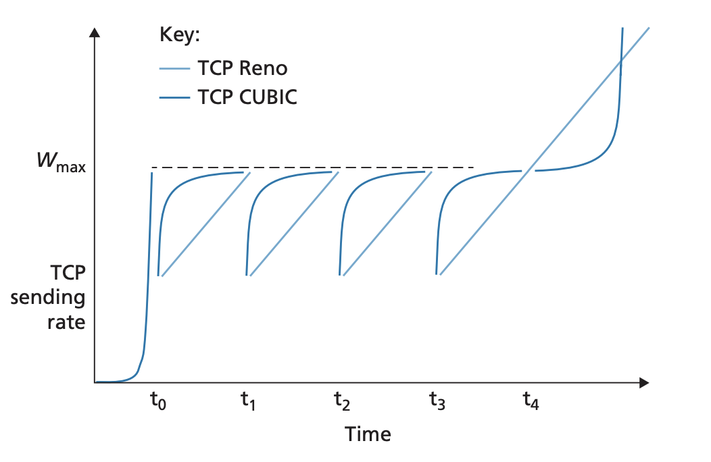

## TCP congestion control

Pages 263-279 Section 3.7

### Classic TCP Congestion Control
The "classic" way of doing congestion control in TCP (RFC 2581) doesn't use
network assistance and is done only with end host systems. Hosts connected with
TCP maintain several states such as `rwnd` and `cwnd`. The host maintain a
congestion window (`cwnd`) that imposes a constraint on the rate at which TCP
sender can send traffic into the network. A TCP sender can only have a certain
amount of unACKd bytes denoted by the equation: $LastByteSent-LastByteACKed \le
min(cwnd, rwnd)$. TCP detects loss of a packet either through a timeout or
receipt of three duplicate ACKs. If no loss is detected and we get ACKs of
previously unACKd segments, congestion window is increased. TCP uses the
receipt of ACKs to increase is congestion window and is therefore said to be
*self-clocking*. TCP uses the following principles when deciding on how to
change the congestion window
- Lost segment: This implies congestion and hence, the sender's rate should be
decreased. Lost segment's are detected with timeouts or a receipt of one
original ACK and three duplicate ACKs. Three duplicate ACKs indicate that the
segment following this segment was lost.
- ACKd segment: This indicates that the network is able to deliver the segments
without a problem and therefore, the sender's rate can be increased when an
original ACK arrives.
- Bandwidth probing: TCP increases congestion window upon an original ACK and
decreases upon a loss event. TCP continuously "probes" the congestion window by
increasing `cwnd` until a loss event at which it decreases `cwnd`. It continues
to do this throughout the connection. The standardization of TCP congestion
control is specified in (RFC 5681)

The TCP algorithm has three main components: 1) slow start 2) congestion
avoidance 3) fast recovery. This way of congestion control is referred to as
Additive Increase, Multiplicative Decrease

Slow start: When a TCP connection begins, `cwnd` is typically set to a small
value of 1 MSS (maximum segment size). However, this sending rate may be much
smaller than the available bandwidth so the sener wants to discover the value
of `cwnd` that can maximize bandwidth utilization but not congest the network.
In the slow-start state, the sender begins `cwnd` at 1 and increases 1 MSS for
each original ACK of a segment. For example, the first sending of a message
will be 1 MSS. If that is ACKd, the next will be 2 MSS. If all segments are
ACKd, it will be 4 MSS. As you can see, the rate at which `cwnd` grows doubles
every RTT if no packets are lost. Thus, TCP send rate starts slow but grows
exponentially.

The slow start phase ends if any of three things happen. 
1. A loss event is detected with timeout. TCP will set its
`cwnd` back to 1 and begin the slow start phase again. It will also set
`ssthresh` to `cwnd/2` before setting `cwnd` to 1. 
2. A loss event is detected with three duplicate ACKs. The sender will do a
   fast retransmit and enter the fast recovery state. The sender will
retransmit the missing segment before the timer times out 
3. If `cwnd` reaches `ssthresh`. It doesn't make to keep on doubling the window
when we know that we failed at around `ssthresh*2`. Once `cwnd` reaches this
value, slow start ends and TCP transitions to congestion avoidance mode

Congestion avoidance: TCP transitions to the congestion avoidance stage when
its `cwnd` reaches half of what `cwnd` was the last time a loss event was
detected. This means that congestino could be right around the corner and it
wouldn't be wise to continue to double `cwnd` per RTT. Instead, TCP grows its
congestion window by 1 MSS per RTT. This is done by increasing `cwnd` by MSS /
`cwnd` for every ACK. If all segments of `cwnd` is ACKd, `cwnd` would increase
by MSS. Cogestion avoidance continues until a loss event. In the case of a
timeout, `ssthresh` is set to half of `cwnd` and `cwnd`starts back from 1. In
the case of three duplicate ACKs, because this means that network is still
delivering packets but some of them were dropped, the slow down is less
aggressive and `cwnd` is set to 3MSS + `ssthresh` while `ssthresh` is halved.

Fast recovery: When in fast recovery, every duplicate ACK increases `cwnd` by 1
MSS (this is the same as slow start). When a new ACK arrives, TCP transitions
back to the congestion avoidance state with `cwnd` set back to `ssthresh`. This
means that while TCP is in the fast recovery state, it operates under the
assumption that eventually the missing packet will be ACKd by the receiver so
it will continue to send new packets as well. Fast recovery is also not a
required component of TCp. In TCP Tahoe (an early version), there was no fast
recovery and it `cwnd` was unconditionally set to 1 after a loss event. The
newer TCP Reno incorporates fast recovery.

TCP Cubic: TCP Cubic is a TCP version that changes the congestion avoidance
phase. It operates under the assumption that if network conditions have not
changed much since the last loss event, it is better to ramp up sending rate to
get close to the pre loss congestion window and only then probe for bandwidth.
It does this by:
- Allowing knobs to control how long it takes to pre loss `cwnd` size. Let us
call this time `K` and pre loss congestion window as `W_{max}`
- It increases `cwnd` by a function of cube of the distance between current
time and the time till `K`. When time is further away from `K`, `cwnd` is
increases much faster
- After time passes and still close to `K`, `cwnd` is increased by smaller
amounts allowing it to probe the congestion level of the link. As further time
passes, `cwnd` is increased faster to try to find the new operating point.

Given TCP's saw tooth like congestion control approach, the average throughput
of a long lived TCP connection is hard to determine. However, with a few
simplications, we can label a general range of TCP throughput. Given the
following assumptions
- Time spent in slow start is negligible because TCP grows out of it
exponentially fast
- RTT stays relatively constant during the TCP connection

During a particular interval, the send rate is size of the window, $w$ divided
by RTT. TCP probes for additional bandwidth by increasing $w$ by 1 MSS each
RTT. Denote $W$ as the value of $w$ when a loss event occurs. Then, assuming
$RTT$ and $W$ approximately stay constant during the connection, TCP
transmission rate ranges from $\frac{W}{2*RTT}$ and $\frac{W}{RTT}$ (the window
stays between `ssthresh` and max congestion window). Beacuse TCP increases rate
linearly, we can simplify this by saying at a given time, TCP throughput is
$0.75*\frac{W}{RTT}$

### Network assisted explicit congestion notification and delayed-based congestion control

In newer TCP sepcifications (RFC 3168), better ways to detect congestion
relying on signals from the network has been proposed

Explicit Congestion Notification: ECN involves both the TCP and IP layers. At
the network layer, two bits in the type of service field in the IP datagram
heaer are used for ECN. These bits are used by a router to indicate that it is
experiencing congestion. The router updates this field in the IP header and is
delivered to the destination host who then informs the sending host. Another
use for this field is to indicate to routers that the sender is capable of
taking action based ECN indicated congestion. When the receiving host receives
an IP datagram with the ECN indicating congestion, the receiver sets the
Explicit Congestion Notification Echo bit (ECE) in the TCP ACK segment. The TCP
sender sees this and reacts to it like it would for a lost segment using fast
retransmit ie halving `cwnd`. 

Delay-based Congestion Control: This approach attemsp to detect congestion
before packet loss occurs. In TCP Vegas, the sender measures RTT of all ACKd
packets. Given an uncongested network and a minimum RTT of $RTT_{min}$, the
uncongested throughput would be $\frac{cwnd}{RTT_{min}}$. If the actual
measured throughput is close this value, it indicates that sending rate can be
increased since the path is not congested yet. However, if sending rate is
significantly less, it means that the path is congested and Vegas will diceraes
the sending rate.

TCP faireness: Fairness among $K$ TCP conenctions means that for a bottleneck
kink of transmissino rate $R$ (meaning this host is the bottleneck through the
path), the average transmission rate for each connection is $\frac{R}{K}$ (the
bandwidth is shared equally). The idea behind TCP fairness is that if two
connections both detect underutilized bandwidth, they will increase the send
rate. If they then detect congestion, it will half send rate. As this process
repeats, eventually, the send rate will converge around the interesection
between maximizing bandwidth and equally distribution between connections.
However, TCP fairness is between connections, if a host were to open multiple
connections, they would be able to grab more of the bandwidth compare to a host
that has fewer connections open. Furthermore, between hosts that share the same
bottleneck link, the host with the faster RTT will end up getting more of the
bandwidth.
