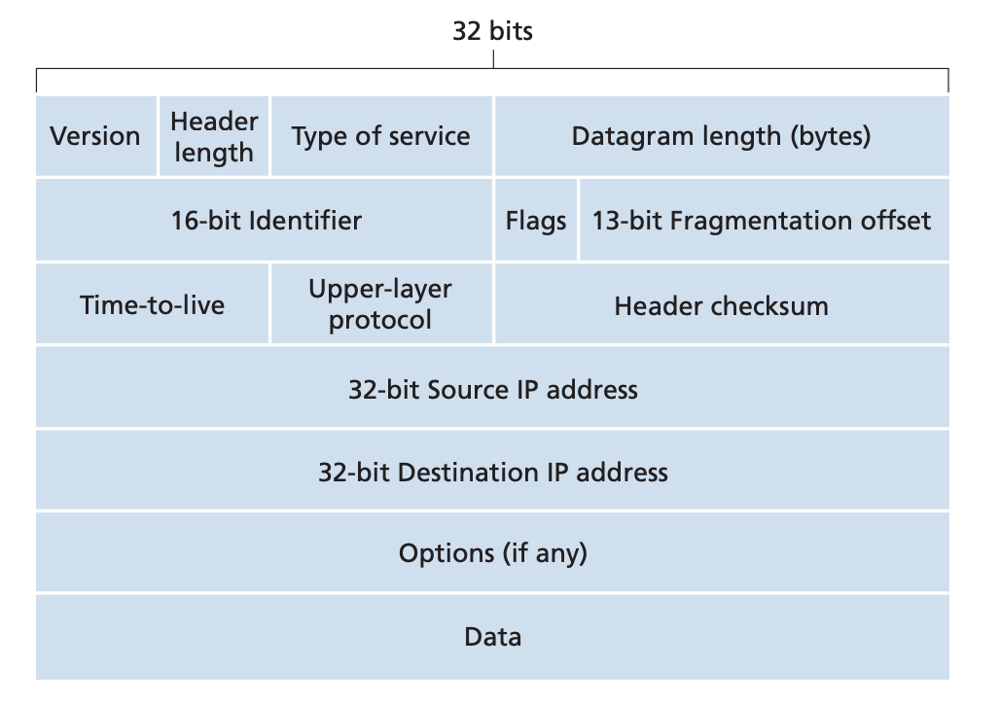
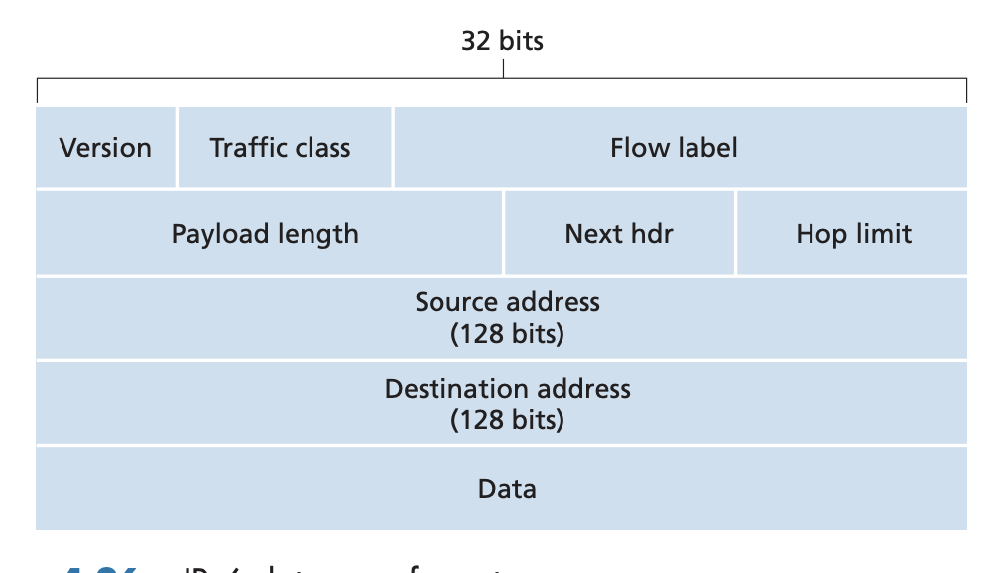

## Internet Protocol: IPv4, Addressing, IPv6 and More

Pages 331-353 Section 4.3

### IPv4 Datagram Format
The network layer packet is referred to as a datagram.

- Version number: Denote protocol version of IP. Used to determine
how to interpret the datagram. 4 bits.
- Header length: IPv4 datagrams can have variable number of options so lengths
can be variable. Used to determine where the data begins (data is the segment
from the transport layer) 4 bits.
- Type of service: Differentiate different IP datagrams such as real time
datagrams vs non real time datagrams. The TOS bits are also used for ECN. 8
bits.
- Datagram length: Total length of IP datagram header and data in bytes.
Maximum size of IP datagram is 65,535 bytes. 16 bits.
- Identifier: Identify fragmented IPv4 datagrams. 16 bits.
- Flags: Used to denote if there are any more IPv4 datagrams as part or if this
is the last fragment. 3 bits.
- Fragmentation offset: The byte offset this fragmentation contains. 13 bits.
- Time to live: Notes the number of hopes this datagram has left in its
lifetime. Used to prevent datagrams from circulating forever. Decremented at
each router. 8 bits.
- Upper layer protocol: Used to indicate to the protocol layer what the
transport protocol data the IP datagram contains. 6 is TCP 17 is UDP. Analgous
to ports in terms of muxing which protocol the datagram is intended for. 8
bits.
- Header checksum: Aids router in detecting bit errors in datagram. Computed by
treating each 2 bytes in the header as a number and summing the numbers using
1s complement. Router computes the header checksum and makes sure it matches
the checksum in the header and discards datagram if it doesnt match. Checksum
must be recomputed and updated at each hop because the TTL changes. 16 bits.
- Source and destination IP: 32 bits each.
- Options: 32 bits.
- Data: Contains transport layer segmenets or other protocols such as ICMP.

IPv4 headers are 20 bytes with no headers. If data is a TCP segment, total
amount of headers is 40 bytes.

### IPv4 Addressing

IP addresses are associated with interfaces and not hosts. Consider the case
for routers. Routers have multiple interfaces to service traffic and each
interface is capable of servicing IP datagrams. Thus, each interface has its
own IP address. Each interface on every host and router must have an IP address
that is globally unique (exceptions in the case of NATs here multiple
interfaces exist behind one address). 

IP subnets are a colletion of hosts and routers where all the hosts and routers
contain the same prefix in its IP address. To precisely, identify a subnet, you
can determine detach each interface from its host or router, creating islands
of isolated networks, with interfaces terminating the end points of networks.
Each of these isolated networks is called a subnet.

The internet's address is assigned using Classless Interdomain Routing (CIDR).
The 32 bit IP address is divided into two parts like $a.b.c.d/x$ containing the
address and the number of bits in the address. An organization is assigned a
network prefix ad thus a contiguous block of addresses. When a router outside
the orgnaization is forwarding a datagram, only the network prefix of the
destination address is considered. The remaining bits in the IP address can be
used to distinguish specific hosts in the organization. This type of addressing
is called classless because IP addresses can have a flexible number of bits for
the network prefix. Before this, there existed classful addressing where
addresses with 8, 16, and 24 bit subnet addresses were known as class A, B, and
C networks. The IP address 255.255.255.255 is considered the broadcast address.
When a host sends a datagram to this address, it is delivered to all hosts on
the same subnet.

In order to obtain a block of addresses as an organization, you must contact
your ISP which would provide you with addresses from the ISPs assigned address
space. The ISPs assigned IP address block is assigned by the Internet
Corporation of Assigned Namesand Numbers (ICANN). They allocate IP addresses to
ISPs and also manage root DNS servers.

DHCP: In order to obtain a host address within an organization, hosts use
Dynamic Host Configuration Protocol (DHCP). DHCP allows hosts to automatically
obtain an IP address when it connets to the network along with the IP addresses
subnet mask and the address of the detaulf gateway router. In DHCP, the host is
the client that queries the organization's DHCP server. DHCP is a four step
protocol:
1. DHCP server discovery: The new host needs to find a DHCp server with the
DHCP discover message. The client sends a UDP packet to destination port 67
and address 255.255.255.255 which is the broadcast address. The source address
is set as 0.0.0.0 (because the client doesn't know its IP yet).
2. DHCP server response: The DHCP server receives the discover message and
responds with an offer message that is broadcast to all nodes on the subnet.
There can be serveral DHCP servers so the client may be able to choose between
multiple offers. Each offer message contains the transaction ID of the received
discover message and the proposed IP adress for the client, network mask, and
an address lease time (usually several hours to days).
3. DHCP request: The client chooses from one of the offers and responds to the
select DHCP server with a DHCP request message echoing back the
configuration parameters.
4. DHCP ACK: The server ACKs this message confirming the request.

DHCP clients must also periodically renew the lease. 

### Network Address Translation
NAT is a solution to the rise of IP capable devices and addressable IP blocks
running out. It allows multiple hosts in the same subnet to be identified by
one address from hosts and routers outside of the subnet. It also allows for
more hosts in the subnet as more bits can be used to identify hosts instead of
the subnet. 

The NAT enabled router contains an interface to the subnet as well
as an interface that is connected to some other router. To the outside world,
the NAT router doesn't look like a router but like a host with a single IP
address. All traffic leaving the subnet has the same source address and all
traffic entering the subnet has the same destination address. THe router gets
its IP address from the ISPs DHCP server and it also runs a DHCP server to
provide hosts in its subnet unique IP addresses. The NAT differentiates traffic
intended for different hosts by maintaining a NAT translation table. When a
host in the subnet sends traffic to outside of the network, it goes through the
NAT. The NAT replaces the replaces the source address and destination with its
own sends the traffic to the intended destination. The NAT logs this mapping of
original IP and port to its own IP and port. When the response arrives at the
NAT, it looks into its NAT table and determines who to send back the traffic
to. The NAT essentially turns different hosts and ports to a single unique port
number. 

Some issues with NATs are that for well known protocols with well known ports,
it can be hard to identify servers running within a NAT

### IPv6
As the 32 bit IPv4 address space started to become used up, the IETF began
developing a new Internet protocol. IPv6 aimted to address theh following
improvements
- Improved addressing capabilities: Increase the size of IP address from 32 to
128 bits. It also introduced anycast addresses that allows a datagram to be
delivered to any one of a group of hosts
- Stremalined 40 byte header: Fixed header length with no options
- Flow labeling: Defines flows which labels packets belonging to a particular
flow for which the sender requests special handling such as non-default quality
of service or real time service. This means that audo or video transmission
might be treated as a flow hile email may not be.

IPv6 Datagram Format:
- Version: Differentiate IPv4 and IPv6. 4 bits
- Traffic class: Like the TOS field in IPv5. Used to give priority to certain
datagrams within a flow. 8 bits
- Flow lable: Identify flow of datagrams: 20 bits
- Payload length: Number of bytes in IPv6 datagram following the 40 byte header
(only data). 16 bits
- Next header: Identifies protocol to which contentes of the data field of the
datagram will be delivered to (eg TCP or UDP). Uses same value as upper layer
protocol field in IPv4. 8 bits
- Hop limit: TTL of a datagram. 8 bits
- Source and destination address: Each 128 bits
- Data: Paylod containing transport layer segment

Comparing IPv4 with IPv6, the following changes are apparent:
- Fragmentation/reassembly: IPv6 does not allow for fragmentation and
reassembly at intermediate routers. It can only be done at the end hosts. If an
IPv6 router receives a datagram that is too learge for the outgoing link, the
router will send back a ICMP error message saying the packet is too big. 
- Header checksum: It is up to the transport layers to implement error
checking.
- Options: No more options, fixed header size. 

Transitioning from IPv4 to IPv6: Existing IPv4 systems can't be made to interop
with IPv6 systems. The solution to this is IP tunnelling. If IPv6 routers or
systems want to route through an IPv4 router, the IPv6 system simply puts the
entire IPv6 datagram and encapsulates that within an IPv4 datagram. The IPv4
datagram is addressed to the destination IPv6 node. The IPv6 node that receives
the encapsulated datagram can check that there is an IPv6 datagram by checking
the protocol number which shuold be 41. 

