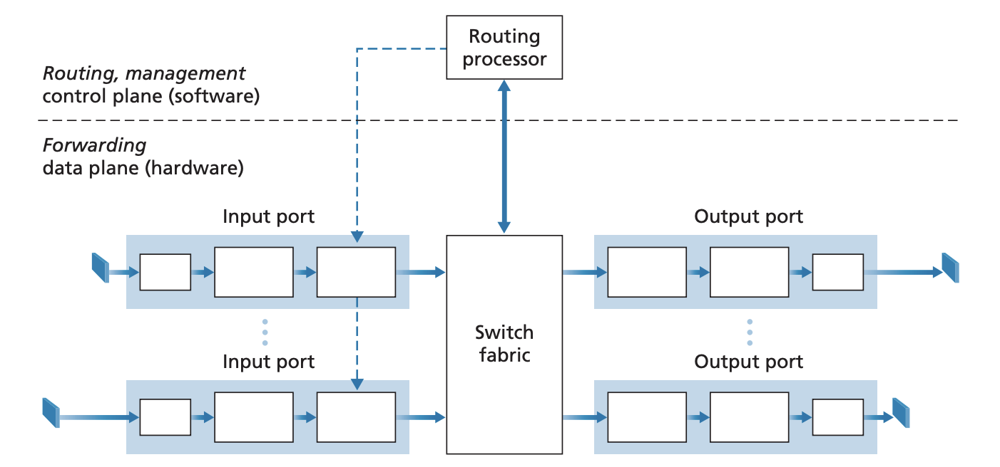
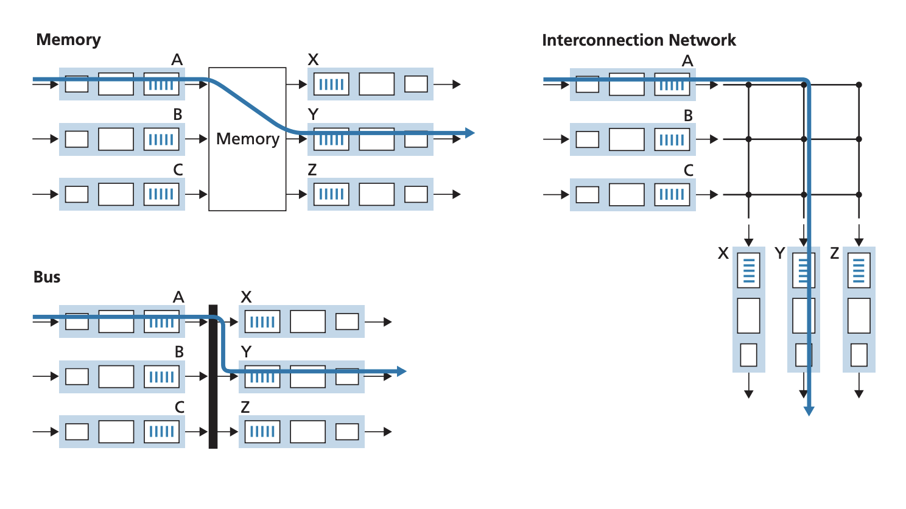

## What's Inside a Router

Pages 311-330 Section 4.2

A generic router contains the following components:
- Input ports: Performs physical layer functions like terminating incoming
physical link, interoperating with link layer other side of connection, and
lookup function where the forwarding table is consulted to determine the output
port to sforward a packet to. The number of ports can vary depending on the
type of router, edge routers that get a lot of traffic can have hundreds of
10Gbps ports
- Switching fabric: Connect input ports to outer ports. This is essentially a
network inside the router
- Output ports: Store packets from switching fabric, transmit packets on
outgoing link by performing link and physical layer tasks. Bidirectional
connections (traffic in both directions) will have output ports paired with an
input port for the bidirectional link
- Routing processor: Performs the control plane functions by running routing
protocols or communicating with remote controller in the case of SDN. 

The forwarding functionality at a router (input output ports, switching fabric)
are typically implemented in hardware. Control plane tasks such as routing
protocols are done in software .

### Input port processing
The input port of a router performs the following functions in order
1. Line termination: Implement the physical and link layer functionality for
receiving data on a medium and interfacing wit the sender.
2. Data link processing: Processes the data received from the line termination
component. Decapsulation of the data is done here to check a packet's version,
checksum, and TTL
3. Lookup and forwarding: Consults the forwarding table to determine which
output port to send data out of. The forwarding table is copied locally to
the line cards using a separate PCIe bus so that the port doesn't have to
consult the routing processor every time for a forward.

Because it is infeasible to have the destination of all 4 billion IPv4
addresses in a router, lookup is done on a range basis. The forwarding table
contains ranges of IP addresses and the corresponding output link interface.
The router does a prefix match of the packet's destination address with the
entries in the table. The entry that has the longest prefix match is the ouput
link that the packet. If no prefix matches, the packet is routed to a default
output link. This lookup is performed in hardware and uses various fast lookup
algorithms better than a brute force linear search. It also uses special RAM
devices such as Ternary Content Addressable Memories.

Once a packet's output link is determined, it is given to the switching fabric
to deliver it to the output link. It is posisble for the packet to be
temporarily blocked from entering the switching fabric if packets from other
input ports are currently using the fabric. This is where blocked packets can
be queued at the input port and scheduled to corss the fabric. The lookup and
forwarding is an example of the common match + action abstraction that happens
in various places in the network stack. It appears in the link layer as well.

### Switching

The switching fabric in a router can be implemented in various ways
- Memory: The simplest earliest routers were traditional computers with a
processor. Input and output ports were traditional I/O devices that signalted
to the process via an interrupt. The packet is then copied to the processor
memory and the routing processor extracts the destination address, performs
theh lookup, and copies the packet to the output port's buffers.
- Bus: Input port transfers a packet directly to the output port via a bus. The
input port prepends a switch internal label to the packet indicating the output
port. All output ports receive the packet but only the port that matches the
label keeps it. If multiple packets arrive at the router, they must wait as
only one packet at a time can be switched.
- Interconnection network: To overcome single shared bus, a collection of
busses arranged in a crossbar can be used. For N input and output ports, 2N
buses are used. Each horizontabl bus is intersected by a vertical bus at a
crosspoint. The crosspoints can be opened or closed by the switch fabric
controller. For example, if a packet arrvies at port A and needs to get to port
Y, the crosspoints at the intersection of A and Y are closed and only bus Y can
pick up. This allows multiple packets to be switched simultaneously as long as
the input and output ports are different.

 
### Output port
The output prot takes packets stored in output port's memory and transmits them
over the link. This involves scheduling and de-queueing packets as well as
performing the link and physical layer functionalities..

### Queuing
Queuing can occur at the input and the output ports.

Input port: Queueing at the input port can happen if the switch fabric is not
fast enough at forwarding packets to the output port. In interconnection
switched fabrics, packets in different queues intended for the same destination
port must be delivered sequentially. Not only this, because only one packet
from each queue can be forwarded at a time, packets that are behind the
blocking packet in a queue must also wait. This is head of line blocking.

Output port: Because the switching fabric is usually faster at forwarding than
the output port is at transmitting a packet, queueing can occur at the output
ports. When the buffer at an output port is full, it must either drop the
packet or remove one or more already queued packets to make room. It can be
advantageous to drop packets or mark the ECN bit before packet congestion
occurs to signal to end hosts. Some active queue management algorithms are
random early detection and peroportional integral controller. 

A larger buffer isn't necessarily better. Larger buffers means longer queueing
delays which can impact end to end delay. Increased delay also means TCP
sender's are less responsive to congestion and slow to adjust the sending rate.
Traditionally, the amount of space for a buffer was set to $RTT * C$ where $C$
is the link capacity. More recently, when a large number of independent TCP
flows$N$ is passing through a link, the amount of buffer needed is said to be
$RTT * \frac{C}{\sqrt{N}}$

### Packet scheduling
When packets are queued, the ports need to make a decision on what packet to
forward or transmit next. 

- FIFO: Packets are transmitted in the order they arrived in
- Priority Queueing: Packets are assigned priority classes and packets with
higher priority are serviced first. These priority classes can be network
managmenet information or real time traffic prioritized over non-real time
traffic like emails. Typically, each priority is given its own queue.
- Round robin and weighted fair queueing: Packets are assigned classes but
classes aren't given priority and each class is serviced equally. Round robin
can be done on a per packet basis meaning after a packet from a class is
transmitted, the scheduler moves onto the next class. Round robin can also be
implemented in a weighted fair queue. WFQ assigns each class a different weight
where the weight of a class $w_{i}$ means that that class $i$ receives
$\frac{w_i}{\sum{w_j}}$ of the service. Round ronbin can also be implemented
per byte where instead of going by packet, the service is fairly distributed
over the queues by bytes serviced. In this model, a queue containing larget
packets won't dominate the queue containing smaller packets.
