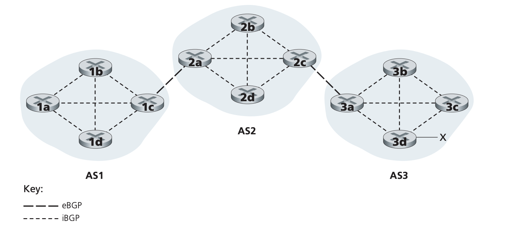
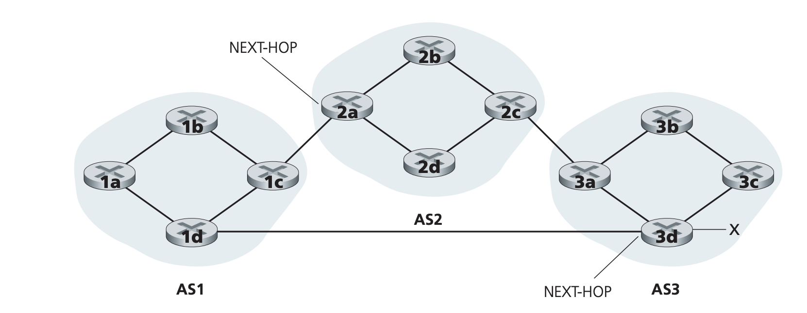
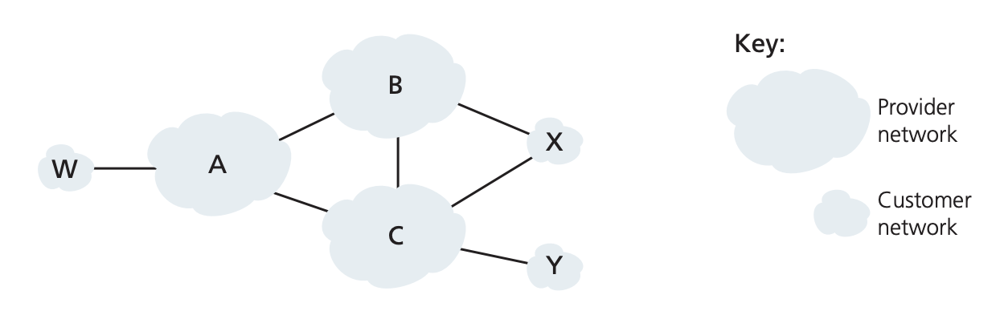

## Routing Among the ISPs: BGP

Pages 399-411 Section 5.4

OSPF is an example of routing within an AS. However, to route a packet across
multiple ASes, there needs to be an inter-AS routing protocol. In the internet,
this protocol is Border Gateway Protocol (BGP).

### The Role of BGP
BGP is used for routing packets to outside of an ISP. In BGP, packets aren't
routed to a destination address but rather the network prefix. Thus, the
forwarding table for forwarding a packet outside of the routers' AS would
contain a network prefix such as 138.16.68/22 and an interface number to
forward the packet out of. BGP provides two main functionalities for routers
- Obtain prefix reachability information: BGP allows each subnet to advertise
itself allowing other subnets and routers know where the subnet is. It
essentially allows different subnets to communicate with each other
- Determine best routes: There may be more than one route to a prefix. BGP will
run a route-selection procedure based on policies specified by the AS. In the
case of BGP, it is important to note that the best route isn't necessarily the
lowest latency but can be influenced by things like business logic and costs

### Advertising BGP Route Information
Routers within an AS are either gateway routers that connect with other ASes or
internal routers. Routers exchange information over semi-permanent TCP
connections using port 179. BGP connections between routers in different ASes
is called external BGP (eBGP) and connections bewteen routers in the same AS is
called internal BGP (iBGP). In the following network configuration, to announce
the location and existance of prefix x that router 3d is in charge of, router
3a first sends an eBGP message to 2c saying prefix x is reachable through AS3.
2c then send siBGP message to all of the routers in AS2. 2a then sends an eBGP
mesage to 1c saying prefix x is reachable through AS3 which is reachable
through AS2. 1c then sends iBGP messages to all of the routers in AS1.

### Determining Best Routes
When a router advertises prefixes across BGP connections, it aloso includes BGP
attributes. The two important attributes are AS-PATH and NEXT-HOP. AS-PATH
contains the list of ASes that the BGP advertisement has passed through. When a
BGP advertisement is passed to an AS, it adds its ASN to the existing list.
This list can be used to determine the AS path a packet would traverse to get
to a prefix. It is also used to detect advertisement loops. If a router sees
that its AS is already in the list, it will reject the advertisement. The
NEXT-HOP attribute is the IP address of the router interface that begins the
AS-PATH. For example, in the network configuration above, the NEXT-HOP for the
path AS2 -> AS3 -> prefix x from AS1 to x would be the left interface of router
2a. The NEXT-HOP value for the path AS3 -> prefix x from AS1 to x would be the
left interface of the router 3d. The NEXT-HOP value essentially tells you what
router interface to forward to to get started on the AS path. Similar to
AS-PATH, when a border router propagates an eBGP message, it updates the
NEXT-HOP to be the IP address of the interface it is sending out of. In this
way, all routers in AS1 know two paths and two ways to get to prefix 1: through
2a or through 3d.

When adding an outside-AS prefix in a router's forwaridng table, both BGP and
intra-AS routing protocols like OSPF are used.
1. Router learns from BGP that subnet x is reachable via multiple gateways.
2. Use routing information from intra-AS protocol to determine the costs to get
to the gateway router(s) that will get you to the NEXT-HOP router.
3. Choose a gateway router depending on the routing algorithm chosen.
4. Determine which interface gets you to the least cost gateway. Add an entry
into the forwarding table where subnet x matches to the interface.

Hot Potato Routing: Hot potato routing is one of the simplest routing
algorithms. The chosne route is the route with the least cost to the NEXT-HOP
router beginning that route. The definition of cost is also configurable, it
could be the number of hops or the latency to get to the router. The idea
behind this algorithm is that you want to get the packet you are routing
outside of your AS as soon as possible or with the least cost. The AS doesn't
concern itself with what might be optimal outside of its own AS, it just
chooses the best strategy for within its AS. It is also possible for two
routers in the same AS to choose different NEXT-HOP routers as cost can differ
from different routers to NEXT-HOP routers.

Route Selection Algorithm: In practice, BGP uses a more sophisticated
algorithm. The BGP algorithm takes in all known routes to a certain prefix.
Then, it determines the path to take by following elimination rules
1. Each route is assigned a local preference attribute. This local preference
is set by the router or be received from another router within the same AS
that this router learned about the route from. This attribute is a policy
decision that AS administrators have to decide to get the routing behavior they
desire. The routes with the highest local preference is selected.
2. Amongst the routes with the highest local preference, the route with the
shortest AS-PATH is selected (least number of ASes traversed)
3. From the remaining routes, hot potato routing is  used.
4. If more than one route remains, use BGP identifiers to select a router
(typically something like lowest router identification number)

### IP Anycast
IP Anycast is a network addressing and routing method where multiple servers
share the same IP address and network traffic can be routed to any of these
servers. In addition to being used for inter-AS routing, BGP is also used for
IP-anycast service which is commonly used in DNS. The motivation behind IP
Anycast is that many systems want to replicate the same content on different
servers and have each user access the server that is the most optimal for them.
For example, in the case of CDNs, a CDN company may address different servers
with the same IP address. BGP is used to advertise the prefix of this IP
address. When a router receives multiple route advertisements for this prefix,
it treats it as different route paths to the same server when in fact it is
different route paths to different servers. This can be used to allow routers
to choose the server that is best for them. That being said, CDNs don't usually
use IP-Anycast because it can cause packets from the same TCP connection to end
up in different servers. However, for things like DNS where messages are single
UDP segments, it is beneficial.

### Routing Policy
BGPs have many policies to determine routes. These policies aren't necessarily
motivated by lowest latency. In the below AS configuration, A, B, and C are
backpone provider networks and W, X, and Y are access ISPs. Usually, all
traffice destined for access ISPs must be destined for a host in that network
and all traffic leaving an access ISP must be originating from the access ISP.
This means that access ISPs are typically not allowed to act as backbone ISPs,
ie they are not allowed to connect different ISPs together. To enforce this,
network adminstrators can set BGP policies that prevent W, X, and Y from
routing traffic for other ISPs. As long as access ISPs don't advertise any
prefixes that is not within itself, other ISPs won't route through the access
ISP. 

BGP policy is also used in the provider ISPs like A, B, and C. Consider the
following example: B learns from A of a route to get to W. In this case, should
B also advertise to C that it can get to W through B -> A -> W. This depends on
the relationship between B and C. Amongst ISPs, there are usually
provider/customer or partner relationships. ISPs typically avoid routing
traffic from ISPs that are not a customer or a partner because then it would be
servicing traffic for free. Depending on the relationship between B and C, B
may or may not choose to advertise the route to W.

