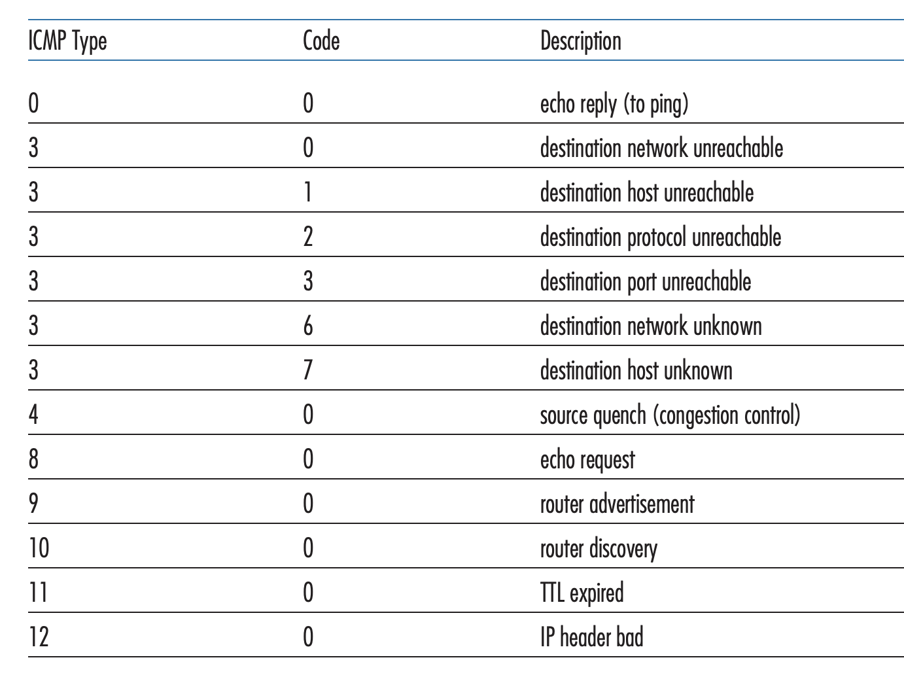

## ICMP: Internet Control Message Protocol

Pages 423-425 Section 5.6

ICMP, specified in RFC 792, is used by hosts and routers to communicate network
layer information to each other. It is typically used for error reporting. For
example, when you make an HTTP request, the error "Destination network
unreachable" is a result of an ICMP error message. ICMP messages are logically
part of the network layer (IP) but in reality, ICMP messages are encapsulated
by IP datagrams. The upper layer protocol is 1 and it provides demultiplexing
capabilities like UDP and TCP. ICMP messages contain a type, code, and the
first 8 bytes of the IP header that caused the message. `ping` uses ICMP type 8
code 0 messages which is an echo request to send to a host. The host then
replies with type 0 code 0 which is an echo reply. Traceroute also uses ICMP
messages to interact with the routers on the way to a destination. It sends UDP
segments with uinlikely UDP port numbers in increasing TTL values from 1. When
the router observes that the TTL of the datagram has expired, it discards the
datagram and sends an ICMP warning message of type 11 code 0. Eventually, the
UDP segment will reach the end host. This end host will send back a type 3 code
3.

