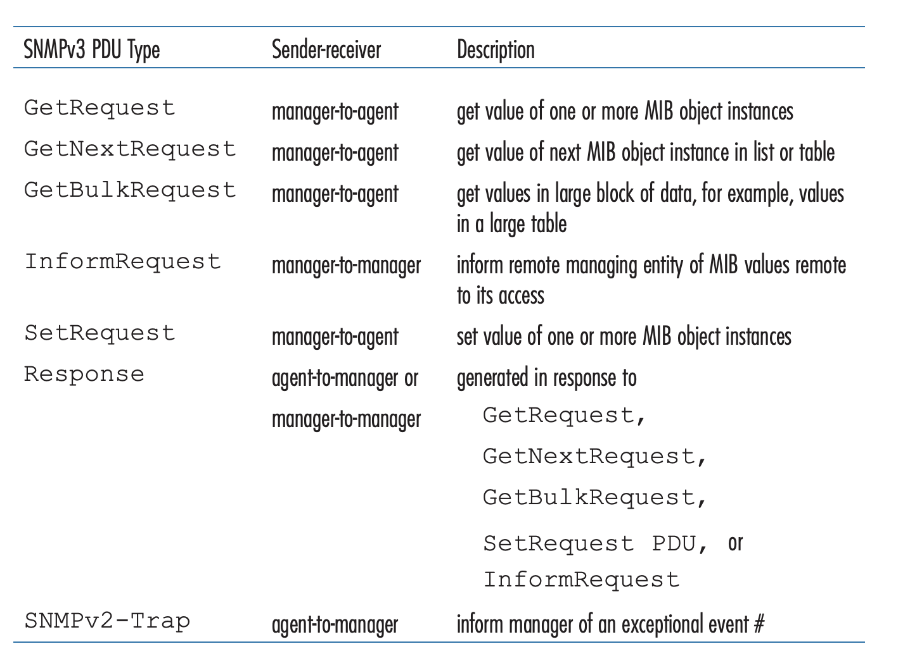
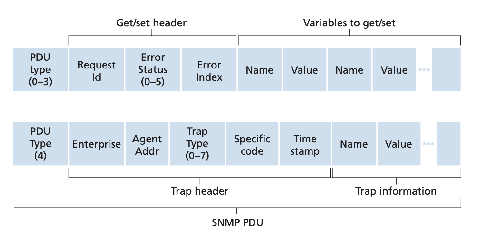
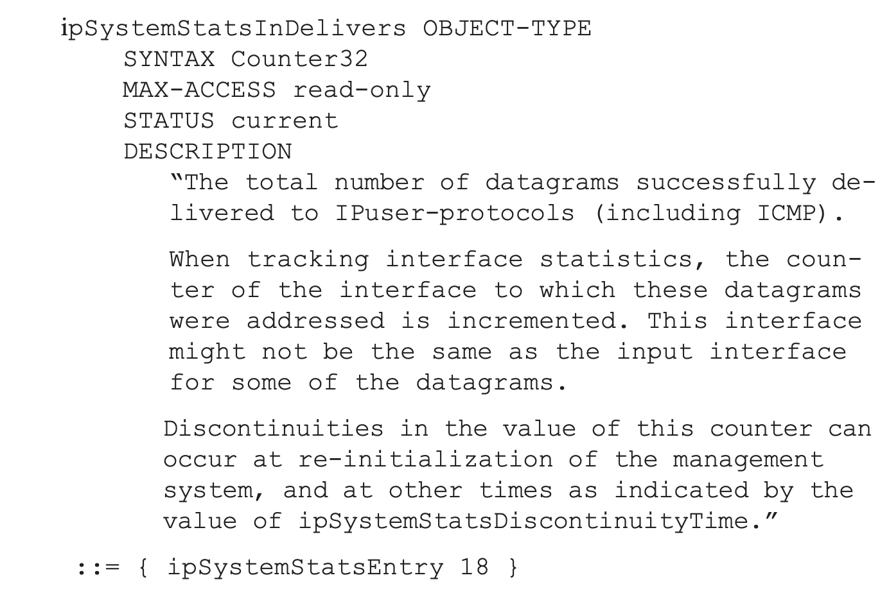
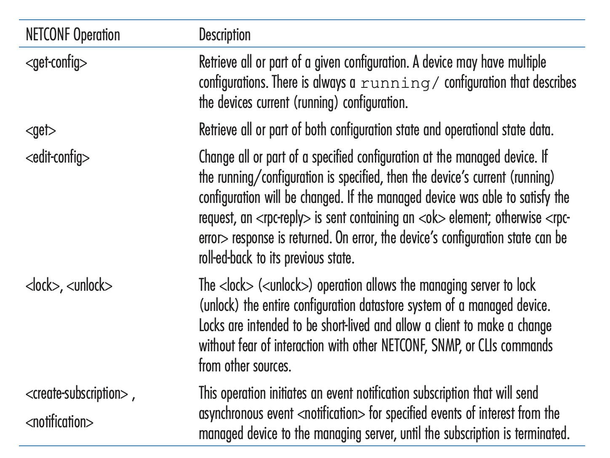

## Network Management and SNMP, NETCONF/YANG

Pages 425-436 Section 5.7

*Network management includes the deployment, integration, and coordination of
the hardware, software, and human elements to monitor, test, poll, configure,
analyze, evaluate, and control the network and element resources to meet the
real-time, operational performance, and Quality of Service requirements at a
reasonable cost.*

This subsection covers the artchitecture, protocols, and data used to manage a
network.

### Network Management Framework
The key components of a network management framework are
- Managing server: A application layer server in a network operation center
that network admins have access to. Network admins configure and monitor the
network devices through this server
- Managed devices: Networking equipment and its software like switches and
routers 
- Data: Each managed devie has data. Configuration data is the device
information such as the assigned IP or interface speed. Operational data is
data needed for the data to operate such as list of neighbors in OSPF protocol.
Device statistics are status indicators and counts such as number of dropped
packets.
- Network managment agent: Process in the managed device that communicates with
the managing server
- Network managment protocol: Protocol over which server and devices
communicate over.

In practice network administrators use three ways to manage the network
- CLI: Issue commands to the device over things like SSH
- SNMP/MIB: Query Managemnt Information Baes (MIB) using Simple Network
Management Protocol (SNMP)
- NETCONF/YANG: A network wide approach to managment. Use YANG, a data modeling
language, to model configuration and operational data. NETCONF protocol
communicates YANG-compatible actions and data to and from devices

### Simple Network Management Protocol (SNMP) and Management Information Base (MIB)
SNMP is an application layer protocol to convey network management control and
information messages between managing servers and a managed devices. Typically,
it is used in request response mode where the management server requests to
query or modify MIB values. It can also be used for devices to send trap
messages to the manager, notifying the manager of exceptional situations.

SNMPv3 have seven types of messages known as protocol data units (PDU). The
seven types are:

A PDU has the following format:

The PDU is typiclly carried in a UDP datagram. However, because UDP is an
unreliable transport, there is no guarantee that a request or a response will
be received by the destination. The request ID is used to differentiate between
different requests and detect lost messages.

Management Information base: In the SNMP/MIB approach, network management is
represented as objects. An MIB object can be a counter descriptive information
such as whether the device is functioning, protocol sepcific information such
as routing path. Related MIB objects are gatehered into modules (for example
for TCP or UDP). An example of an MIB object is `ipSystemStatsInDelivers` which
defines a 32-bit counter that tracks the number of successfully IP dastagrams
to the upper layer protocol.

### Network Configuration Protocol and YANG
NETCONF allows messages to 1) retrieve, set, and modify configuration data 2)
query operational dasta and statistics 3) subscribe to notifications generated
by managed devices. The managing server controls devices by sending it XML
documents with RPCs using a secure, connection oriented protcol like TLS over
TCP. Some important NETCONF operations are:

YANG is a data modelling language used to manage network configuration data in
much the same way SNMP uses MIB.
