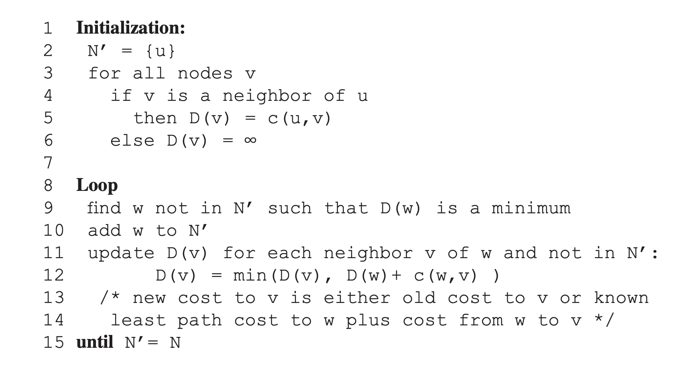
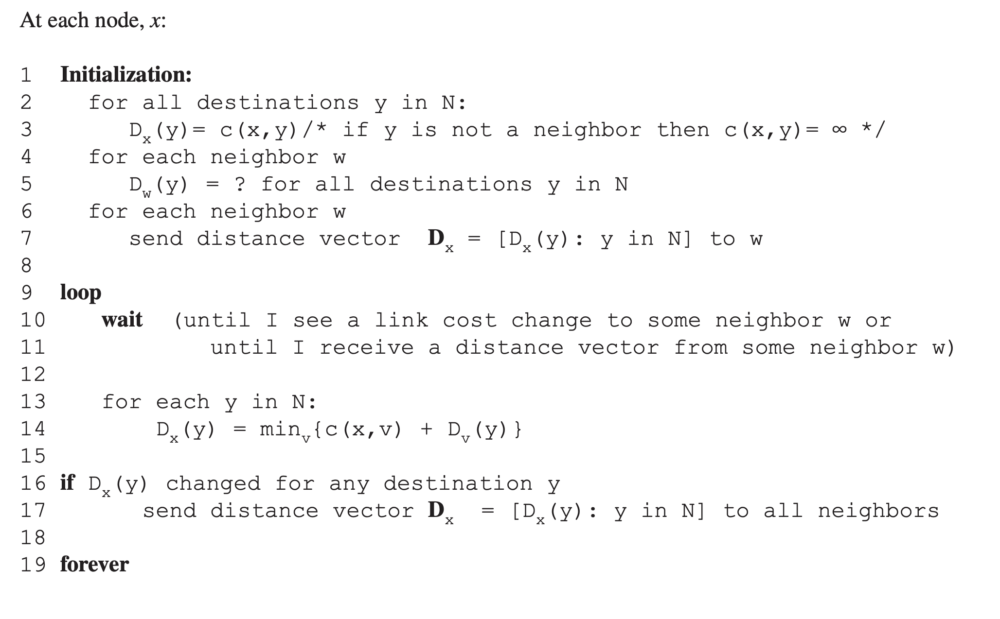
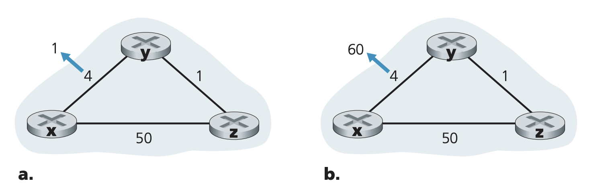

## Routing Algorithms

Pages 380-395 Section 5.2

Routing algoirthms determine the lowest cost path to get from the source to the
destination. Broadly, there are two approaches to routing, centralized or
decentralized. Centralized routing algorithms compute the least cost path
between hosts using a complete, global understanding of the network. This means
it requires information on all connectivity and edge weights between nodes.
Centralized routing algorithms are referred to as link-state algorithms.
Decentralied algorithms calculate the least cost path in iterations performed
at each router. No node has complete information about the network and instead,
each node starts with only an understanding of its directly connected links and
through a protocol, it gradually learns about its neighbouring nodes and a
least cost path to the destination. Decentralized algorithms are referred to as
distance vector algorithms.

Routing algorithms can also be classified in how often they change. Static
routing algorithms change very slowly. Dynamic routing algorithms change the
routing paths as the network traffic loads or topology chanes.

A third way of classifying routing algorithms is whether or not they are load
sensitive, taking into consideration the congestion of a link.

### Link State Algorithm
In LS, the network topology and all link costs need to be known to route
packets. This is done with protocols like OSPF where each node broadcasts link
state packets that contain a nodes directly attached links and costs to all
other nodes in the network. A commonly used algorithm for LS routing is
Dijkstra's. It computes the shortest path from one node to all other nodes. 

The output of Dijkstra's is the least cost path from a source to node to all
other nodes in the network. Then, the forwarding table at each node just needs
to store the next hop in the least cost path. This is repeated for all nodes in
the network as the source node so the forwarding table at each node will
contain for each destination node, the next hop to take. The computational
complexity of this algorithm is $O(n\log{n})$ if a heap is used to find the
next least cost node and this is repeated for each node in the network.

The cost of a link is often computed by congestion or delay based metrics (ie
measuring RTT). This means that the costs of the links are dyanmic depending on
the congestion and can change over time. This can cause scenarios where the
shortest path oscillate back and forth between two paths. You initially route
through path A but that causes congestion in path A increasing the link cost of
path A. Now, the new least cost path is determined to be path B but routing
through path B also causes congestion and the link cost to increase. Because
path A is not being used, there is no more congestion in that path and in the
next computation of the shortest path, path A is chosen. A solution to this is
to have the nodes compute the LS algorithm at different times. This can be done
by randomizing the time each node sends out link advertisements.

### Distnace Vector Algorithm
In DV, each node initially starts with information on its connectivity and link
costs. Over time, nodes communicate to understand the connectivity of its
neighbors. The DV algrithm is iterative, asynchronous, and distributed. It is
distributed in the sense that each node receives some information from one or
more of its directly attached neighbors, performs some calculation, and
distributes the results of the calculation to its neighbors. It is iterative in
that this propagation is continues until no more information is exchanged
bewteen neighbors. It is asynchronous in the sense that it does not require all
of the nodes to operate together, a portion of the network can run this
algorithm while a different portion might be down.

The DV algorithm is based on the Bellman-Ford equation $d_x(y) = min_v(c(x,
v)+d_v(y))$. This equation essentially means you take the minimum out of all
the different paths you can take to get from $x$ to $v$ and then $v$ to $y$. To
get the shortest path from $x$ to $y$, out of the neighbors of $x$, denoted as
$v$, you take the minimum sum of the cost from $x$ to $v$ and $v$ to $y$. The
output of this algorithm is the minimum cost from $x$ (the node that ran it) to
get to destination $y$ but also the next hop to get to $y$, $v$.

Each node maintains the following state:
- The link cost between its direct neighbors
- The node's distance vector that contains the next hop and cost to get to a
certain destination node.
- Each neighbors' distance vector

The node's own vector is initalized with each non-neighboring node is
initialized as infinity. The node's neighbors' vector is initialized as
unknowns. Each node then sends its vector to all of its negihbors. Then, the
algorithm goes into a loop waiting for new messages from its neighbors
announcing a link cost change. If it sees that the vector of its neighbor
changeed, it goes through each node in the network and updates the minimum cost
to each node using the Bellman-Ford equation. If its own vector has changed, it
announces it to all of its neighbors.

Note that each node doesn't know all of the other nodes in the network. It
learns about nodes that aren't directly connected to it via vector updates from
its neighbors. The DV algorithm also naturally comes to an end when there are
no more updates to be shared. This happens because each node only sends out
changes to its DV if there is a change. Once all of the nodes converge, there
are no more updates to be shared until the network changes.

A weakness of the DV algorithm is that it can fall into an infinte loop when
link cost increases. Consider the following situation. The network initially
starts at state b where x to y is 4, y to z is 1, and z to x is 5. When x to y
changes from 4 to 60, y updates is distance vector and sees that the new
shortest path is through z with cost 1 + 5. Then, z to x changes from 5 to 50.
z also updates it distance vector and sees that the shortest route to x is
through y with cost 1 + 4. Now, packets intended for x sent from y or z will be
in a routing loop between z and y.

Furthermore, as z and y share updates of their distance vectors, there is
another loop. Once y detects a change in its vector, it announces that to z. z
sees that the cost to get to x from y is 6 so it updates its distance vector to
x to be 7. z sends this change to y and y also updates it distance vector to be
1 + 7. This loop continues until the z eventually computes that the cost to get
to x through its direct connection is cheapter (when the cost to route through
y is over 50).

This looping scenario can be avoided using the poisoned reverse technique. If z
routes through y to get to destination x, then z will advertise to only to y
that its distance to x is infinity. This prevents y from trying to route
through z to get to x. However, poisoned reverse doesn't solve the count to
infinity problem entirely. If there is a loop involving three or more nodes,
poisoned reverse can't detect the loop.

### DV vs LS
- Message complexity: LS requires $O(NE)$ messages where $N$ is the number of
fnodes in the network and $E$ is the set of edges. There is no set amount of
messages for DV to converge
- Convergence: LS converges in $O(N^2)$. DV convergence can vary as it can
suffer from count to infinity problem
- Robustness: LS is a little more protected from malicous nodes since the
shortest path calculation is done at each node. DV is not since a malicious
node can announce incorrect values and get all traffic routed towards it
