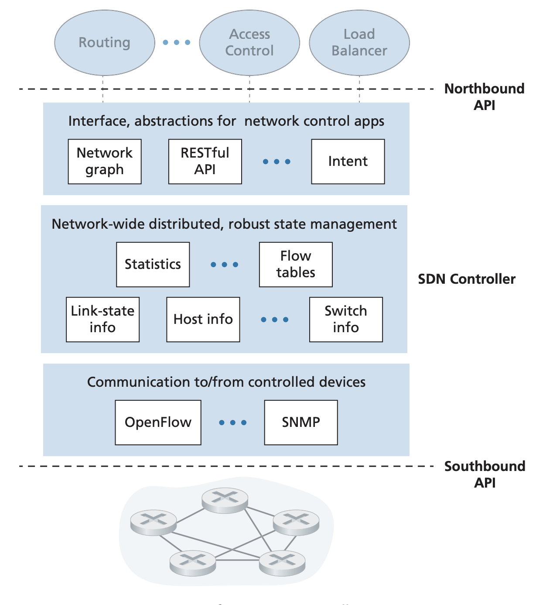
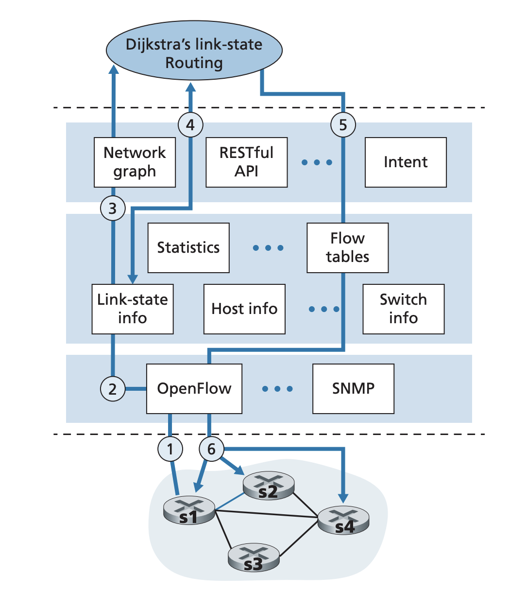

## The SDN Control Plane

Pages 411-423 Section 5.5

The four key characteristics of SDN are
- Flow based forwarding: SDN controlled switches can forward based on any
number of header field from the transport, network, and link layers. This means
it can forward based on much more than just the destination. 
- Separation of planes: The data plane consists of the switches and the
frowarding of packets based on the match + action pattern. The control pane
consists of servers and software that determines the flow tables in the
switches.
- Network control functions: The logic behind managing flow tables and routing
is spearte from the actual switches. The control plane consists of two
components, and SDN controller and a set of network control applications. The
controller maintains the state of the network and provides the information to
the network control applications.
- Programmable network: The network control applications provide various
different functionalities. Through the SDN controller, these network control
applications can serve as routers determining the path between two end hosts
using different methods (link state Dijkstra's), access control that determines
what packets are blocked by the swithces, or load balancers.

In this way, SDN provides a significant uncoupling of the switches, the
controller, and the network control applications. Before SDNs, a switch or
router was monolithic in that it had to provide the data and the control plane
functionalities and was typicall sold by a single vendor. With SDN, the
different components can be from different entities.

### SDN Controller and SDN Network Control Applications

The SDN control plane is split into two components, a central control and
various network control applications. A SDN controller mainly provides
functionality in three layers
- Communication layer: The SDN controller needs to be able to communicate with
network control devices like switches and hosts. The control devices also needs
to be able to communciate with the ctonroller for things like a change in the
links or a device going down. This communication protocol is the lowest layer
of the controller architecture and interfaces with the control devices. 
- Network wide state management: This is where the logic for maintaing flow
tables is. This layer needs to maintain an accurate understanding of the
network but also provide this understanding and the flow table to network
control applications
- Interface to network control application: This layer interacts with network
control applications and allows it to read/write network state and flow tables. 

The controller is logically central. It is usually implemented as a distributed
system for fault tolerance and high availability. 

### OpenFlow Protocol
The OpenFlow protocol is the communication protocol between the controller and
the SDN controlled devices like switches and routers. It operates over TCP with
port 6653. The messages over this protocol are

Controller to device:
- Configuration: Let controller query and set a switch's configuration
parameters
- Modify state: Let controller add or delete entries in the switch's flow table
and port properties
- Read state: Let controller collect statistics and counter values from
switch's flow table and ports
- Send Packet: Let controller send a specific packet out of a specified port at
the control switch
- 

Device to controller:
- Flow removed: Inform controller that a flow table entry has been removed, for
example as a result of a timeout or as an acknowledgement of a modify state
message from the controller
- Port status: Let controller know about the status of a port
- Packet in: Send a packet that doesn't match any flow table entries to the
controler.

### Data and Control plane interactions
1. A switch experiences a link failure and it notifies the SDN controller using
Open Flow port status message.
2. SDN controller receives message and notifies link state manager which
updates a link state storage. 
3. A network control application that implements Dijkstra's is registered to
receive notifications of link state changes. The application receives this
change notification
4. The control application runs Dijkstras to compute the new lowest cost paths
5. The control application communicates with the link state manager to update
flow table
6. Flow table manager uses OpenFlow to update the flow tables at the switches

