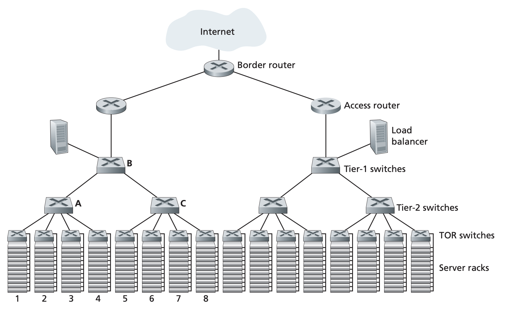

## Data Center Networking

Pages 505-512 Section 6.6

Data centers consist of hosts, infrastructure such as transformers and per
suppies, and network infrastructure. Hosts are stacked in racks with each rack
having around 20 to 40 hosts. These hosts are conneted to a top of rack switch
that interconnects the hosts in the rack with each other and other switches in
the data center.  Datacenters support traffic from external clients and traffic
between internal hosts. Border routers connecting the datacenter and the
internet handle traffic from external clients

### Load Balancing
External requests are first directed to a load balanger who distributes the
requests across multiple hosts. It also performs NAT like function where it
translates the external IP adress to the internal addresses of hosts,
preventing direct access to hosts for security reasons.

### Hierarchical Architecture
For large datacenters with tens of thousands of hosts, a hierarchy of switches
and routers are used as shown in the image above. At the highest level is the
border router that connects the data center to the Internet. The border router
connect to access routers. Access routers connect to tiers of switches where a
tier-1 switch connects to multiple tier-2 switch which connects to multiple TOR
switches. The network equipment is also connected for redundancy. A TOR switch
can connect to two other tier 2 switches in case one fails and each tier 2 and
tier 1 switch can be duplicated. One of the main challenges of data center
networking is host to host communication. Ways this issue can be solved are
- Use higher rate switches and routesr. More expensive and doesn't scale
- Co locate related services and data as close together as possible physically
- Have increased connectivity between TOR switches and tier 2 switches, between
tier 2 switches and tier 1 switches

### Trend in Data Center Networking
- Cost Reduction: In order to reduce costs while maintaining and improving
delay and throughput, new network designs for data centers are constantly being
designed. An example of this is the Clos topology that arranges the network and
hosts into hierarchies, essentially creating a giant crossboar switch between
hosts
- Centralized SDN Control and Management: Data centers are managed by a single
entity so SDN like logically central controllers are used in data centers.
Because organizations control all aspects of the data center, the flexibility
and rich routing, statistics, and observation features that SDN provides is
desirable.
- Physical contstraints: Data center links have high capacity and have
extremely low delays. Consequently, buffer sizes are small and congestion
control protocols such as the on in TCP do not work well in data centers. Data
centers require hosts to react fast to congestion and have very little packet
drop. To address this, new TCP variants and technologies have beend developed
