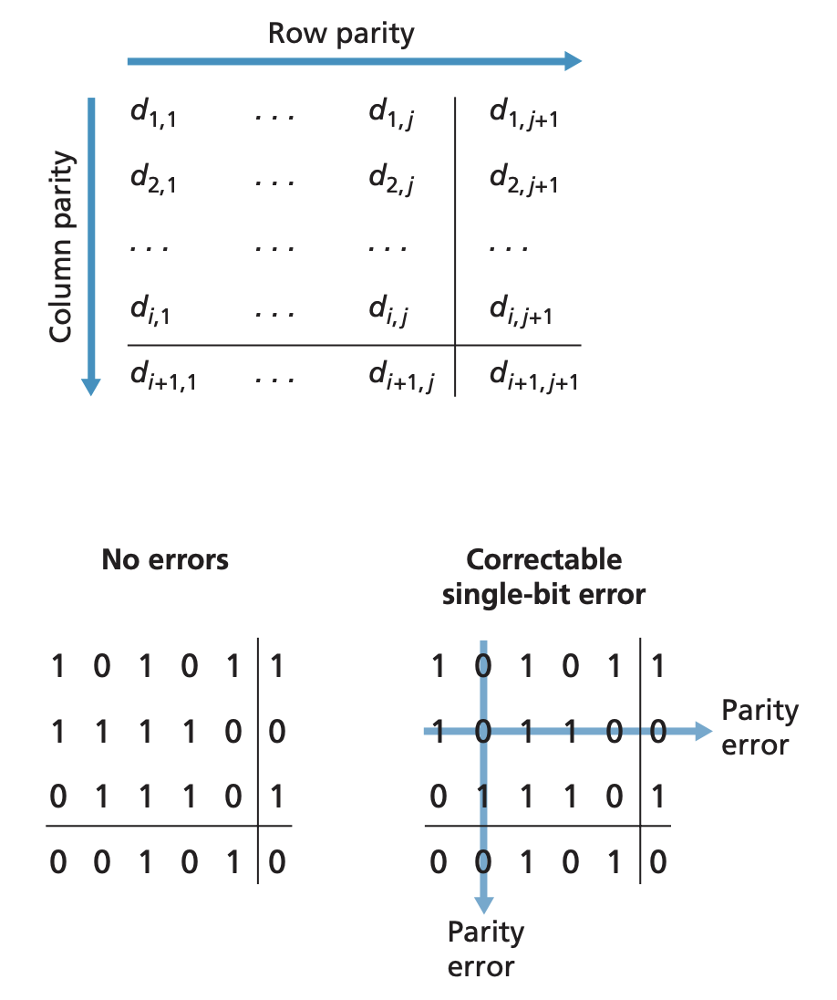
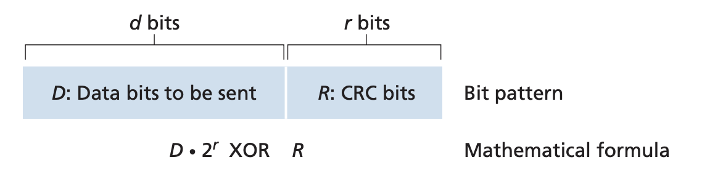
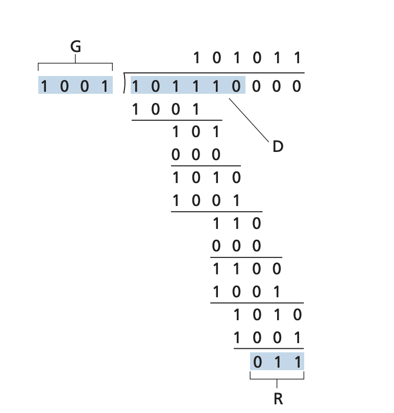

## Error Detection and Correction Techniques

Pages 455-461 Section 6.2

In the link layer, the data along with the frame headers are used to generate
error detection and corretion bits called EDC. The frame $D$ along with the EDC
is sent along the medium and the receiver recieves data $D$' and EDC'. The job
of the receiver is to try to detect and error from what it receives. Note that
error detection allow the receiver to sometimes but not always detect bit
errors. There are three common techniques used for error detection and
correction, parity checks, check-summing, and cyclic redundancy checks.

### Parity checks
The simplest form of error detection is the use of a parity bit. The parity bit
is simply a single bit that indicates whether or not the number of 1s in the
data + the parity bit is even or odd. A parity scheme can be either even or
odd. In an even parity scheme, the sender simply checks the number of 1s in the
data and makes the parity bit 1 or 0 to make sure that the number of 1 bits in
the data sent is even. In an odd parity scheme, the sender does the same except
it changes the parity bit to make sure there an odd number of set bits. The
receiver has to check the received data. In an even parity scheme, if there are
an even number of 1s, the receiver knows that some odd number of bit errors
have occured. However, in an even parity scheme, if an even number of bit
errors occurs, the error won't be detected.

While a 1 bit parity scheme is not sufficient, the parity checking can be
generalized to be more robust. For example, the 1 bit parity checking can be
extended to two dimensions. The data $D$ is divided into $i$ rows and $j$
columns. A parity value is computed for each row and column resulting in 
$i + j + 1$ parity bits. Now, if a single bit error occurs, the parity of the
affected row and column will be incorrect. The receiver will be able to detect
not only the fact that a single bit error has occured but also which bit
exactly it has occured. Two-dimensional parity can also detect any combination
of two errors in a packet. 



The ability to both detect and correct errors is known as forward error
correction (FEC). 

### Checksumming methods
In this method, the $d$ bits of the data are treated as a sequence of $k$-bit
integers. One method of checksumming is the Internet checksum where the data is
treated as 16-bit integers and summed. The 1s complement of the sum is the
checksum in the IP header. The receiver takes the data received including the
header (and the checksum) and checks whether the 1s complement is 0 (the idea
is that if you add the data as well as the checksum, the sum should be 1 if
there are no bit errors, more info in section 3.3). If any bit is 1, this means
that there is an error. In IP, the checksum is over only the IP header. In TCP
and UDP, the checksum is over the entire segment including the header.
Checksumming is simple and has little payload overhead but provide relatively
weak protection against errors as compared to cyclic redundancy checks which is
what is often used in the link layer. The network and transport layer use
checksumming because it is implemented in software. It is important the error
checking is simple and fast to do. However, CRC is done in dedicated hardware
components which can do the more complex CRC checks fast. 

### Cyclic Redundancy Check (CRC)
CRC is the commonly implemented error detection technique. The CRC works as
follows. The sender and receiver first agree on a $r+1$ bit pattern known as a
generator, $G$. The key idea behind CRC is that for a given piece of data $D$,
the sender will choose $r$ additional bits $R$ such that the resulting $d+r$
bits is exactly divisble by $G$, ie has no remainders using mod 2 arithmetic.
Thus, the receiver simply has to receive the $d+r$ bits, divided it by $G$, and
if the remainder is nonzero, there is an error. The addition and subtraction in
CRC doesn't use carries or borrows. This means that if 1+1 becomes 0 without
the next bit being affected and 0-1 is stil 1 with the surrounding bit not
being used as a carry. This means that addition and subtraction is identical to
the XOR of the operands
```
1011 ^ 0101 = 1110
1001 ^ 1101 = 0100
```
is the same as 
```
1011 - 0101 = 1110
1001 - 1101 = 0100
```

Multiplication of any base 2 value $2^k$ in binary is a left shift by $k$.
Thus, given $D$ and $R$, the quantity $D * 2^r$ ^ $R$ yields the $d+r$ bit
pattern. 



The sender then computes $R$ using the equation $D * 2^r$ ^ $R = nG$. This
essentialy means that we want to choose $R$ such taht $G$ divides the $d+r$ bit
sequence without remainder. If we XOR both sides of this equation (because
addition and subtraction is the same in this scheme), $D * 2^r = nG$ ^ $R$
which tells us that if we divide the left by $G$, the value of the remainder is
precisley $R$. Thus, $R$ is $\frac{D * 2^r}{G}$. The following is an example
where $D = 101110$, $d=6$, $G=1001$, and $r=3$. 101110000 is the left shit of
$D$ by $k$ bits. Dividing this by 1001 gives us the remainder 011. We append
this to the actual data.



There are implementations for 8, 12, 16, and 32 bit generators. Each of the CRC
standards can detect burst errors of fewer than $r+1$ bits which means that all
consecutive bit errors of $r$ bits or fewer can be detected. 

