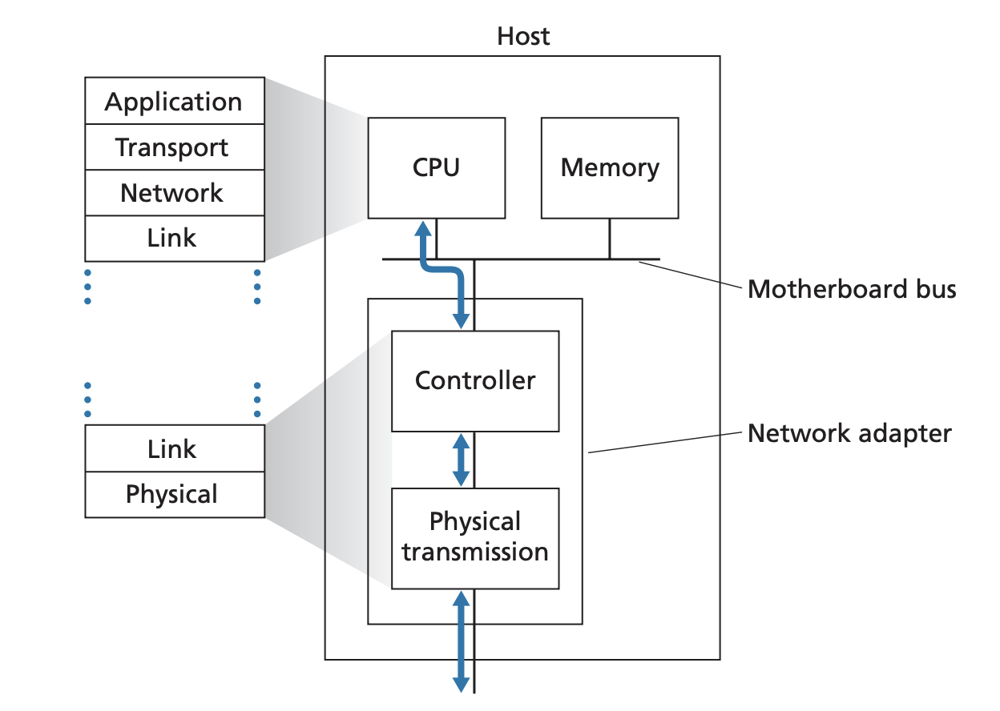

## Introduction to Link Layer

Pages 450-454 Section 6.1

The link layer is responsible for moving a datagram from one node to an
adjacent node, connected by a physical link or a wireless medium. However,
depending on the medium and the protocol, the services that can be offered can
vary but may include

- Framing: Encpasulate network layer datagrams with link layer frame. A link
layer frame contains headers and the network layer datagram as the data. The
format of the frame is dependent on the protocol
- Link access: A medium access control (MAC) protocol specifies the rules by
which a frame is transmitted onto the link. However, the protocol and the way
in which nodes are connected can vary. The link layer abstracts the complicated
process of delivery regardless of it is point to point connection or if there
are multiple nodes on the same medium
- Reliable delivery: Link layer protocol can provide reliable delivery between
nodes especially for error prone mediums like wireless. It does this with
similar principles as TCP through acknowledgements and retransmissions.
However, link layer reliable delivery is often considered unecessary for low
error rate meidums like fiber, coax, and copper and in practice is often not
implemented
- Error detection and correction: Some link layer protcols provide mechanisms
to detect bit errors since there is no need to forward datagrams that have
rrors.

The link laer is often implemented in specialized hardware devices called
Network Interface Card/Controller (NICs). While some features of the link layer
are implemented in hardware, parts of it is implemented in software that run on
the host's CPU. The software compnent perform higher level functionalities such
as assembling link layer addressing information and activating the controller
hardware. 

