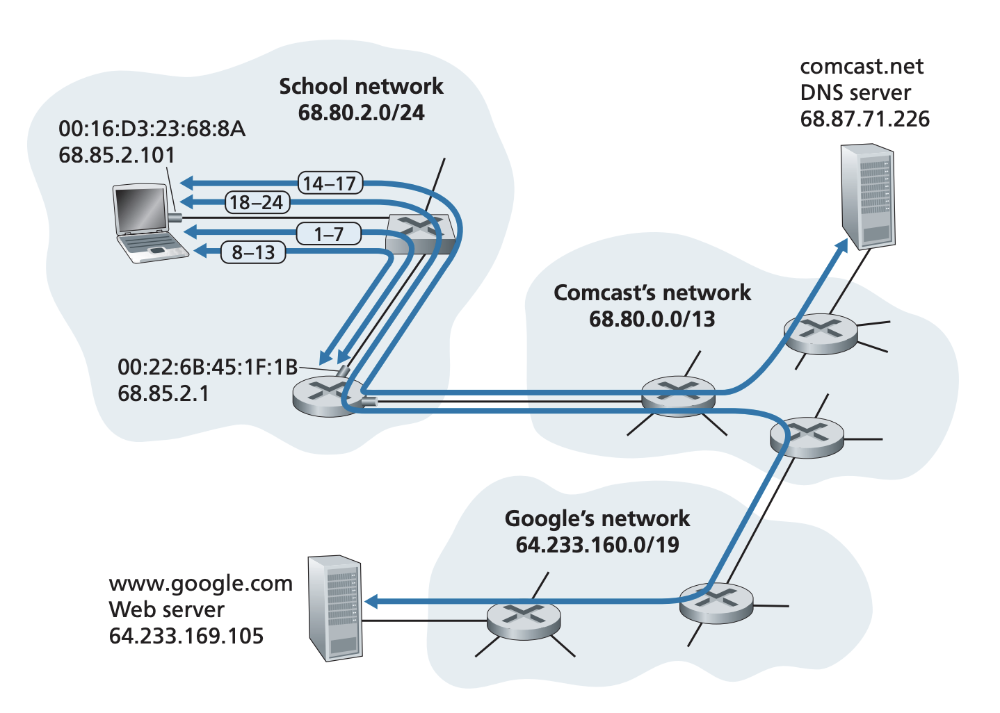

## Retrospective: A Day in the Life of a Web Page Request

Pages 512-518 Section 6.7

This is a full recap of what protocols are used when you do something simple on
the internet such as downloading a web page. The scenario is that a student
connects his laptop to the school's Ethernet switch and downloads a web page.

### Getting Started: DHCP, UDP, IP, and Ethernet
The student's laptop is connected to the network via an Ethernet cable which is
connected to an Ethernet switch which is in turn connected to the school's
router. The school's router is connected to an ISP which provides a DNS
service. Before the student can do anything, the student's laptop needs to
obtain an IP address and the default gateway.
1. The OS on the student's machine creates a DHCP request message and puts this
message in an UDP segment with the port 67 as the destination port. This UDP
segment is put in an IP datagram with a broadcast address of 255.255.255.255 as
the destination and the source address as 0.0.0.0. 
2. The IP datagram is put in an Ethernet frame. The Ethernet frame has a
destination MAC address of FF.FF.FF.FF.FF.FF which is the broadcast address
and the source as the laptop's MAC address. This Ethernet frame is broadcasted
to all hosts connected to the switch where one of them will be the DHCP server.
3. The switch receive's the Ethernet Frame containing the DHCP request and
broadcasts it to all of its ports including the port that is connected to
the router
4. The router receives the Ethernet frame with the DHCP request in its inteface
connected to the switch. The router inspects the IP datagram and sees that
the destinatino is a broadcast address so the host must also see this segment.
The UDP segment within the IP datagram is given to the UDP protocol and the UDP
protocol demuxes the UDP segment and forwards it to the DHCP server running on
the router.
5. The DHCP server running on this router is allowed to allocate addresses
within the CIDR block 68.85.2.0/24. The DHCP server allocates an IP for the
student's laptop and it creates a DHCP ACK message containing the IP adress,
the IP address of the DNS, the IP address of the default router, and the subnet
of 68.85.2.0/24. The DHCP message is encapsulated in a UDP segment that is
encapsulated in an IP datagram which is encapsualted in an Ethernet frame. The
Ethernet frame has a source MAC address of the router's NIC that it is going
out of and a destination MAC address of the student's laptop.
6. Because Ethernet switches are self-learning and it has previously seen what
interface the frame from the laptop came from, it knows what interface to
forward the frame from the DHCP server to. It also learns what port the DHCP
server's MAC address is located in.
7. The student receives the frame containing the DHCP ACK. It extracts the
payload and records its IP address and the IP address of the DNS srever. It
also adds the IP address of the default gateway in the IP forwarding table. Any
destination with IP address outside of the 68.85.2.0/24 block will be sent to
the gateway router. The student's OS also sends back another DHCP message
echoing the configuration provided by the DHCP server, essentially confirming
that it has chosen the IP address provided by this DHCP server. The server ACKs
this second DHCP message from the laptop.

### Still Getting Started: DNS and ARP
In order to get the IP address of the webpage that the student is trying to
download, the DNS protocol is used.

8. When the student makes a request to the webpage, the OS needs to know the IP
address of the webpage. The OS will create a DNS query message putting the
url in the question section. The DNS segment is put in a UDP segment with the
destination as port 53. The UDP segment is put in an IP datagram with the
destination address of the DNS that was received in the DHCP exchange
previously.
9. The student's laptop puts the IP datagram in an Ethernet frame. The laptop
wants to send the frame to the gateway router (because the DNS is outside of
the school's subnet). However, the laptop (more specifically the NIC on the
laptop) doesn't know what MAC address to send the frame to. In order to find
what MAC address corresponds to the IP address of the gateway router. The NIC
uses the ARP protocol to to find this MAC address.
10. The NIC creates an ARP query message with the target IP the address of the
gateway router and the target MAC address the broardcast address
FF:FF:FF:FF:FF:FF. This is sent out and the Ethernet switch sees this frame and
forwards it to all the ports.
11. The gateway router sees this frame and gives it to the network layer. The
network layer sees that the target address is itself and thus prepares an
ARP reply with its MAC adress in the message. The ARP reply is placed in an
Ethernet frame with the destination address as the student's laptop. The frame
is sent to the switch and the switch forwards it to the student's laptop.
12. The student's NIC sees the ARP reply and extracts the MAC address from the
ARP reply.
13. Bob's laptop can now address the gateway router. It creates an Ethernet
frame containing the DNS query and the gateway router's MAC address as the
target. It sends it out to the switch and the switch forwards it to the gateway
router.

### Still Getting Started: Intra-Domain Routing to the DNS Server
14. The gateway router receives the frame and exracts the IP datagram. The
router looks up the destination which is the DNS server and determines that
the interface to send the IP datagram out of is the one connected to the ISPs
router. The IP datagram is placed in an Ethernet frame with the target as the
ISPs router. The router knows about the ISPs router through inter-AS routing
protocols such as BGP. 
15. The ISPs gateway router receives the frame, extracts the IP datagram, and
examines the destination address. It consults its forwarding table to
determine which interface to send the datagram out of. The gateway router knows
what interface to send the datagram out of through intra-AS routing protocols
such as OSPF (link state) or distance vector routing algorithms.
16. The IP datagram arrives at the DNS server. The server extracts the DNS
query and looks up the url in its resource records. This record may be
cached and it it does, the DNS is able to reply immediately. If it is not, the
DNS traverses the DNS hiearchy tree, first consulting the root DNS server, then
the TLD server, then the authoritative server. The DNS server creates a DNS
reply message containing the IP of the url and puts that in a UDP segment. This
is then encapsulated in an IP datagram and then an Ethernet frame. The DNS
reply traverses back to the student's laptop
17. The student's laptop now knows what the IP address of the url is. 

### Web Client-Server Interaction: TCP and HTTP
18. The student's laptop now has the IP address of the webpage. The browser on
the student's laptop first creates a TCP socket with the server that hosts
the webpage. When the socket is created and the student connects to the
webserver, there is a three way handshake. These TCP segments also go through
the IP encapsulation, Ethernet frame encapsulation, MAC address discovery,
intra AS routing, inter AS routing, etc steps. The TCP SYN segment encapsulated
within an IP datagram which is encapsulated in an Ethernet frame is sent out to
switch which is then forwarded to the gateway router.
19. The gateway router then forwards it to the ISP gateway router which then
forwards it to some other router. Evnetually, it is received in the
webserver's ISP's gateway router.
20. The TCP SYN arrives at the webserver and the TCP socket that is listening
for new connections accepts and creates a new socket for the student's
browser tab and the webserver to communicate over. A TCP SYNACK segment is
created and sent back to the student's laptop
21. The TCP SYNACK makes the travel through the webserver, through the gateway
routers, to the switch, and eventually back to the student's laptop. 
22. The sockets are now connected and the student can now make HTTP GET
requests to the webserver. The HTTP message is the payload of the TCP segment.
23. The HTTP GET request is read by the webserver which responds with an HTTP
response.
24. The HTTP reply is sent back to the student and the student is now able to
see the webpage.

