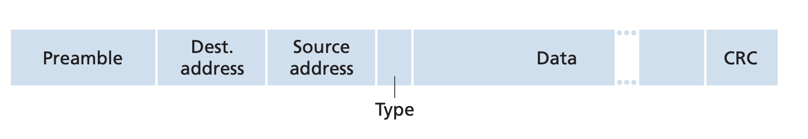
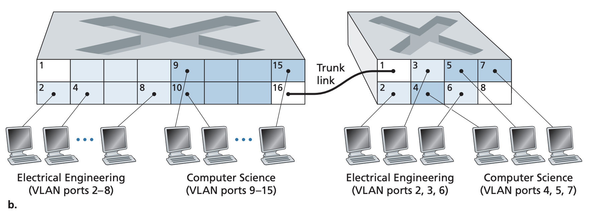

## Switched Local Area Networks

Pages 477-501 Section 6.4

Switches operate at the link layer and thus don't speak network layer
addressing and routing. Instead of IP addresses, the link layer uses MAC
addresses.

### Link Layer Addressing and ARP

MAC Addresses: Each NIC has a globally unique address known as the MAC address.
For most LANs and Ethernet, the MAC address is 6 bytes long typically expressed
in hexadcimal. MAC addresses were initially designed to be permanent but now it
is possible to change them via software. In order to get globally unique MAC
addresses, the IEEE (that manages the address space) gives each company a chunk
of the address space consisting of $2^{24}$ addresses. The company then creates
NICs with addresses within this space. When a NIC sends a frame, it attaches
the destination MAC address in the frame header. It is also possible to send to
all other NICs in the network by specifying a broadcast address in the
destinatoin. This broadcast address is FF-FF-FF-FF-FF-FF in hexadecimal. 

Address Resolution Protocol: ARP is the translation between IP addresses and
MAC addresses. When sending messages within a connected network (wired or
wireless), the sending hosts need to know the destinations MAC address for link
layer delivery. Each host and router maintains an ARP table which contains the
mapping between IP and MAC adress as well as a TTL value that indicates how
long the mapping is valid for with a typical expiration time of 20 minutes. 

If the sender doesn't know the IP resolution for a MAC address, it constructs
an ARP query that contain the sending and receiving IP addresses. The query
essentially asks all other hosts and routers on the subnet if they know the MAC
resolution of an IP address. The sender creates an APR query packet with its IP
and MAC address as the source and the known destination IP address and the
broardcast MAC address. This is encapsulated in a link layer frame and
broadcasted to all other nodes in the subnet. The nodes check to see if their
IP address matches the query's destination IP address and the one with the
match sends back a response containing its MAC address to the sender. 

When sending messages outside of the subnet, the frame must go through a
router. In these multi hop cases, at each hop the destination MAC address
should be that of the next hop and not the final destination. It is the
intermediate node's job to create a frame with the MAC address of the next hop.

### Ethernet
Etherenet is now the standard wired LAN protocol. 

Ethernet Frame: The ethernet frame consists of six fields
- Preamble: The first 7 bytes are 10101010 and the last byte is 10101011. The
preamble tells the receiver adapters to "wake up" and synchronie their clocks
the sender's clock. 8 bytes
- Destination address: MAC address of destination NIC or broadcast. 6 bytes.
- Source address: MAC address of source. 6 bytes
- Type: Which network protocol the frame encapsulates such as IP or ARP. 2 bytes
- Data: Payload with max size of MTU - ethernet overhead and minimum size of 46
bytes where rest is stuffed if too small.
- CRC: Detect bit errors. 4 bytes.

### Link Layer Switching
Switches receive incoming link layer frames and forward them to outgoing links.
A switch is transparent in that hosts and routers don't know about the
existance of a switch in the route to the destination.

Forwarding and Filtering: This is the match + action pattern that we saw
similar to routers. Filtering is the determining whether a frame should be
forwarded or dropped. Forwarding is the switch function that determines the
interface to which a frame should be directed. Switches maintain a switch table
that contains mappings between a MAC address, an inteface to send it out of,
and a time at which the entry was inserted. If no entry is found for an
incoming frame, the switch copies the frame to the buffers for all interfaces
and sends broadcasts it out of all its interfaces. 

Self Learning: Switches are able to automatically, dynamically, and
autonomously build its switch table. 
1. Initially, the switch table is empty
2. For each incoming frame, the switch stores in its table the MAC address of
the source and the interface it received it from.  The switch learns of a MAC
address by receiving packets
3. The switch deletes an entry in the table if no frames are received with that
address as the source address for some period of time.

In this way, switches are plug and play in that you just have to connect LAN
segments to the switch and it will start working

Properties of Link Layer Switching: 
- Elimination of Collisions: In a LAN built with siwtches, there is no wasted
bandwidth due to collisions because the switch buffer frames never transmit
more than one frame on a link at any one time. 
- Heterogenous links: Switches differentiate links so different parts of the
LAN can have different links and speeds
- Management: Makes life easier by doing things like disconnecting from
malfunctioning NICs and collect statistics

### Virtual Local Area Networks (VLANs)
Switches that support VLANs allow multiple vrtual local area networks to be
defined in a singular physical LAN. Hosts within a VLAN communicate as if they
were connected to a switch. A swithc's ports can be divide dinto groups where
each group/VLAN get some set of ports to work with. To connect two VLANs, a
switch also has a VLAN switch port to an external router and configure that
port to be for the different VLANs. Often times, switch vendors create switches
that have VLAN capabilities and a router so a separate router is not needed. In
order to scale VLAN switches, VLAN trunking is done. VLAN trunking takes a port
on a VLAN switch and connects that to another VLAN switch. The trunk port
belongs to all VLANs and frames sent to any VLANs are forwarded over the trunk
link to another switch. 

