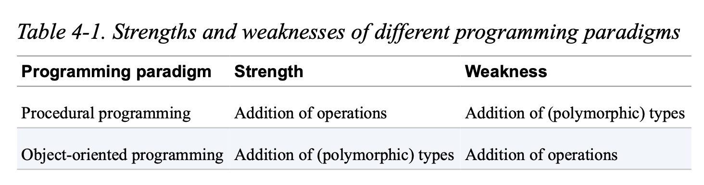

# Guideline 15: Design for Addition of Types or Operations

Dynamic polymorphism allows for easy extension of types but not operations. While it is easy to add another class that inherits from a base class, it is not easy to add a virtual method to the base class because this would require other classes that inherit from it to implement this new method as well. 

For example, if we have this base class:

Shape.h
```
class Shape {
public:
    Shape() = default;
    virtual ~Shape() = default; virtual void draw() const = 0;
};
```

It's easy to add another shape and implement the `draw()` function.

Circle.h
```
#include <Point.h>
#include <Shape.h>

class Circle : public Shape {
public:
    explicit Circle( double radius ) : radius_( radius )
    {
            /* Checking that the given radius is valid */
    }

    double radius() const { return radius_; }
    Point center() const { return center_; }
    void draw() const override;
 
private:
    double radius_;
    Point center_;
}
```

Circle.cpp
```
#include <Circle.h>
#include /* some graphics library */

void Circle::draw() const {
   // ... Implementing the logic for drawing a circle
}
```

If we wanted to draw all of the shapes then we can simply do 

```
void drawAllShapes( std::vector< std::unique_ptr<Shape> > const& shapes )
{
for( auto const& shape : shapes ) {
        shape->draw();
     }
}
```

And we could do the same for different shapes. However, now it is difficult to add another virtual method because all classes that inherit from the base class would have to implement the method. The problem here is that if we want to add functionality, we need to update the base class.

How about if we were to do it procedurally? Remove the methods from the function and have it be free functions.

The `draw()` function becomes a free function.

DrawCircle.cpp
```
#include <DrawCircle.h>
#include <Circle.h>
#include /* some graphics library */
void draw( Circle const& c ) {
     // ... Implementing the logic for drawing a circle
}
```

and in order to draw all circles, we need to do something like

```
void drawAllShapes( std::vector<std::unique_ptr<Shape>> const& shapes )
{
    for( auto const& shape : shapes ) {
        switch( shape->getType() ) {
        case circle:
            draw( static_cast<Circle const&>( *shape ) );
            break;
        case square:
            draw( static_cast<Square const&>( *shape ) );
            break;
        }
    }
}
```

Now, we can easily add a method. We don't have to update the base class, it can simply be a free function that a type is free to implement or not. However, the problem is that we would have to rely on some `switch` or `if` `else if` statements to discern the type of the shape. This would make adding a new type (a new shape) difficult because now, you have to add a new case every where you need to check for a new type.

The dilemma here is that there seems to be a trade off between being able to add a new type and being able to add a new method. 

