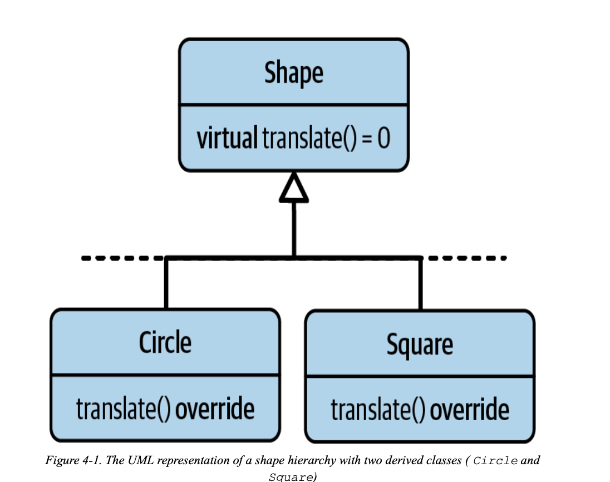
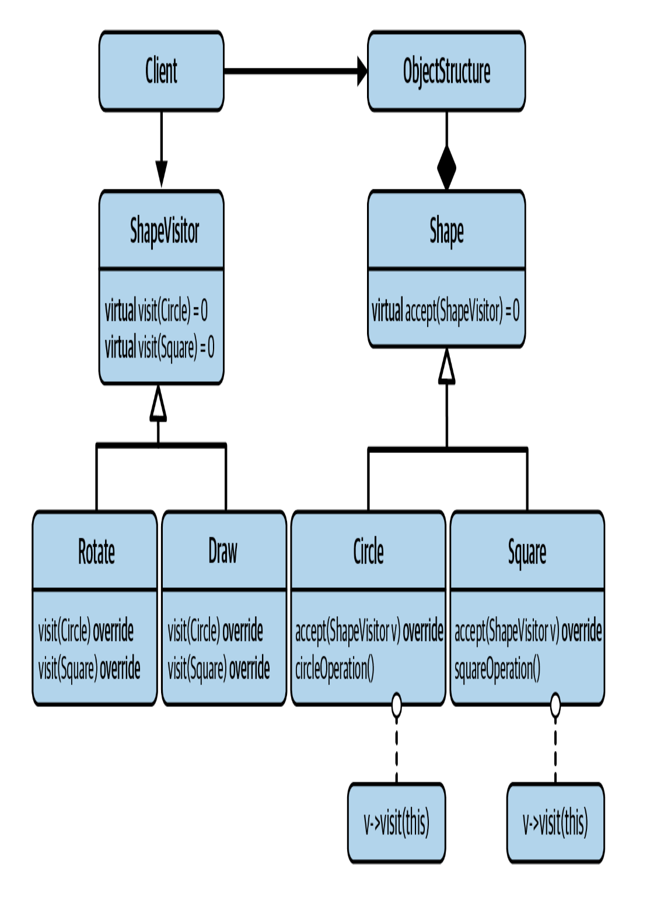
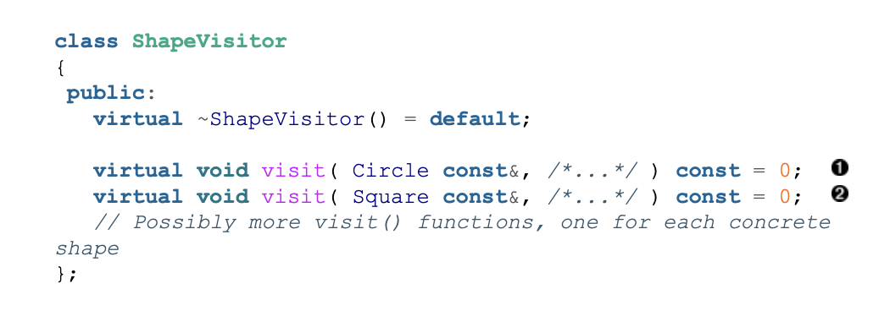
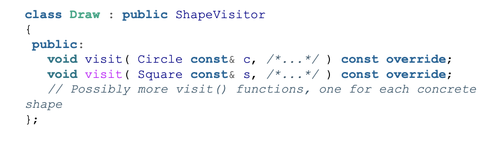
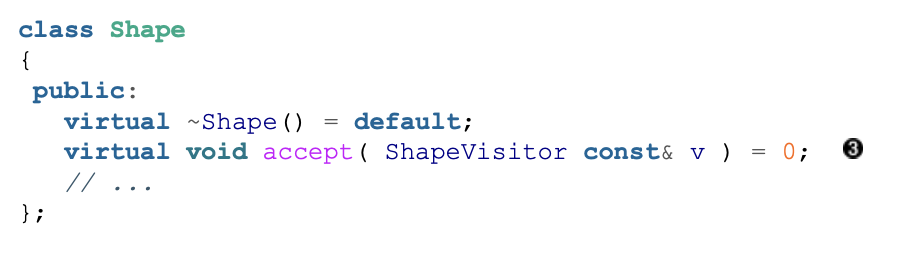
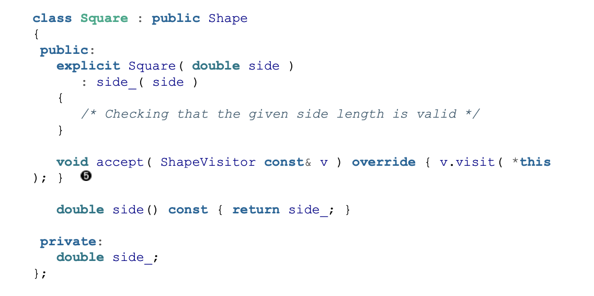
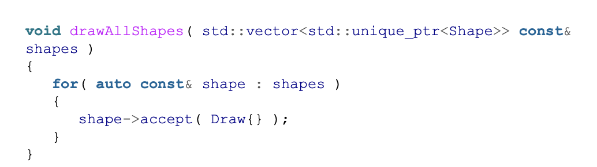

# Guideline 16: Use Visitors to Extend Operations

The Visitor pattern is the answer to OOP's weakness of adding operations.

Consider the following desgin:

You have different shapes that inherit from the base class `Shape`. There are many operations and potentially new operations that you have to add. Adding these operations as virtual functions in the `Shape` base class wouldn't work because you don't know where other people are inheriting from the base class and adding a virtual function would make them have to implement it. 

This is where the visitor design pattern comes in

> Intent: “Represent an operation to be performed on the elements of an object structure. Visitor lets you define a new operation without changing the classes of the elements on which it operates.”

We can introduce a `ShapeVisitor` base class that represents an abstraction of shape operations. 

The `ShapeVisitor` class has a `visit()` for every concret shape in the hierarchy. 

And now, you can inherit from this `ShapeVistor` to implement the operation.

This way, you don't have to modify the base class to add a new operation, you just have to add a new class that inherits from `ShapeVisitor`. Also note that this only really works if you have a fixed number of types that inherit from `Shape`.

To use the visitors, you only have to add a pure virtual `accept` in the `Shape` base class. 

and classes that inherit from `Shape` need to implement the `accept`.

And in order to actually use the `accept`, you just have to call it and pass in the operation that you want to run.

## Weaknesses

A weakness of the visitor design pattern is that operations that are very similar in implementation need to implement different `visit` functions for each type. If you consider `translate`, moving the center of a shape from one point to another, it's the same for each shape. However, you need to add a `visit` for each shape which means a lot more boilerplate.

Another weakness is that this makes it difficult to add new types. You would have to add a pure virtual function to the `ShapeVisitor` base class and add the new shape to each of the classes that inherit from `ShapeVisitor`

There is a performance tradeoff as now there are two more virtual functions, the `accept` and `visit`. These virtual functions are not cheap and come at a performance cost. 