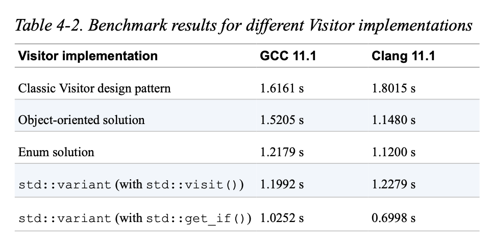

# Guideline 17: Consider std::variant for Implementing Visitor

std::variant can contain one of multiple types one at a time.

```
#include <cstdlib>
#include <iostream>
#include <string>
#include <variant>
struct Print {
    void operator()( int value ) const{ 
        std::cout << "int: " << value << '\n';
    }

    void operator()( double value ) const {
        std::cout << "double: " << value << '\n';
    }

    void operator()( std::string const& value ) const {
        std::cout << "string: " << value << '\n'; }
    };
 
int main() {
   // Creates a default variant that contains an 'int' initialized to 0
    std::variant<int,double,std::string> v{};

    v = 42;
    v = 3.14;
    v = 2.71F;
    // Assigns the 'int' 42 to the variant
    // Assigns the 'double' 3.14 to the variant
    // Assigns a 'float', which is promoted to 'double'
    
    v = "Bjarne"; // Assigns the string literal 'Bjarne' to the variant

    v = 43; // Assigns the 'int' 43 to the variant

    int const i = std::get<int>(v); // Direct access to the value
    int* const pi = std::get_if<int>(&v); // Direct access to the value

    std::visit( Print{}, v ); // Applying the Print visitor
    return EXIT_SUCCESS; }
```

std::visit allows you to apply a custom visitor to the variant. The visitor must supply an `operator()` for every alternative. 

We can use this to try doing our Shapes.

There is no need for a `Shape` base class. Each shape can be its stand alone class.

Circle.h
```
#include <Point.h>
class Circle {
public:
    explicit Circle( double radius ) : radius_( radius )
    {
        /* Checking that the given radius is valid */
    }
    
    double radius() const { return radius_; }
    Point center() const { return center_; }

private:
    double radius_;
    Point center_{};
};
```

Square.h
```
#include <Point.h>
class Square {
public:
    explicit Square( double side ) : side_( side )
    {
        /* Checking that the given side length is valid */
    }

    double side () const { return side_; }
    Point center() const { return center_; }

private:
    double side_;
    Point center_{};
};
```

You can then create a variant out of these classes
Shape.h
```
#include <variant>
#include <Circle.h>
#include <Square.h>

using Shape = std::variant<Circle,Square>;
using Shapes = std::vector<Shape>;
```

Then, you can implement an operation as such
Draw.h
```

#include <Shape.h>
#include /* some graphics library */
struct Draw {
    void operator()( Circle const& c ) const {
        /* ... Implementing the logic for drawing a circle ... */
    }

    void operator()( Square const& s ) const
    {
        /* ... Implementing the logic for drawing a square ... */
    }
};
```

There needs to be one implementation for each possible type. And now, you don't need to have switch or if statements and when adding a new type while still being able to flexibly add operations.

```
void drawAllShapes( Shapes const& shapes ) {
    for( auto const& shape : shapes ) {
        std::visit( Draw{}, shape );
    }
}
```

## Performance



Note that using std::get_if to check the type ourselves is faster than using std::visit.

## Downsides

std::variant provides an open set of operations but a closed set of types. 

It is also not good practice to put types of very different sizes since std::variant allocates memory for the biggest type. You would be wasting memory.