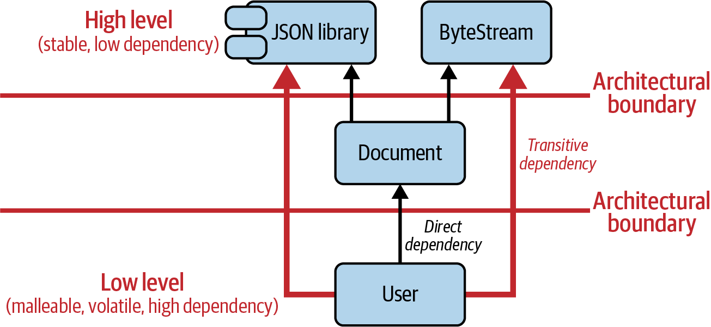
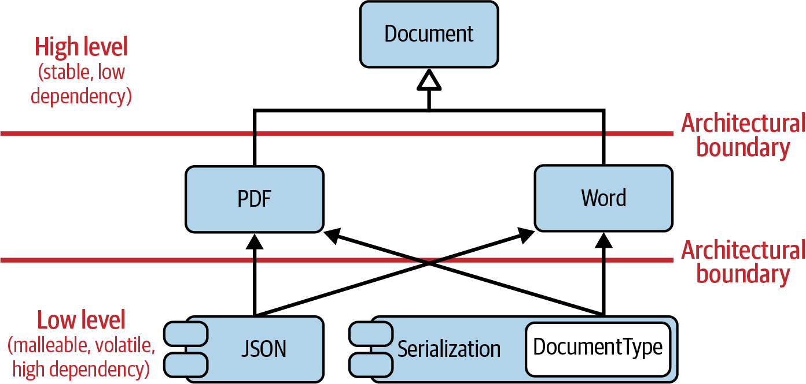

# Guideline 2: Design for Change

## Separate Concerns
A class/function/functionality should only do ONE thing. (Single Responsibility Principle). Don't create **artitfical coupling** by making one thing do multiple functinoalities.

Example: An abstract document class

Notice how this class is doing multiple things. It is a representation of a document (could be different types, formats, whatever) and it also handles exporting to different formats (JSON, bytestream)

This is a problem because there are many dependencies now. The JSON and Bytestream exporting functionalities have become dependencies of the Document class. If there is a change to the JSON library or the Bytestream class, you have to potentially change the Document class. This means you would have to make changes to any of the classes that inherit from this class.

The following structure creates **artificial coupling**. The User entity that is subject to a lot of changes is depending on the potential JSON library used

Instead, separate the functionality

## Don't repeat yourself
If the same logic is being used in multiple places, define it in one place and use that.