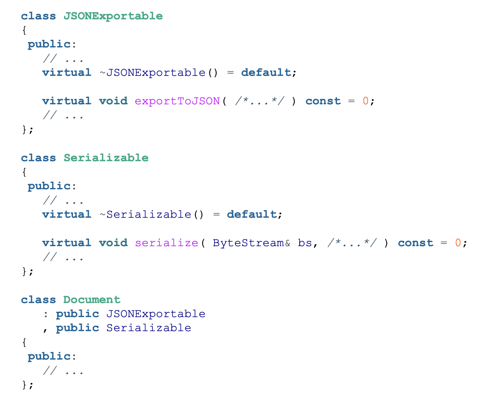

# Guideline 3: Separate Interfaces to Avoid Artificial Coupling

## Separate Interfaces == Seperate Concerns

In the following abstract document class, the Document class has interfaces for exporting to JSON and serializing.

Any deriving classes of document needs to implement both interfaces (or fake implement them) even if you might only need one of them. Furthermore, if you add another function to the Document class, now everything that dervies from it needs to implement it. 

The **Interface Segregation Principle** (ISP) form SOLI says

> Clients should not be forced to depend on interfaces they do not use.

Instead, you could do something like

Now the document class is only concerned the core logic of a document.