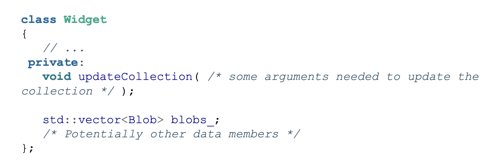
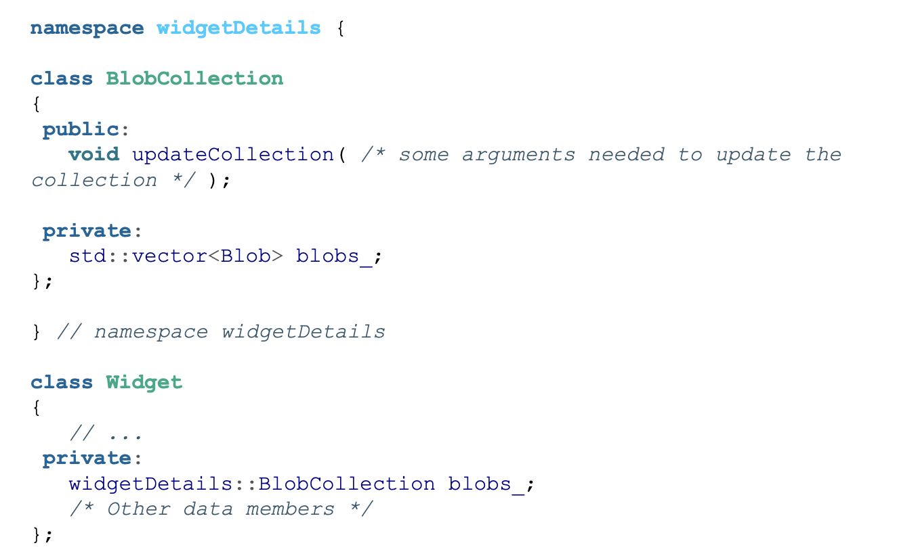

# Guideline 4: Design for Testability

## Testing private functions

Consider the following class Widget. It has a private function updateCollection that can potentially be very complex and manipulates private member variables. How would you test this?

1. Call a function that calls updateCollection. Bad because this is a *white box* test. The public function could potentially change and you would have to know the contents of that function.
2. Make a test fixture a friend class of Widget. Bad because the source code is now dependent on the Test code. 
3. Make the testing fixture inherit from the Widget class and make the function protected. This would work but this isn't the intended use of inheritance. You are kind of abusing it to gain access to a protected member function. 

Solution: Separate concerns. Is the vector of blobs and the updateCollection function really part of the Widget function? Instead, we could separate the logic of managing blobs into a separte entity. A separation of responsibilities (SRP).

Now, updateCollection is separated into its own thing. There is also even more encapsulation. updateCollection had access to every member variable and state in the class which means more ways things can go wrong. Now, it only has access to blobs. 