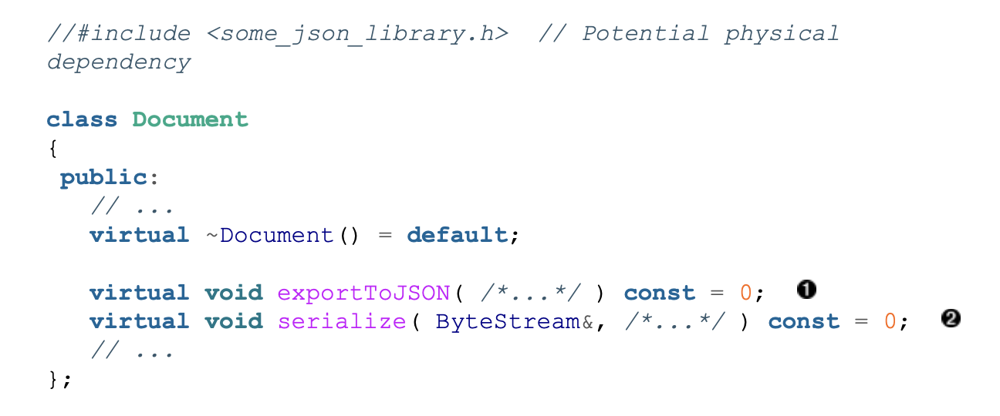
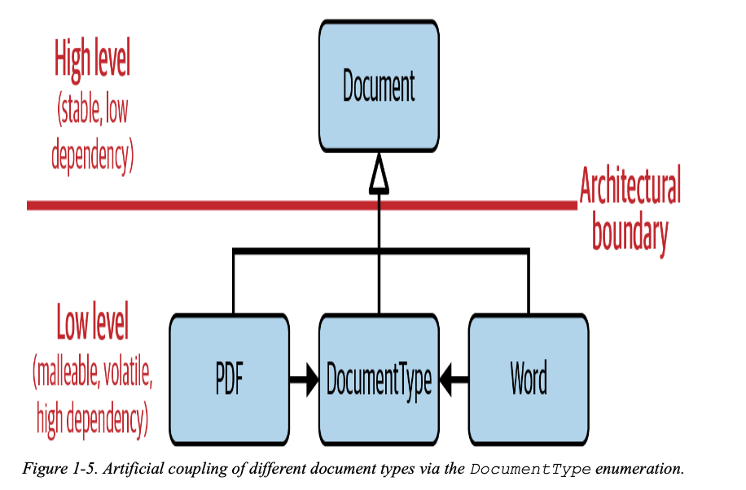
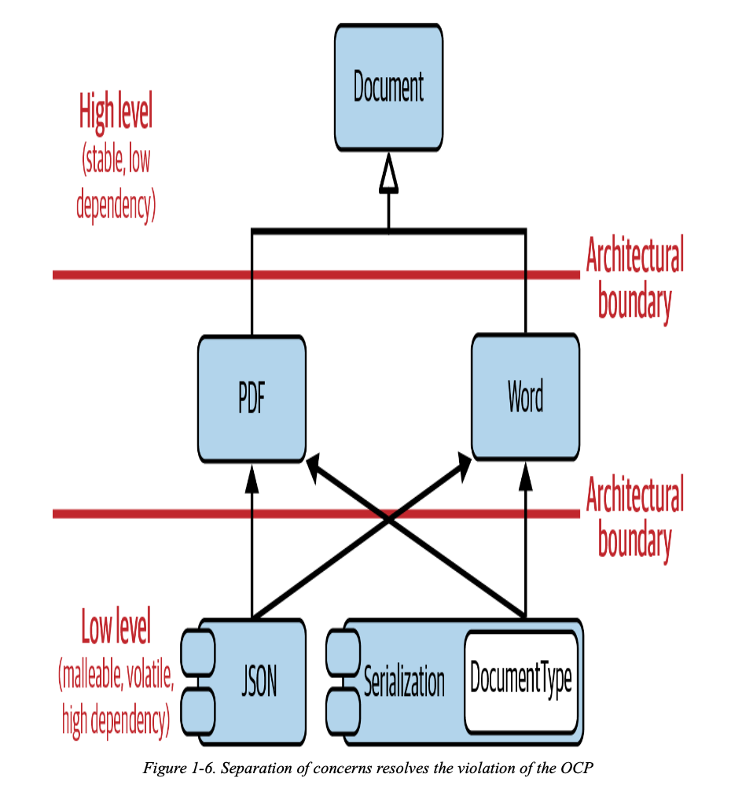

# Guideline 5: Design for Extension

From the abstract document class in Guideline 2, the initial design was to add a pure virtual function `serialize`. This was bad design because all classes that inherit the `Document` class needs to implement `serialize` even if it not going to be used but also because it limits extension. 

To serialize different types of documents, we need some kind of way to differentiate document types, maybe with an enumeration. However, the problem with this is that if you want to add another document type, the other document types can now see that change. 

The **Open-Closed Principle** (OCP) from SOLID states that 
> Software artifacts should be open for extension, but closed for modification

Each document class doesn't need to know what type of document it is. That is only relevant for serialization.

Now, only the Serialization artifact is dependent on new document classes. Other document classes like PDF and Word don't have to care if there is an addition like XML.
