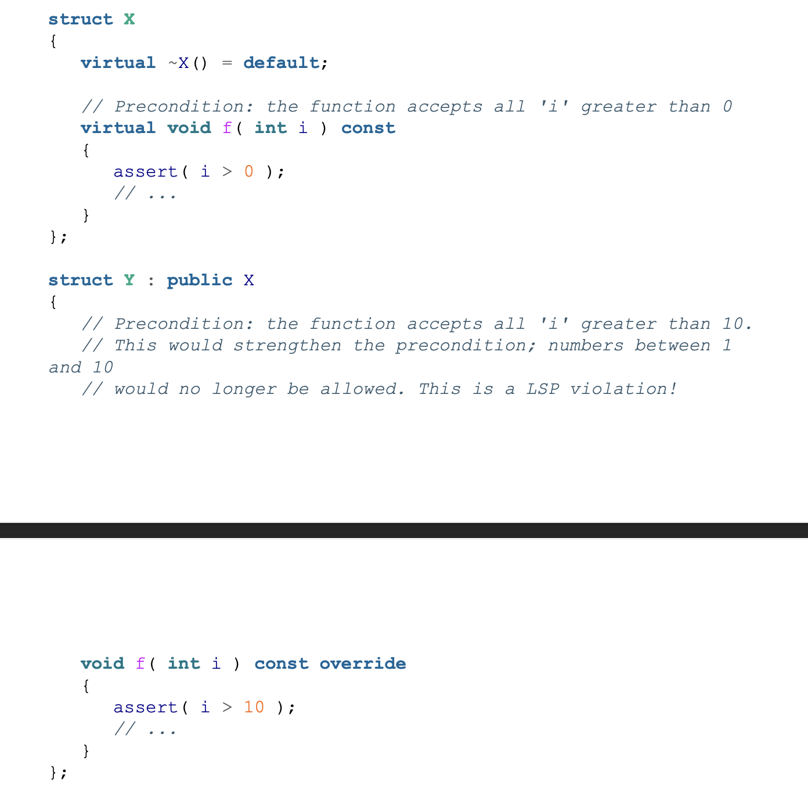
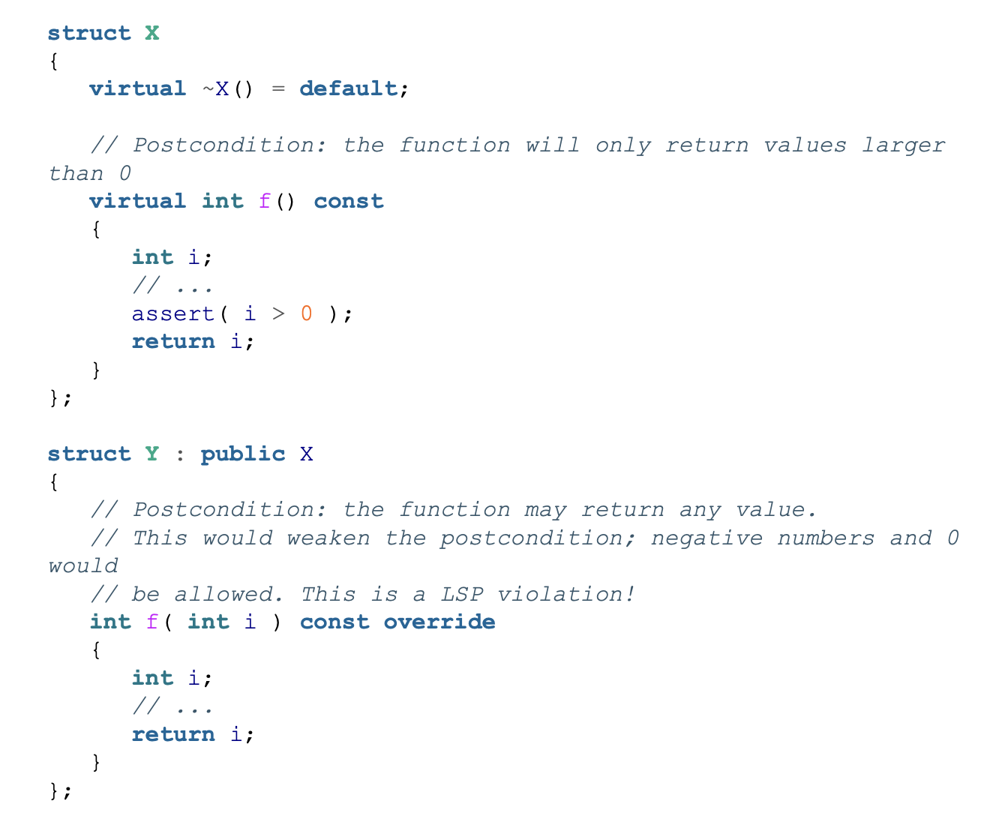
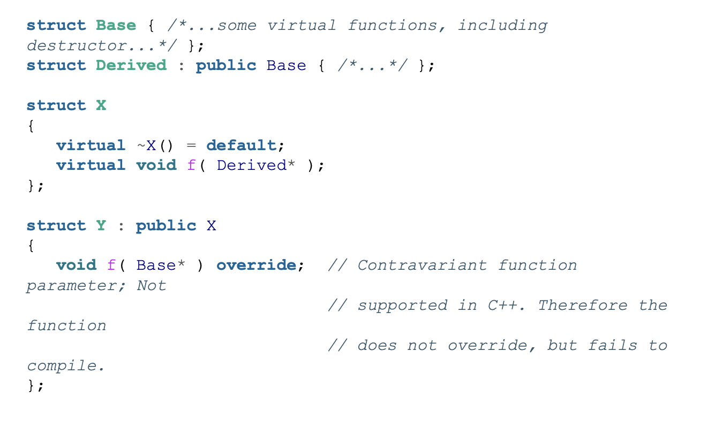

# Guideline 6: Adhere to Expected Behavior of Abstractions

## Liskov Substitution Principle

LSP is the third SOLID principle and is concerened with behavioral subtyping. 
> Subtype Requirement: Let $ \phi(x)$ be a property provable about objects $ x $ of type T. Then $\phi(y)$ should be true for objects $y$ of type S where S is a subtype of T

This basically means 5 rules

- Preconditions cannot be strengthened in a subtype. A subtepy cannot expect more in a function than what the super type expresses. For example, Y that inherits from X cannot expect a more strict precondition on function f.

- Postconditions similarily cannot be weakened in a subtype.

- Function return types in a subtype must be covariant. This means return types can be a subtype of the return type of the corresponding function in the super type. However, it cannot be a super type of the corresponding function in the super type.

- Function parameters in a subtype have to be contravriant in a member function. Subtype can accept a super type of the function parameter in the corresponding member function of the super type. This is not supported in C++.

- Invariants must be preserved in a subtype. Any expectations about state in a super type must always be valid before and after calls to member functions on the subtype

