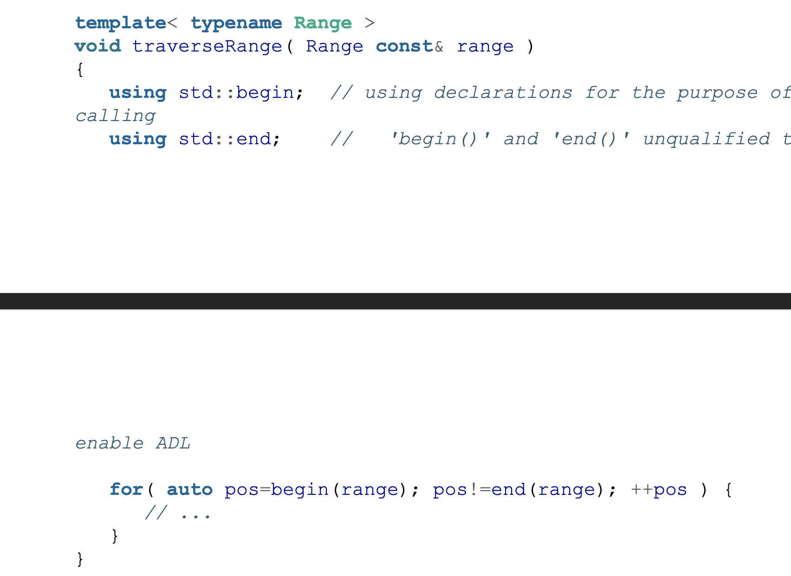

# Guideline 8: Understand the Semantic Requirements of Overload Sets

## Free Functions
You can add a free function to any type and it is non-intrusive. Adding a member function to an existing type is instrusive. Ie, you can add your own funciton `sort` that takes in different parameters as the STL but you can't add a function in the `std::vector` class.

For example: 

The `begin` and `end` member functions are supported by a lot of types but there are some that don't such as the built-in array. This will only work on types that implement the `begin` and `end` functions. 

Instead, you could use a free function to get the begin and end iterator.s 

This philosophy appears in the STL as well. The STL has **algorithms** and **containers**. They are abstracted away from each other and don't know about each other. You use iterators to combine them. 

Overloading functions also needs to adhere to LSP (Liskov Substitution Principle). For example, you can't have a swap function that only swaps some member variables of a container. This would break the existing expectation of the swap function. 