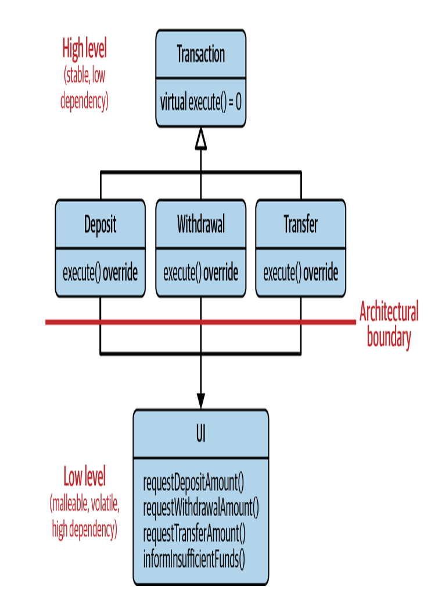
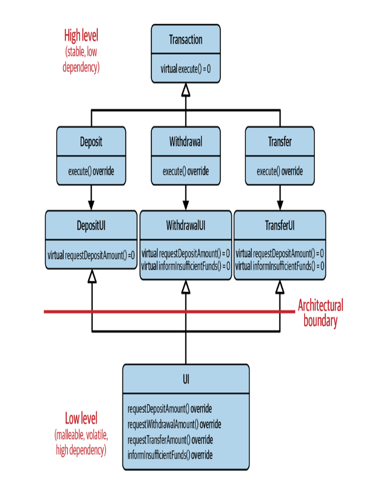
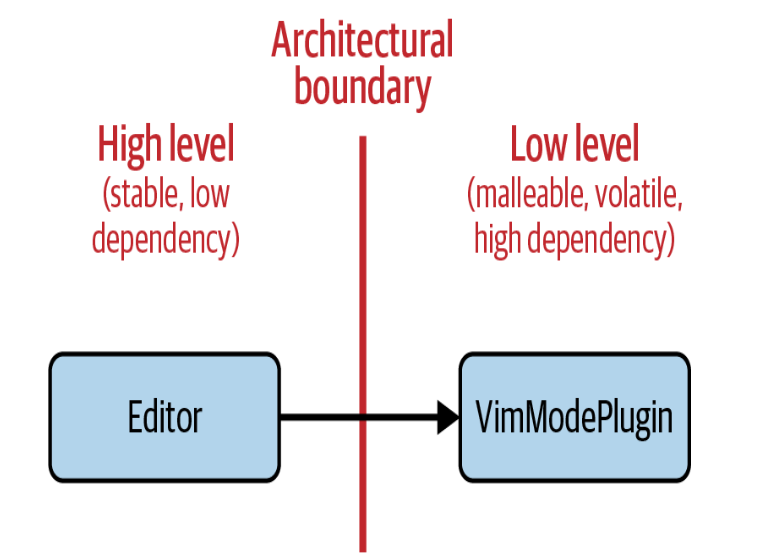
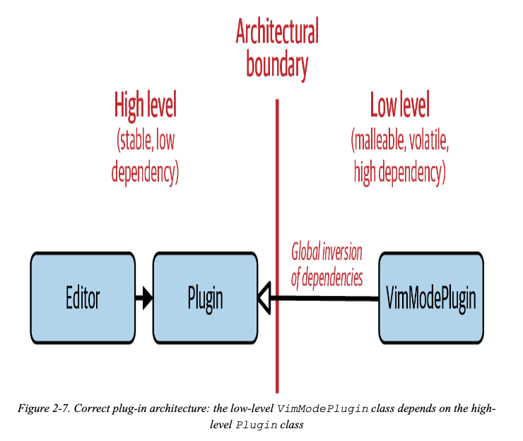

# Guideline 9: Pay Attention to the Ownership of Abstractions

## Dependency Inversion Principle
 
In the ATM example, all transactions depend on the UI class and indirectly depend on each other. This is an example of where a high level component (the transactions) that doesn't change often depends on a low level component (the UI class) that is subject to a lot of changes.


You can instead add an abstraction that represents deposits, withdrawls, and transfers as an intermeiate layer between the transactions and the UI class. This way, if we need to add another transaction type or UI component, it wouldn't affect transactions that are not relevant and you could simply add another abstraction. 

Robert Martin said
> High level modules should not depend on low-level modules. Both should depend on abstractions

> Abstractions should not depend on details. Details should depend on abstractions. 

The abstractions are part of the high level and the depending UI is the lower level. 


## Plugin Example
Another example is if you are making a text editor. You want to provide plugins for people to build. However, because the core of your editor, the Editor class depends on plugins that users can create, every time there is a new plugin you may have to change the Editor class. 


Instead, you can create an abstraction layer between the Editor and different types of Plugins. However, it is important the high level component (your code) that is stable owns the Plugin abstraction. Otherwise, users could change the Plugin abstraction causing you to adapt the Editor around that. The lower level, user plugins should depend on the abstraction for Plugins that you create, not the other way around. 


youreditor/Plugin.h
```
class Plugin { ... }
```
youreditor/Editor.h
```
class Editor { ... }
```
thirdparty/VimPlugin.h
```
#include <youreditor/Plugin.h>
class VimPlugin : public Plugin { ... }
```