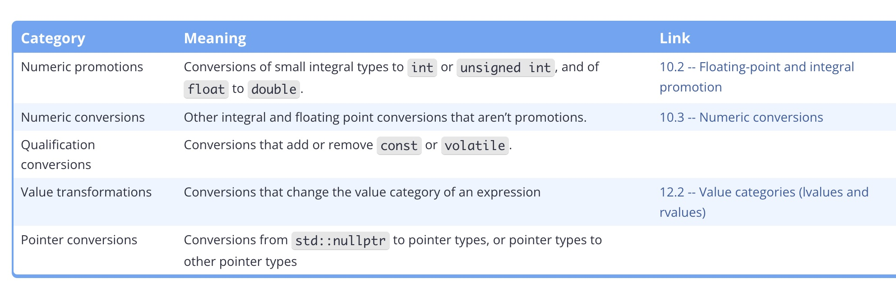
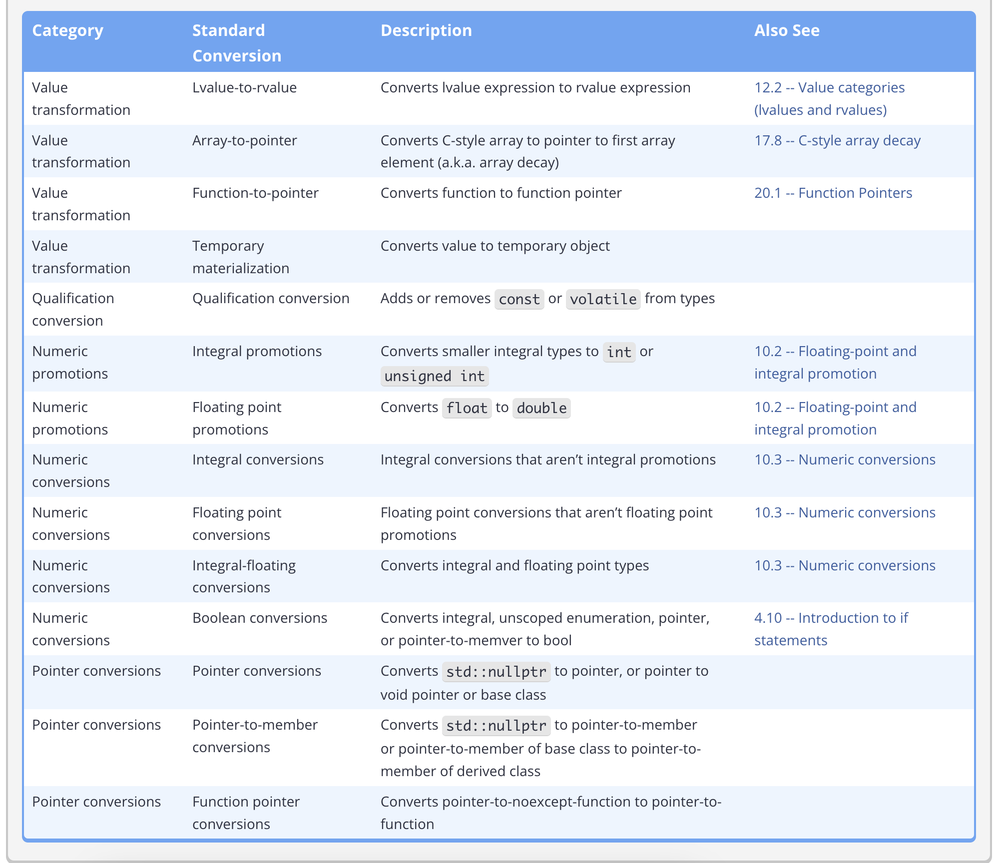

Type conversion is simply changing the binary representation of a value in one type to an equivalent representation in a different type.

For example,. the binary representation of 3 is 0b0011. If we were to directly copy this binary representation into a float, you wouldn't get 3.0 because floats interpret this binary differently. Instead you would need something like 0b0100 0000 0100 0000 0000 0000 0000 0000

There are largely 5 categories of conversions. 

There are 14 conversions in total.
