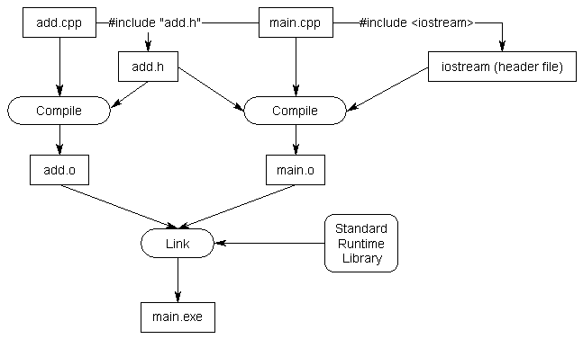

Header files containt forward declarations so that you don't have to forward declare in your source file.
The preprocessor will replace any #incldue with the actual content of the file you are including.

For example if you have the following files
```
main.cpp

#include "add.h" // Insert contents of add.h at this point.  Note use of double quotes here.
#include <iostream>

int main()
{
    std::cout << "The sum of 3 and 4 is " << add(3, 4) << '\n';
    return 0;
}
```

```
add.h

#ifndef ADD
#define ADD

int add(int x, int y);

#endif
```

```
add.cpp

#include "add.h" // Insert contents of add.h at this point.  Note use of double quotes here.

int add(int x, int y)
{
    return x + y;
}
```

The process of translation (preprocessing + compiling + linking) looks like this.


Definiitions in header files will generally break the one definition rule. This is because header files are usually included by multiple different source files. Remember that variables and functions can only be defined once but can be declared multiple times. 

There are some things that can be safely defined in header files such as inline functions, inline variables, types, and templates

#includes with <> tell the preprocessor to look for files in the include directory. This directory is usually specified by your IDE or compiler. #includes with "" tells the preprocessor to first look in the current directory of the file and then the include directory if a match can't be found.

You can tell the compiler what directory to look for using the `-I` flag.
```
g++ -o main -I./source/includes main.cpp
```
Best Practices:
- Avoid relying on transitive includes. Explicitly include the header files that you need in the file
- Order of inclusion of header files should not matter but ordering it in this way helps you flag missing includes
    - The paired header file for this source file
    - Other headers in the same project
    - Third party libraries
    - STL