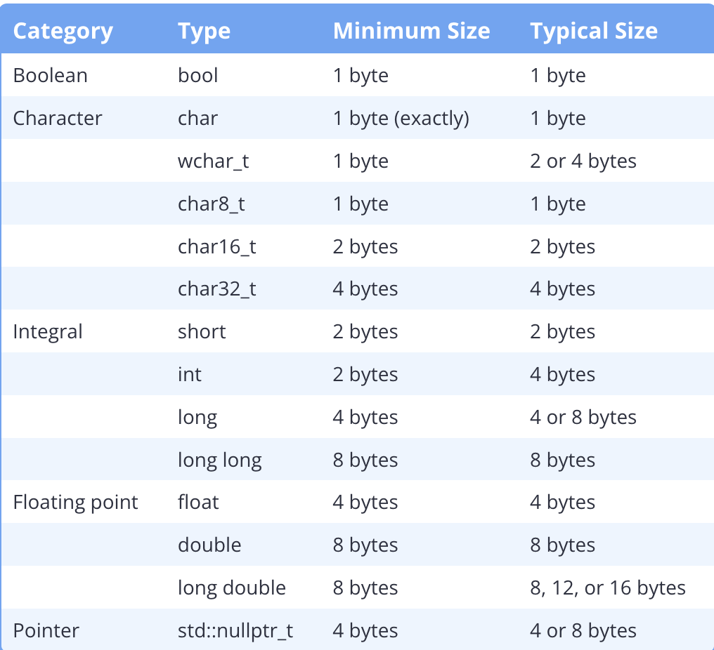
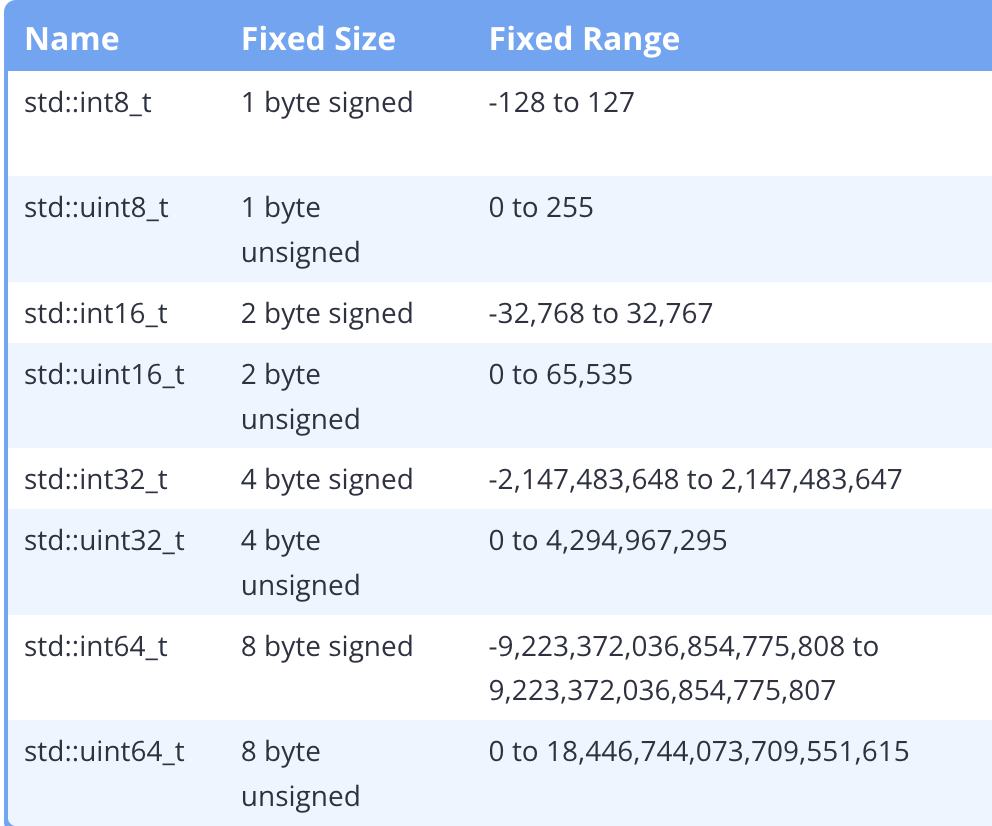
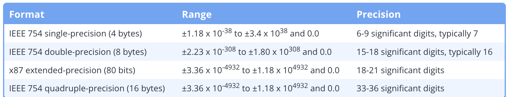

c++ standard does not define the exact size of any fundamental types, instead it defines minimum sizes a type has to be. 
In C++
- An object must occupy at least 1 byte
- A byte must be at least 8 bits
- char, short, int, long, and long long have a minimum size of 8, 16, 16, 32, and 64 bits respectively
- char and char8_t are exactly 1 byte


Try to avoid unsigned integers because
- The lower boundary (0) is easier to overflow
- Mixing of signed and unsigned integers can cause unexpected behavior. If an expression has a signed integer and an unsigned integer, the signed integer will usually be converted to an unsigned integer. 

```
signed int s{-1};
unsigned int u{1};
if (s < u)
    std::cout << "-1 is less than 1\n";
else
    std::cout << "1 is less than -1\n";
```
Here, the else will be evaluated because `s` is implicitly converted to an unsigned integer `4294967295`

C++11 introduced fixed width integers, integers guaranteed to use a certain number of bytes. Fixed width integers are defined in the `<cstdint>` header.


`std::int8_t` and `std::uint8_t` behave like signed and unsigend chars.

Fixed width integers don't actually define new types. Instead, they are aliases for existing integral types with the desired size. The STL will fiugure out how many bits an int actually takes up and use that for std::int32_t if it is the desired number of bytes.

Fast integral types are types that have the minimum number of bytes that you specify but the underlying integral type will be the size that is processed most quickly by the CPU. For example, if you need at least 4 bytes but want the underlying type that is processed by the CPU the fastest, you can use `std::int_fast32_t  `. The underlying integral type will be at least 4 bytes but it can also be 8 bytes depending on the CPU.

Least integral types are similar but they use the smallest underlying type that you need to represent what you need. If a CPU does not support 4 byte data types but you want 4 byte data types, you can use `std::int_least32_t`. The underlying data type will be a 4 byte int if it is supported or a 8 byte int otherwise.

`size_t` is an alias for an unsigned integral type. The compiler defines if it is an unsigned, unsigned long, or an unsigned long long. On most systems, it will be the size of the address width. `size_t` is also imposes a limit on the size of an object. Nothing can be bigger than `size_t` because that would mean you can't return the actual size of the object.

Floating point ranges:

