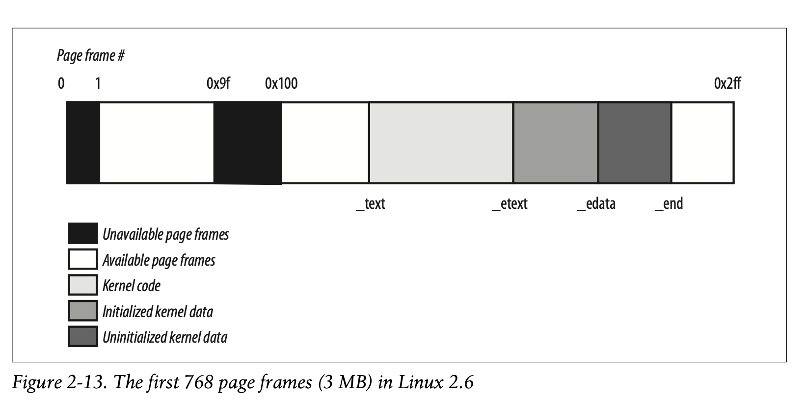

# Paging in Linux

Linux adopts a four level paging model that are divided into
- Page Global Directory
- Page Upper Directory
- Page Middle Directory
- Page Table

This means the linear address can be split into five parts while the size of
each part depends on the architecture. For 32 bit architectures that don't
require all four levels, Linux essentially zeroes out the Page Upper and Page
Middle Directory fields. However, the positions of the unused levels are kept
in the sequence of pointers so that the same code works for 32 and 64 bit
archs. The number of entries for these unused entries become 1 and are mapped
to the proper entry in the Page Global Directory. 

For 32-bit with Physical Address Extension, three levels are used. The Page
Global Directory corresponds to the PDPT, the Page Upper is not used, Pae
Middle corresponds to x86 Page Directory, and the Page Table corresponds to the
x86 Page Table.

All four levels are used on 64 bit archs.

When a process switch occurs, Linux saves the `cr3` register into the
descriptor of the process and loads the location of the Page Global Directory
of the next process into `cr3`.

The following is a list of macros used for page table handling.
- `PAGE_SHIFT`: LEngth in bits of the Offset field. For x86, 12 which is the log
base 2 of 4096 which is the page size. `PAGE_MASK` for x86 would return
0xfffff000 to mask out all of the offset bits.
- `PMD_SHIFT`: Length of bits of offset and table fields. Essentially the size
a Page Middle Directory entry can map. `PMD_MASK` is used to mask out all the
bits of the offset and table fields. If PAE is disabled, `PMD_SHIFT` is 12
(offset) + 10 (table). If PAE is enabled, `PMD_SHIFT` is 12 (offset) + 9
(table)
- `PUD_SHIFT`: Same as `PMD_SHIFT` but for the Page Upper Directory. `PUD_SIZE`
is the area mapped by a single Page Global Directry and `PUD_MASK` masks away
offset, table, middle, and upper fields. `PUD_SHIFT` is always equal to
`PMD_SHIFT` and `PUD_SIZE` is equal to 4MB or 2MB on x86.
- `PGDIR_SHIFT`: Same as `PUD_SHIFT` but for Page Global Directory.
`PGDIR_SIZE` is the size mapped by a single Page Global Directory entry,
`PGDIR_MASK` is used to mask offset, table, middle, and upper fields.

## Physical Memory Layout
The kernel builds a physical address map that keeps track of which physical
address ranges are usable by the kernel and available because they are mapped
to hardware device I/O or it contains BIOS data. Pages are considered reserved
if it is unavailable or if it contains kernel code and kernel data structures.
A reserved page can not be dynamically assigned or swapped to disk. As a
general rule, the Linux kernel is installed in RAM starting from the physical
address 0x00100000 (second megabyte) and typically requires less than 3MB of
RAM. The kernel is loaded from the second megabyte because
- Page frame 0 is used by BIOS to store system hardware config
- Physical address 0x000a0000 to 0x000fffff are usually reserved to BIOS
routines and ISA graphic cards
- May be reserved by specific computer models

In boot, the kernel queries the BIOS and learns the size of the physical0
memory. It may also invoke the BIOS to build a list of physical address ranges
and their memory types. Then, `machine_specific_memory_setup()` is invoked to
build the physical address map based on the BIOS list if it is available,
otherwise, the kernel builds this table based o the conservative default 0x9f
to 0x100 (LOWMEMSIZE() to HIGH_MEMORY) is reserved.

A typical configuration for a 128 MB RAM computer is 
- 0x00000000-0x0009ffff: Usable
- 0x000f0000-0x000fffff: Reserved
- 0x00100000-0x07feffff: Usable
- 0x07ff0000-0x07ff2fff: ACPI data
- 0x07ff3000-0x07ffffff: ACPI NVS
- 0xffff0000-0xffffffff: Reserved

The memory layouf of the kernel (assuming 3MB)

`_text`: At physical address 0x00100000 (first megabyte) denotes first byte
of kernel code. `_etext` marks end of kernel code. Kernel data is split into
initialized and uninitialized portions marked. The end of kernel code is marked
by `_etext` and the end of initialized data is marked by `_edata`.

## Process Page Tables
The virtual address space of a process is divided into two parts
- 0x00000000 to 0xbfffffff: Can be addressed in User or Kernel mode
- 0xc0000000 to 0xffffffff: Can only be addressed in Kernel mode

The `PAGE_OFFSET` macro yeilds the value of 0xc0000000. The first entries of
the Page Global Directory map to virtual addresses lower than 0xc0000000 (768
for PAE disabled, 3 for PAE enabled). The remaining entries are the same for
all processes and are equivalent to the entries of the master kernel Page
Global Directory.

## Kernel Page Tables
The kernel matains its own set of page tables called the master kernel Page
Global Directory. This is never used direcly but is used as the reference model
for corresponding entries of Page Global Direcotires of regular processes.

When the kernel image is loaded into memory, the CPU is still in real mode
meaning paging is disabled. In the first phase, the kernel creates a limited
address space including the kernel code and data segments. This is the initial
Page Table and 128 KB of kernel data structures. This minimal address space is
just large enough to install the kernel in RAM and to initialize its core data
strucutres. In the second pahse, the kernel sets up the page tables. This is
done as following:

### Provisional kernel page tables
At static kernel compilation, a provisional Page Global Directory is
initialized. `startup_32()` is called to initialiez the provisional Page Table.
The provisional PGD is in the `swapper_pg_dir` variable while the provisional
page table is in `pg0` located at the end of the kernel uninitialized data
segment. Assuming the kernel image fits in 8MB of RAM (meaning we need two page
table because a page is 4KB, 1024 entries in a page table). The kernel creates
a mapping from virtual addresses 0x00000000 through 0x007fffff and 0xc0000000
through 0xc07fffff to physical addresses 0x00000000 through 0x007fffff. This
basically means the kernel can address the first 8MB of RAM in linear or
physical addresses.

The provisional page table exists because the CPU is initially in rela mode
where there is no paging and addresses are physical addresses. Linux switches
to the protected mode and then turns on pagingin. Later on, Linux builds the
real page tables and throws the provisional page tables away. THe problem is
that you cannot turn on pagining without page tables. The Linux kernel is
linked to run at virtual address 0xc0000000 which should correspond to physical
address 0x00000000. Early on, the kernel maintains two mappings to the same
physical address region to avoid jumping to nowhere when paging is enabled. The
jumping to nowhere problem is when paging is turned on and the current
instruction pointer no longer translates to a valid physical memory layout.
This is why there needs to be two mappings to the same region so that right
after paging is turned on, the kernel can still refer to the same physical
address.

### Final Kernel Page Table
The kernel needs to set its virtual address to be the physical address +
`PAGE_OPFFSET` where this page offset is 0xc0000000. This is because for every
process, the kernel's part of the address space is designed to be
the top 1GB which is 0xc0000000–0xffffffff. Within this, the top 128MB of
kernel space is reserved for other things as well.

The `paging_init` function switches from the provisional to the final page
tables. It builds the final page table mapping, loads it in the `cr3` register
and flushes the TLB. `pagetable_init` is uesd to initialize the final page
table. It is essentially a loop that goes through the entries of the page
global directory that map to the kernel (768 and onwards) and fills it so that
it is aligned with physical address starting from 0. Each page global directory
entry maps to 4MB of physical memory. The loop goes through these entries and
marks it as kernel only.

## Fix Mapped Linear Addresses
The top 128MB of the 1GB kernel space is not directly mapped to physical RAM
where the physical address is not the virtual address - 0xc0000000. This region
contains various things and one of these is fix mapped linear addresses. It is
a compile time constant virtual address that maps one page (4KB) to any
physical page frame. This exists for kernel objects that must be accessed very
early, very often, must live at a know virtual address (interrupt stuff,
vsyscall page). Linux uses constant addresses for these things because it is a
compile time constant and more efficient because when dereferencing a pointer
to a fix mapped linear address, you don't have to load the pointer value into
memory and then dereference, you can just dereference the memory address. The
`fix_to_virt` function is an inline function that can be evaluated at compile
time to return the address of a `fixed_addresses` enum value.

## Handling Hardware Cache and TLB
To maximize cache hit rates, the most frequently used fields of a data
structure are placed at the low offset and large data structures are stored in
memory in a way that all cache lines are used uniformly. Most processors
implement cache synchronization and in these cases, the kernel does not perform
any hardware cache flusihg. However, for those architectures that don't there
is cache flushing.

The TLB entries are invalidated by the kernel thus there is no cache
synchronization for the TLB. The kernel has various TLB flush methods depending
on the page table change. These methods are
- Flusihg all TLB entries used when the kernel page table entries are changed
- Flushing a range of TLB entries when a range of kernel page table entries are
changed
- Flushing all non-global page TLB entries of the a process for a process
switch
- Flushing TLB entries that correspond to a range of virtual address
- Flushing a specific TLB entry for evicting a TLB entry on a page fault

On multiprocessor systems, the core that the function is running on will send
an Interprocessor Interrupt to the other cores that forces that to execute the
proper TLB invalidation function.

Generally, any process switch means changing the set of active page tables and
flushing of the local TLB entries relative to the old page table. In the Intel
Pentium processor, this is doen automatically when the kernel writes the
address of the new Page Global Directory in the `cr3` register. However, TLB
flushes can be avoided in the following cases
- Process switch between two regular processes that use the same set of page tables
- Process switch between regular process and a kernel thread. Kernel threads do
not have their own set of page tables but rather use the set of page tables
owned by the regular process that was scheduled last for execution

TLB flushes also happen when a page frame is assigned to a user process. It has
to flush any TLB entry that refers to the newly assigned virtual address. The
kernel also tries to flush TLB entries lazily. If multiple cores use the same
page table and a TLB entry needs to be flushed in all of them, flushing can be
delayed on cores running kernel threads. This is because kernel threads do not
have their own page tables but rather use the page tables belonging to a
regular process. Kernel threads also never refer to a user mode virtual address
so there is no need to invalidate the TLB entry in that moment. As soon as the
CPU in lazy TLB mode switches to a regular process, the hardware automatically
flushes the TLB entries. If the switch happens to a regular process with the
same set of page tables as the kernel thread, the kernel is responsible for
flushing the TLB.

To implement this lazy TLB mode, new data structures are needed. The
`cpu_tlbstate` variable is a static array with the size of the max number of
CPUs on the system of structures containing an `active_mm` field pointing to
the memory descriptor of the current process  for that CPU and a `state` flag
containing `TLBSTATE_OK` (non-lazy) and `TLBSTATE_LAZY`. The memory descriptor
also contains a `cpu_vm_mask` field that stores the indices of the CPUs that
should receive IPC related to TLB flushing. When a core receives an IPC for TLB
flushing, it first checks if it affects the page tables of the current process.
It also checks if it is in lazy mode and in this case, the kernel does not
flush the TLB but removes the CPU index from the `cpu_vm_mask`. This means it
no longer receives IPI for TLB flushing and on a process switch on that CPU,
there is a TLB flush to flush all non-global TLB entries.
