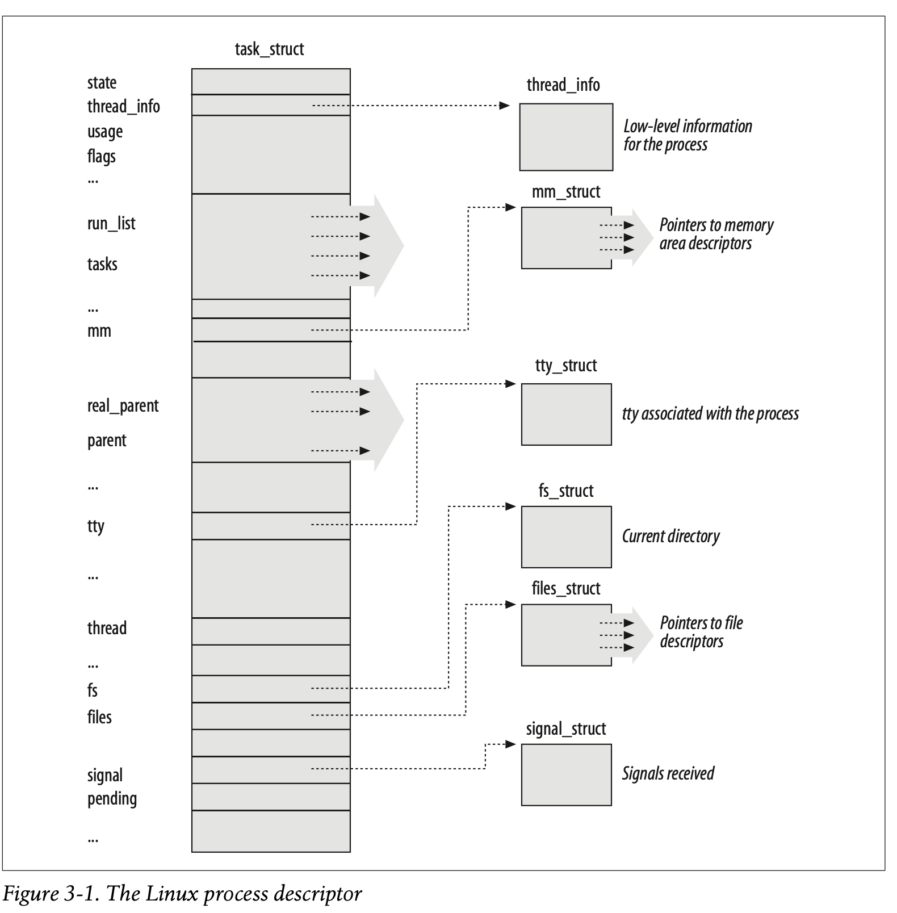
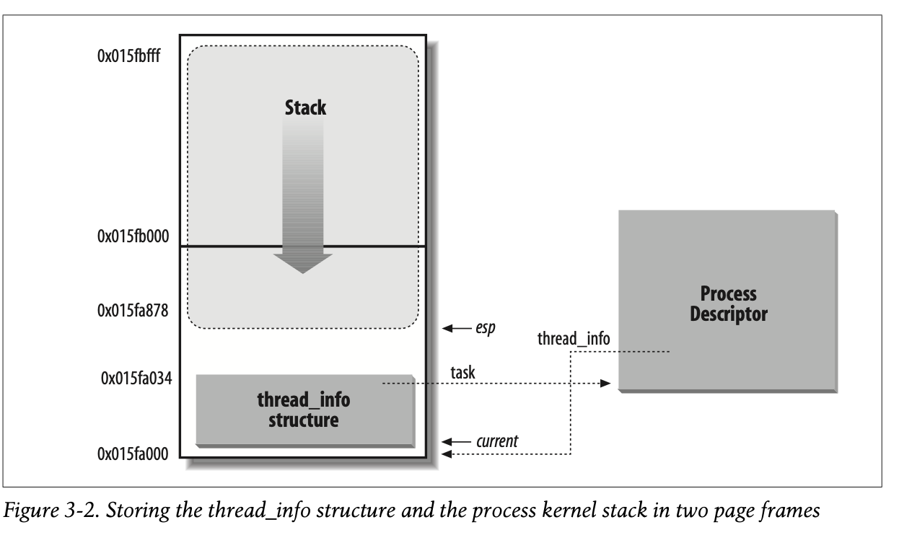
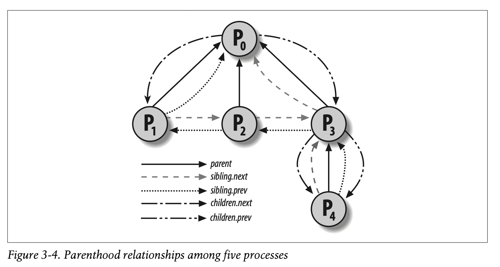
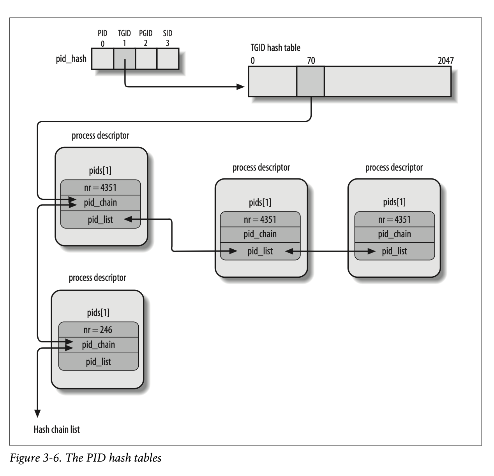

# Process Descriptor

The process descriptor contains information on what a process is doing. It has
many fields and have many levels (fields that point to other structures). In
Linux, this is the `task_struct` structure.



## Process State
The `state` field in the `task_struct` describes what the process is doing. It
is an array of flags, each of which describes a possible state. At the time of
the book, these states were mutually exclusive. 

- `TASK_RUNNING`: Currently executing on a CPU or waiting to be executed
- `TASK_INTERRUPTIBLE`: Process is suspended until some condition is met
- `TASK_UNINTERRUPTIBLE`: Not used much except when describing a state where
the process must wait until a given event occurs without being uninterrupted.
For example, opening a device and the device driver probing for a corresponding
hardware device must be uninterrupted because the hardware device could be left
in an unpredictable state
- `TASK_STOPPED`: Process execution has been stopped after one of `SIGSTOP`,
`SIGTSTP`, `SIGTTIN`, `SIGTTOU`
- `TASK_TRACED`: Process stopped by a debugger such as when a ptrace system
call is executed to monitor a program.

The `exit_state` and the `state` field is set to one of the following when a
process execution is terminated
- `EXIT_ZOMBIE`: The parent process has not yet issued a wait call for it. The
kernel cannot disregard the data contained in the dead process's process
descriptor
- `EXIT_DEAD`: The process is state is removed because the parent issued a
wait. 

## Identifying a process
Each process must have its own process descriptor, even lightweight processes.
Processes are often identified with `pid`. The process descriptor contains
`pid` field consisting of a number that increases sequentially for each created
process. This value has an upper limit where the default is defined as
`PID_MAX_DEFAULT-1` (32767) but can be reduced by writing a value into
`/proc/sys/kernel/pid_max`. In 64 bit systems, this value can be much higher
(4194303). Once pids are exhausted, the kernel has to wrap around. It must
maintain a `pidmap_array` that denotes which PIDs are currently assigned. This
`pidmap_array` bitmap is stored in a single page in 32 bit systems but may
cross multiple pages in 64 bit systems. These pages are never released by the
kernel.

In Linux, lightweight processes have unique PIDs. However, it is desirable to
be able to identify a group of lightweight processes by a single PID. Thread
groups are used for this where the group can be identified with the PID of the
thread group leader. This is stored in the `tgid` field and `getpid` returns
`tgid` instead of `pid`. 

### Process descriptors handling
The process descriptor is kept in the dynamic memory region of the kernel. For
each process, the kernel packs two different data structures in a single
per-process memory area: a data structure linked to the process descriptor
called the `thread_info` structure and the kernel mode process stack. The
length of this memory area is 8192 bytes and these two pages are stored in
consecutive page frames where the first page frame is aligned to a multiple of
2^13. There are compilation options for the `thread_info` and the kernel stack
to span a single page frame. The `thread_info` structure starts from the
beginning while the stack grows downwards from the end. The `thread_info` and
`task_struct` reference each other with the `task` and `thread_info` fields
respectively in each structure. The `esp` register is the CPU stack pointer
that tracks the top of the stack. Right after switching from user mode to
kernel mode, the kernel stack is empty so the `esp` register points to the byte
immediately following the stack. The kernel stack can be up to 8140 bytes.
`alloc_thread_info` and `free_thread_info` are used to allocate and release
memory area storing a `thread_info` struct and kernel stack. The union of these
two can be represented as 
```C
union thread_union {
    struct thread_info thread_info;
    unsigned long stack[2048]; /* 1024 for 4KB stacks */
};
```



### Identifying the current process
Identifying the process running on a CPU can be done easily by looking at the
`esp` register. The `thread_union` structure is 8KB or 4KB long so you can
simply mask out the 13 or 12 respective least significant bits to get the base
of the `thread_info` structure. The `current_therad_info` function provides
this as such
```
movl $0xffffe000,%ecx /* or 0xfffff000 for 4KB stacks */
andl %esp,%ecx
movl %ecx,p
```

To access the `task_struct` structure for the process, the kernel uses the
`current` macro which is equivalent to `current_thread_info()->task`

### Doubly linked lists
The kernel defines a `list_head` data structure whos onley fields `next` and
`prev` represent the forward and back pointers of a generic doubly linked list.
A new list is created using `LIST_HEAD(list_name)` macro which declares a new
variable named `list_name` of type `list_head` which acts as the placeholder
for the head of the new list. Several functions and macros are implemented for
the doubly linked list
- `list_add(n, p)`: Inserts an element pointed to by `n` right after element
pointed to by `p`
- `list_add_tail(n, p)`: Inser an element pointed to by `n` right before
element pointed to by `p`
- `list_del(p)`
- `list_empty(p)`: Check if the list specified by `p` of its head is empty
- `list_entry(p, t, m)`: Return address of data structure of type `t` for
`list_head name `m and and address `p` is included
- `list_for_each(p, h)`: Scan elements of list specified by address `h` of the
head, in each iteration, a pointer to the list element is returned in `p`
- `list_for_each_entry(p, h, m)`: Retruns address of data structure embedding
the `list_head` data structure rather than the address of the `list_head`
structure itself

### Process list
The process list is a doubly linked list that links togther all existing
process descriptors. Each `task_struct` structure includes a `task` field of
type `list_head`. The head of the process list is the `init_task_struct` which
is the "process 0". `tasks->prev` of the `init_task` points to the tasks field
of the process descriptor inserted last in the list. `SET_LINKS` and
`REMOVE_LINKS` are used to add and remove process descriptors. The
`for_each_process` macro scans the whole process and is defined as
```C
#define for_each_process(p) \
    for (p=&init_task; (p=list_entry((p)->tasks.next, \
                                     struct task_struct, tasks) \
                                    ) != &init_task; )

for_each_process(p) {
// body of loop
}
```
The macro provides the loop control statement. `p` contains the address of the
current scanned process descriptor

## Relationship Among Processes
The process descriptor contains fields to denote the relationship between processes
- `real_parent`: Points to process descriptor of process that created this
process. If the parent process no longer exists, points to the `init` process
- `parent`: Usually the same as `real_parent` but can be different in cases
such as where `ptrace` facility is used
- `children`: Head of list of processes created by this process
- `sibling`: Contains the pointers to the next and previous list of processes
where the parent is the same as this process



There are also other relationships between processes. The below fields in the
process descriptor are for fields other than parental relationships
- `group_leader`: Process descriptor that points to the group leader of P
- `signal->pgrp`: PID of the group leader of P
- `tgid`: PID of the thread group leader of P
- `signal->session`: PID of the login session leader of P
- `ptrace_children`: Head of the list containing children of P that is being
traced by a debugger
- `ptrace_list`: Next and previous in the `real_parent`'s list of traced
processes (used when P is being traced)

### The pidhash table and chained lists
Hashtables are used to correlate PIDs to process descriptors. There are four
such hash tables because the process descriptor has fields corresponding to
different PIDs. The below are hash table types, their field name and what it is
used for. There are also four different types of PIDs as shown below
- `PIDTYPE_PID`: `pid` field. PID of the process
- `PIDTYPE_TGID`: `tgid` field. PID of the thread group leader process
- `PIDTYPE_PGID`: `pgrp` field. PID of the group leader process
- `PIDTYPE_SID`: `session` field. PID of the session leader process

The four hash tables' addresses are alloaced dynamically at kernel init and the
addresses are stored in the `pid_hash` array. Linux uses chaining to resolve
colliding hashes with different PIDs. 

The `pid` structure is the core data structure that contains information of a
process. The array of `hlist_head` represent the heads of the chain lists. An
entry in the `pid_hash` points to a list of `hlist_head` which can also be
referenced from the `task_struct`. Each entry within the hash table points to
processes within the same (if looking at the `PGID`) entry of `pid_hash`,
processes with the same process group PID. Each node in the chain list
corresponds to one group and is also a list of processes.



## How Processes are Organized

The runqueue lists all processes in the `TASK_RUNNING` state. Other states such
as `TASK_STOPPED`, `EXIT_ZOMBIE`, `EXIT_DEAD` are not in any list and is only
accessed through their PID or child processes. Processes in
`TASK_INTERRUPTIBLE` and `TASK_UNINTERRUPTIBLE` are divided into many classes
with additional lists which are called wait queues. 

Wait queues contain processes waiting for a specific event such as interrupts
or fixed time intervals. It represents a set of sleeping processes that are
woken by the kernel. Each wait queue is identified by a wait queue head struct
that contains a `spinlock_t` and a `list_head`. Each element in the wait queue
list represents a sleeping process. There are two types of sleeping processes:
exclusive processes denoted with the flag value 1 where the kernel selectively
wakes a process up in the instance the event the process was waiting for
happened, and nonexclusive processes with the flag value 0 where the kernel
always wakes the process up. For nonexclusive processes, the default wake
function is used. For exclusive processes, custom awakening functions can be
defined. Processes wishing to wait can invoke various fucntions
- `sleep_on`: Sets current process to `TASK_UNINTERRUPTIBLE` and inserts it
into the wait queue. Invokes the scheduler which resumes the execution of a
different process. When woken again, the process resumes from after the
scheduler invokation and removes itself from the wait queue.
- `interruptible_sleep_on`: Sets and puts itself in the `TASK_INTERRUPTIBLE`
list
- `sleep_on_timeout`, `interruptible_sleep_on_timeout`: Allow caller to define
the amount of time the process should sleep by using `schedule_timeout` instead
of `schedule`
- `prepare_to_wait`, `prepare_to_wait_exclusive`, `finish_wait`: The first two
allows scaller to set the process state to whatever the caller passses and then
sets the exclusive flag accordingly and inserts iself in the wait queue. The
third function removes itself from the wait queue
- `wait_event`, `wait_event_interruptible`: Put calling process to sleep on a
wait queue until a given condition

Processes in the wait queue can be woken up via various macros. 

## Process Resource Limits
Each process has a set of resource limits that specify the amount of system
resources it can use. These are contained in the process descriptor in the
signal field. The field associated with limits is an array of the `rlimit`
struct  which denotes the current and the max limit of a resource. Some of
these resources are
- `RLIMIT_AS`: Max size of process address space
- `RLIMIT_CPU`: Max CPU time in seconds, if it is exceeded, SIGXCPU and then a
SIGKILL is sent
- `RLIMIT_FSIZE`: Max file size
- `RLIMIT_NPROC`: Max number of processes user can own

Whena user logs into the system, the kernel creates a process owned by the
superuser that can invoke `setrlimit`. This same process later executes a login
shell and becomes owned by the user. All new user processes inherit this
process and the contents of the `rlimit` array and cannot override the limits.
