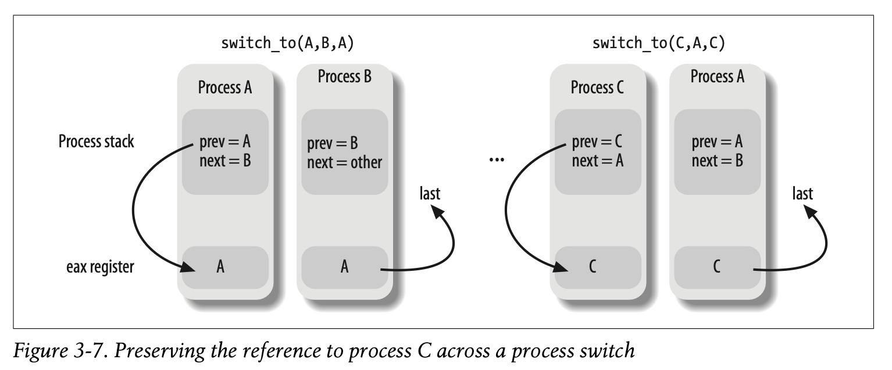

# Process Switch

## Hardware Conext
The hardware context is the set of data that must be loaded into registers
before the process resumes execution on the CPU. Part of the hardware context
is stored in the process descriptor while the remaining part is saved in the
kernel mode stack. Older Linux used a `far jmp` instruction to do a context
switch in hardware. Linux 2.6 uses software to perform the switch. Before the
process switch, the contents of the register used by a process in user mode is
saved to the kernel mode stack.

## Performing Process Switch
A process switch occurs in two distinct steps. First the page global directory
is switched out to point to a new address space and second, switching the
kernel mode stack and the hardware context to restore CPU register state. This
seond step is handled in the `switch_to` macro and it takes in three
parameters, `prev`, `next`, and `last`. These are all pointers to task
descriptors. `prev` and `next` are the task descriptors that is being replaced
and the new one that is being scheduled to run. This third variable is needed
to maintain reference. When a process A is being switched out for process B,
`prev` is pointint to A and `next` is pointing to `B`. Then, when `A` wants to
be reactivated, and the current process is `C`, `prev` is set to `C`, `next` to
`A`. However, because A's kernel mode stack is old and its `prev` is still A
and the next is `B`. Any reference to `C` is lost which is still needed. This
last parameter is the output parameter that species the memory location of the
descriptor of C. Figure 3-7 illustrates the kernel mode stacks of processes
during a switch.

 
Before process switching from A to B, the `switch_to` macro saves the value of
`prev` in `eax` (this is the previous location of the task descriptor). When
switching back to A from C, the macro writes the content of the `eax` register
in the `last` parameter. This allows the process we are switching to to
maintain a reference of the process we switched from.

### __switch_to() function
The `__switch_to` functino does most of the heavy lifting of process switches.
It takes in the `prev_p` and `next_p` processes as values in the `eax` and
`edx` registers. You can tell gcc to use registers for parameters sing the
`regparm` `__attribute__`

## Saving and Loading FPU, MMX, and XMM
The arithmetic floating point unit (FPU) is now commonly a part of the CPU but
in older days, it was a separate coprocessor that was invoked with ESCAPE
instructions. In Pentium models, MMX instructions for speeding up multimedia
applications was introduced. MMX instructions act on the floating point
registers of the FPU and allow SIMD in the processor. However, these FPU, MMX,
and XMM registers are not saved in the TSS (Task state segment) by the
microprocessors automatically but instead provides hardware support to save
these registers only when needed. Therefore, the kernel only saves these
registers when needed. When there is a switch from process A to B, process A's
FPU, MMX, and XMM register contents are not saved on switch but only when
process B tries to user these registers with an ESCAPE or MMX instruction. The
kernel can also use the FPU and MMX units. There are functions that handle the
saving and restoring of the existing user space register values. However, the
saving and restoring has considerable overhead as to negate the speedup gained
from using special arithmetic units so it is only used selectively in places
like cheksum functins.
