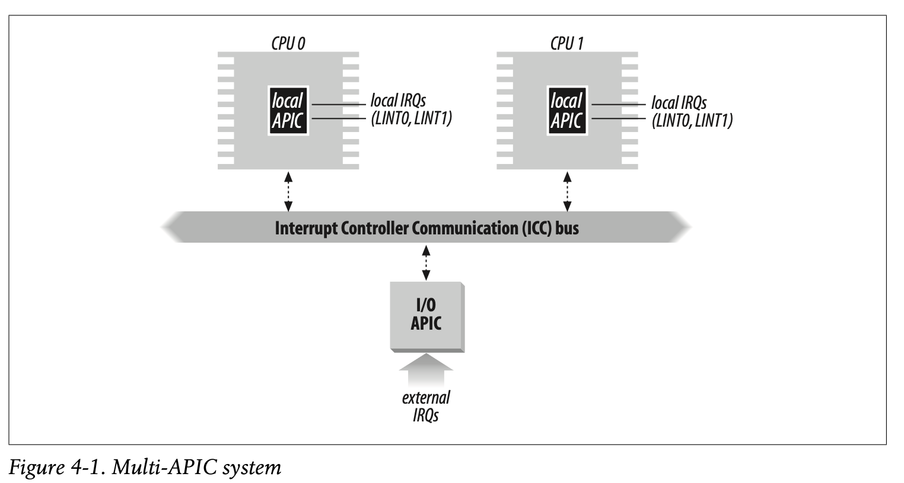
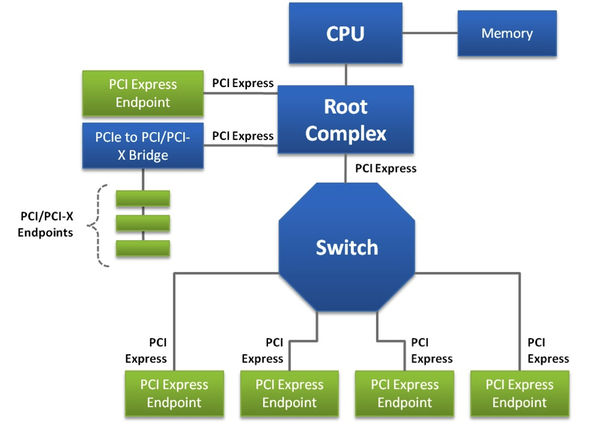

# Interrupt and Execptions

The Intel documentation differentiates between interrupts and exceptions
Interrupts:
- Maskable interrupts: Can be in two states, masked or unmasked where a masked
interrupt is ignored by the CPU control unit
- Nonmaskable interrupts: Critical events such as hardware failure causes
nonmaskable interrupts that are always recognized by CPU

Exceptions:
- Processor-detected exceptions: Generated when there is an anomalous condition
while executing an instruction. Divided into three groups
1. Faults: Can generally be corrected and program can be restarted without loss
of continuity. Instruction can be resumed after exception handler terminates
2. Traps: Reported following the execution of a trapping instruction and
handles control to the kernel. User program continues at the instruction
pointed to by the instruction pointer. The instructino is not reexecuted. 
3. Aborts: Serious error where CPU may be unable to continue execution. Forces
the affected process to terminate.

- Programmed exceptions: `int` or `int3` instructions that can be generated at
the programmers will. Handled in control units as traps.

Each interrupt and exception is identified with a number ranging from 0 to 255.
This is called the interrupt vector and vectors of nonmaskable interrupts and
exceptions are fixed while maskable interrupts can be altered by programming
the Interrupt Controller

## IRQs and Interrupts
Hardware device controllers usually have a dedicated output line for Interrupt
ReQuests (IRQ) that are connected to a Programmable Interrpt Controller (PIC).
The PIC monitors the IRQ lines and converts the raised signals into the
corresponding interrupt vector (which is just a number really), stores the
vector into Interrupt Controller I/O port so the CPU can read the data, sends a
signal to the processors INTR pin, and waits until the CPU acknowledges the
interrupt. The PIC can be programmed to disable some IRQ lines in order to stop
issuing interrupts to the processor. These disabled interrupts are sent once it
is enabled again.

In old systems, IRQ lines were mapped with physical interrupt pins and a wire
that was connected to the procssor. On modern systems, an IRQ line is a logical
interrupt input into an APIC, not a bus or wire. Modern PCIe devices use MSI or
MSI-X where a device is given a target address in the APIC's address space, a
data value which is the interrupt vector and metadata. When the device wants to
fire an interrupt, it performs DMA to the given address and the local APIC
picks that up. When a device comes online (is connected)
1. The firmware on device discovers the PCIe devices and the OS enumerates the
devices via config space
2. The device advertises INTx or MSI or MSI-X
3. The OS allocates an interrupt vector and a target CPU or CPU set. It prorams
the I/O APIC redirection entries (to forward to the correct CPU) or the
address and data registers used for MSI/MSI-X for the device
4. Driver registers ISR for the interrupt and kernel records mapping

### The Advanced Programmable Interrupt Controller APIC
PICs are for uniprocessor systems. Multicore systems using a I/O APIC as well
as a local APIC for each core. External IRQs come in through the I/O APIC which
is connected to an Interrupt Controller Communication Bus to which local APICs
are connected to.

Unlike regular PICs, the interrupt priority is not related to the pin number
and is programmed to indicate the interrupt vector and its priority,
destination processor, and how the processor is selected. External IRQs are
distributed to CPUs in two ways
- Static Distribution: IRQ signal is delivere to local APIC in corresponding
redirection table entry. This can be one CPU, subset of CPUs, or all CPUs
(broadcast)
- Dynamic distribution: The IRQ is delivered to the processor that is executing
the process with the lowest priority. Each local APIC can be desginated a
priority for the current running process. In cases where this priority is the
same across multiple cores, interrupts are delivered in a round robin fashion

The I/O APIC also allows interprocessor interrupts. If a CPU wants to send an
interrupt to another CPU, it stores the interrupt vector and the target CPU in
its local APIC. A message is sent over the APIC bus to the target local APIC
after which the local APIC will generate an interrupt to its own core.

## Exceptions
x86 processors define up to 32 exception vectors. Some optionally push an error
code onto the kernel mode stack for the exception handler to check. 

## Interrupt Descriptor Table
The Interrupt Descriptor Table associates each interrupt or exception with the
corresponding handler. IDT consists of 8 byte entries and must be initialized
with the address and maximum length stored in the `idtr` register. The IDT can
include three types of descriptors
- Task gate: Includes the TSS selector (task state segment which is essentially
the execution context of a process) of the process that must replace the
current process on an interrupt
- Interrupt gate: Includes segment selector (which is the kernel code segment
for Linux) and the offset of the interrupt or exception handler. Clears the IF
flag while transferring control to the handler so that no further masked
interrupts are recognized by the processor.
- Trap gate: Similar to interrupt gate but without clearing of IF flag.

### Side note
A PCIe "device" is a hardware function that implements the PCIe protocol and
particiaptes in the PCI express fabric. There are different types of PCIe
devices
- Root complex: Connects CPU/Memory to the PCIe fabric
- Switch: Routes packets between PCIe links
- Endpoints: Devices such as NIC, GPU, NVMe
- Bridge: Creates a new bus hierarchy

