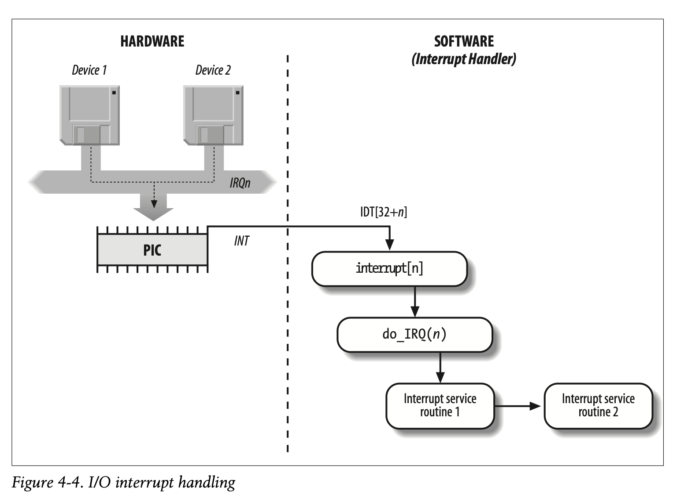
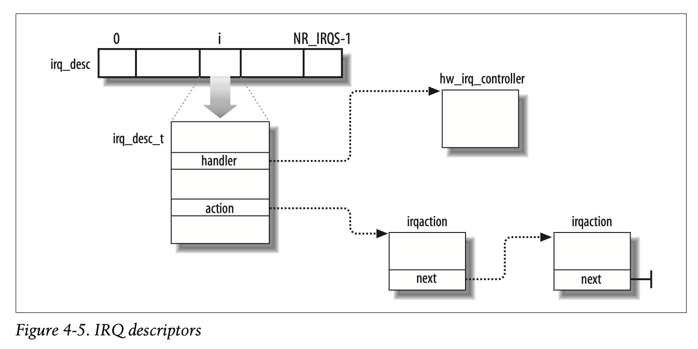

# Interrupt Handling

Interrupt handling cannot be done in the same way as exception handling in
terms of simply sending an interrupt to the current running process. Interrupts
frequently arrive long after a process has been scheduled off and put into a
waitqueue so sending a signal to the current process wouldn't make sense. There
are three main classes of interrupts
- I/O interrupts: An I/O device requires attention and the corresponding
interrupt handler needs to query the device to determine what to do
- Timer interrupts: A timer has issued an interrupt which tells the kernel that
a fixed time interval has elapsed. These interrupts are handled mostly as I/O
interrupts
- Interprocsesor interrupts: A CPU issued an interrupt to another CPU on a
multiprocessor system

## I/O Interrupt Handling
I/O interrupt handlers need to be able to service several devices at the same
time. In PCI bus architecture, several devices can share the same IRQ lines
which means that the interrupt vector alone doesn't tell you which device the
interrupt came from. It is possible that the same interrupt vector can be
assigned to different devices. To achieve flexibility, the kernel does
- IRQ Sharing: The interrupt handler exceutes multiple interrupt service
routines (ISRs) where each ISR relates to a single device sharing the IRQ line.
Each ISR verifies whether their device needs attention and if so, handles it
- IRQ dynamic allocation: IRQ lines can be associated with device drivers
dynamically. The kernel can dynamically allocate interrupt vectors, bind them
to drivers, and reclaim when devices are inactive or removed.

While an interrupt handler is running, the signals on the IRQ line are
temporarily ignored so the handler cannot block and must always stay in the
`TASK_RUNNING` state. The actions performed by interrupt handler can be split
into three classes
- Critical: Acknowledgeing interrupt to PIC, reprogramming the PIC or device
controller, updating data structures accessed by the device and the processor.
Actions that need to be performed right away
- Noncritical: Updating data structures only accessed by processor, can also be
done pretty quickly so may be done immediately in the interrupt handler
- Noncritical deferrable: Actions such as copying buffer contents into process
address space. Handled by separate functions

All I/O interrupt handlers do the same four basic actions
1. Save IRQ value and register contents to stack
2. Send ack to PIC to allow further interrupts
3. Execute ISRs associated with devices sharing the IRQ
4. Terminate inerrupt handler

### Interrupt vectors
Some interrupt vectors are reserved for specific uses such as exception vectors
that are reserved and architecturally defined or vectors reserved for special
kernel or CPU purposes. The remaining vectors are controlled by the kernel
dynamically and assigned to external interrupts for devices

### IRQ Data Structures
Every interrupt vector has its own descriptor whose fields include pointers to
the handler, data needed by the handler, and the different ISRs that are
associated with that interrupt vector in a inked list fashion. Interrupts are
considered unexpected if it is not handled by the kernel (no ISR associated
with the IRQ line or no ISR recognizes the interrupt as its own device). The
kernel disables IRQ lines with many unexepcted interrupts by keeping a counter
of total numbers of interrupts on the IRQ line and the number of unhandled
interrupts on that IRQ line. Once these numbers reach a certain threshold, the
IRQ line is disabled. The IRQ descriptor also has many states. Some of these
states are IRQ handler currently running, IRQ line disabled, an IRQ is pending
acknowledgement by the APIC, etc.

Nowadays, the vector that contains the IRQ descriptors is dynamically allocated
and does not have a fixed mapping. IRQ numbers are not vectors and there is a
hierarchical mapping. An interrupt passes through multiple logical identities
The first is the hardware source layer that is emitting the interrupt, either
physically with wires or with a message based signal like MIS/MSI-X. Then it
passes through the kernel that maps the hardware source to the IRQ number. The
IRQ number is essentially the kernel's logical mapping for an interrupt source
and is an abstraction around the hardware source. Then, the kernel needs to map
the IRQ number and the handler to a specific CPU and the interrupt vector
within that CPU to handle the interrupt. Each CPU has a limited set of
interrupt vectors (like 256) so the kernel needs to decide which vector number
to use on which CPU to handle the interrupt. This mapping is done inside the
interrupt controller and can be programmed for changing interrupt affinity,
load balancing, etc. Once the interrupt is delivered to the CPU, the CPU looks
into its IDT. The reverse mapping from (CPU #, vector #) to IRQ number exists
so the CPU can find the associated handler registered for that IRQ number.

IDT vs IRQ: Once a CPU receives and interrupt, it jumps to the handler
registered at the interrupt vectors offset in the IDT. Then, the kernel takes
over and consults the IRQ to invoke the IRQ handler and the different ISRs
associated with that IRQ number.

### IRQ distribution in multirpocessor systems
Linux treats CPUs symetrically called (Symmetric Multiprocessing, SMP). It
tries to avoid concentrating interrupts on one CPU and distributes interrupt
handling. Nowadays, Linux picks a per-IQR explicit CPU targetting where a
specific CPU and a vector number on that CPU is chosen for an IRQ. There is
also a user space daemon that measures per CPU interrupt load and changes IRQ
affinities of CPUs dynamically according to `/proc/interrupts`. Nowadays, one
NIC or NVMe device has hundreds or thousands of queues and each queue has an
interrupt associated with it so distribution of these interrupts are important.
The affinity of a CPU to handling IRQs can be changed in
`/proc/irq/N/smp_affinity` with a CPU bitmask or `proc/irq/N/smp_affinity_list`
which controls with CPUs may receive that IRQ.

### Multiple Kernel Mode stacks
In Linux, each `task_struct` has its own kernel stack (8 - 16KB depending on
architecture) used for handling system calls, exceptions, and kernel execution.
Separate stacks for IRQ handling also exists. On x86, this is done with the
Interrupt Stack Table (IST). Each CPU has a dedicated IRQ stack which is
pointed to from an IST entry. The CPU switches automatically to that stack on
interrupt handler entry. Exceptions also have their own stacks depending on
the type. User mode exceptions like page faults and syscalls use the current
task's kernel stack. Critical exceptions in kernel mode are handled in per CPU
exception stacks that are also pointed to by IST entries.

## Interprocessor Interrupt Handling
Interprocessor Interrupts (IPIs) are delivered not through IRQ lines but as a
message on a bust that connects to the local APIC of all CPUs. There are three
kinds of IPIs that are important
- Call function: Sent to all CPUs but the sender, forcing the CPUs to run a
function passed by the sender. 
- Resechedule: When a CPU receives this IPI, it acknowledges the interrupt and
sets a flag that makes the scheduler run immediately after the interrupt
returns
- Invalidate TLB: Sent to all CPUs but the sender forcing them to flush their
TLBs

Modern Linux's IPI subsystem has layers of abstraction. First the architecture
independent higher level IPI functions decides what type of IPI is sent to what
CPU. This layer invokes an architecture dependent layer that maps the IPI type
to the correct CPU interrupt vector. Per CPU IPI vectors are allocated at boot.
This layer calls the interrupt controller to send the IPI. The interrupt
controller is responsible for actual sending the message to the target CPU by
injecting an interrupt into each CPUs local APIC. Once the target CPU receives
the interrupt, it looks into its IDT and runs an IPI entry stub. The IPI
handler knows the mapping between the (CPU #, Vector #) to the IPI type and
invokes the correct handler such as scheduling, function calling, or flushing
TLB. Apart from the three different IPI types, Linux uses IPIs for stopping a
CPU, broadcasting a timer event, perf/tracing, and debugging.
