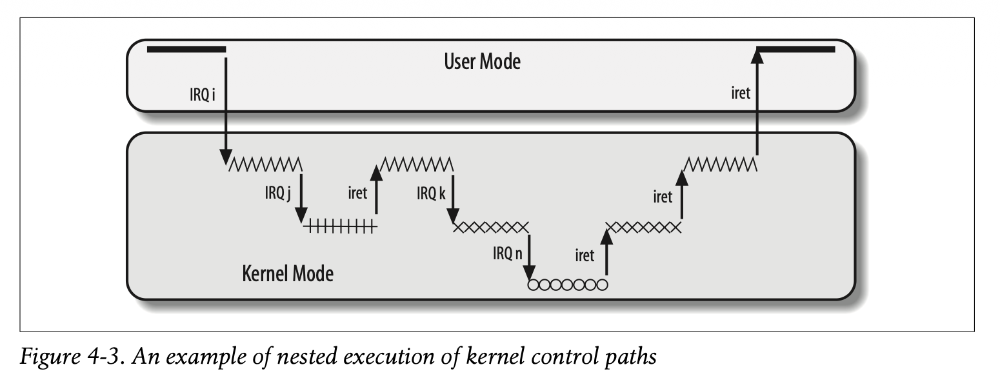

# Nested Execution of Exception and Interrupt Handlers
When an interrupt is fired, a kernel control path is started where the first
instructions are saving the contents of the CPU registers and the last
instructions are restoring the contents of the CPU registers. Kernel control
paths can be arbitrarily nested as shown in 4-3 meaning an interrupt can be
interrupted by another interrupt. 

Thus, interrupts must never block because this could cause a process switch and
the state that was saved in the current process's kernel mode stack would be
lost. With nested interrupts, multiple executions exist on the same process's
kernel stack. Modern Linux uses the per CPU interrupt stack but the
non-blocking invariant remains the same.

In a bug free kernel, the only exception that can happen in kernel mode is a
page fault. When handling a page fault, the kernel can suspend the current
process and schedule another process. Once the process that caused the page
fault is scheduled again, the execution handler for the page fault runs. The
page fault handler never gives rise to further exceptions which means only two
kernel control paths can be stacked at a time during the handling of page
faults, the syscall control flow and the page fault handler. Page fault
handlers can be switched off because it runs in a specific process's context
and is restartable. On the other hand, interrupt handlers are asynchronous and
not tide to a specific instruction that can be retried. It is not logically a
part of any process execution and if it is swiitched off, there is no way to
resume it safely because hardware state may be inconsistent or events may be
lost. Interrupt handlers also run on the kernel stack of the interrupted
process. If the interrupted process is switched off, the original stack frame
with the data is not available.

Interrupts can preempt other interrupts and exception handlers. However, an
exception cannot preempt an interrupt handler. This is because interrupt
handlers are assumed to be bug free and exceptions cannot arise during the
exceution of one (even page faults). Linux interleaves kernel control paths for
two major reasons
- Improve throughput of PICs and device controllers. Device controllers wait
until the IRQ signal is acknowledged by the CPU. If kernel control paths could
not be interleaved, this dramatically reduces performance of device controllers
and I/O devices
- Implement inetrrupt model without priority levels. This makes programming it
easier
